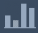
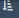

<!-- End Side Nav -->
  <!-- Start Main Body -->
  <!--start custom header-->
  <!-- Topbar -->
  <!--<section>-->
* [**](https://facebook.com/alertlogic)
* [**](https://twitter.com/alertlogic)
* [**](https://www.linkedin.com/company/alert-logic )

* 
* [**										Customer Login](https://invision.alertlogic.net/)
* 
* [**										Support](https://www.alertlogic.com/support/)
* 
* [**										Contact Sales](https://www.alertlogic.com/contact-sales/)

<!--</section>-->

<!-- END Topbar -->

<!-- Header -->

<!--<section>-->

<!-- Logo -->

<!-- Show for large up -->
      Security. Compliance. Cloud.      
<!-- Mobile Menu -->

<!--</section>-->

<!-- END Header -->

<!-- Main Navigation -->
<nav>
  <!--<section>-->
* [Home](../home.md)
* [GET STARTED](../home.md#get-started)
* [REQUIREMENTS](../home.md#requirements)
* [INSTALLATION](../home.md#installation)
* [PRODUCT GUIDES](../home.md#product-guides)
* [API](https://docs.alertlogic.com/developer/)
* [RELEASE NOTES](../release-notes/archived.md)

<!--</section>-->
</nav>
<!-- END Main Navigation -->

<!--end custom header-->
# Incident Response and Investigative System (IRIS)

## Introduction

The Alert Logic ActiveAnalytics Platform surfaces events of interest for review and possible escalation by ActiveWatch security analysts. The overwhelming amount of data surfaced created a need for a more efficient way to manage it. The IRIS web-based application was developed to meet this need.

Events are observable occurrences on a network or host that imply harm or compliance violation. Incidents area correlation of events that imply harm to an information system.

IRIS allows for a fast and efficient way to visualize and contextualize event information, making it possible to more effectively manage incidents. It connects incidents to the Cyber Kill Chain, which allows effective gathering of feedback to improve the process. IRIS also removes events that are unrelated to an incident and events that qualify for removal based on defined rules for a given environment. This fine-tuning of event information creates effective white lists, increases productivity, and allows for proactive hunt activities.

This guide explains the usage and functions of IRIS, allowing you to:

* Access and view incidents
* Navigate, acknowledge, analyze, and escalate or close incidents

Please see the IRIS Wiki for all the latest FAQs.

## Heads up display (HUD)

### Overview

The HUD is a visual representation of the incidents database that allows you to choose an incident to review.

The sign-in page for the HUD can be found at: [https://hud.iris.alertlogic.com/](https://hud.iris.alertlogic.com/) and requires Global AIMS production credentials to log in.

### HUD interface

The initial landing page default view shows the **Unacknowledged** tab under the **SOC Incidents** tab, listing unacknowledged, high criticality incidents sent to the ActiveWatch team for review. The other two primary tabs are **My Incidents**, which lists incidents that you are investigating, and **AL_SOC**, which lists incidents assessed by an automated process as low and medium criticality.

Selecting an incident in the HUD launches the IRIS interface.

#### SOC incidents

This tab defaults to listing unacknowledged incidents, ranked by the remaining time on the Service Level Agreement (SLA) timer attached to each incident. There are four sub-tabs.

The four sub-tabs are:

* **All** - a listing of all incidents that have not been worked to completion
* **Unacknowledged** - incidents that have not yet been selected for assessment
* **Acknowledged** - incidents that have been selected for assessment
* **Complete** - incidents that have been worked to completion

The default sort is based on SLA time remaining, sorted from oldest to newest. You can also sort by **customer** (name) or **incident type** by clicking the drop-down menu to the right of the current sort option.

The key item identifiers for each incident are:

* **Customer name**—the customer affected
* **Incident type**—concise listing of the incident
* **Alpha ID**—generated by the legacy incident system, used by customers not yet on IRIS
* **Incident ID**—generated by IRIS
* **Time remaining**—the time remaining in the SLA timer

SLA timer

The 15-minute SLA incident timer will count down from 15 minutes to 0. When it reaches zero, it will start counting up with a negative symbol, which indicates how far past the 15-minute SLA the incident is. The timer is color-coded to indicate SLA Status:

* Green - 15 minutes to 8 minutes
* Yellow - 8 minutes to 6 minutes
* Orange - 6 minutes to 3.5 minutes
* Red - 3.5 minutes until completed
* Blue - when the incident is completed

Search

To search for incidents in the HUD, click the magnifying glass icon in the upper right corner and type in an Incident, Alpha, or Customer ID. Incident ID or Alpha ID searches will display the specific incident. A Customer ID search will display incidents for the specified customer. The default sort is for Customer ID incidents is **most recent**. The date range and time frame for the Customer ID search can be modified by clicking on the **From** or **To** date fields, selecting the desired date, and then clicking **Search**.

#### My Incidents

This tab lists incidents you are currently working, allowing you to quickly find them again if you have to step away from your computer.

The four sub-tabs are:

* **All** - a listing of all incidents that have not been worked to completion
* **Unacknowledged** - incidents that have not yet been selected for assessment
* **Acknowledged** - incidents that have been selected for assessment
* **Complete** - incidents that have been worked to completion

The default sort is based on SLA time remaining, sorted from oldest to newest. You can also sort by **customer** (name) or **incident type** by clicking the drop-down menu to the right of the current sort option.

#### AL_SOC

This tab lists incidents assessed by an automated process as low and medium criticality. These are provided in case you need to review these incidents for a possible upgrade in criticality.

The four sub-tabs are:

* **All** - a listing of all incidents that have not been worked to completion
* **Unacknowledged** - incidents that have not yet been selected for assessment
* **Acknowledged** - incidents that have been selected for assessment
* **Complete** - incidents that have been worked to completion

The default sort is based on SLA time remaining, sorted from oldest to newest. You can also sort by **customer** (name) or **incident type** by clicking the drop-down menu to the right of the current sort option.

## IRIS interface

Clicking on the incident in the HUD takes you to the landing page for the specific incident. This is where you will work the incident until it is complete.

    Selecting an unacknowledged incident assigns it to you and you will be responsible for working that incident. If you wish to open an incident to look at while reading through this document, open one of the completed incidents instead.    ### IRIS	navigation

Across the top of the landing page are the [HUD sidebar](#HUD-sidebar) (labeled **Incidents**), the customer name and CID for this incident, the incident name with ID and time stamp, the SLA timer, and the [Profile icon](#Profile). Under the header information there are three tabs to view the specific information for the incident:

* [Overview tab](#Overview-tab) - displays high-level information about the incident and customer and partner contact preferences
* [Investigation tab](#Investigation-tab) - displays details about the selected incident and related events
* [Disposition Tab](#Disposition-tab) - where incident resolution is entered and the incident is completed

These will be discussed in depth below.

### HUD sidebar

The HUD sidebar is a quick reference panel for viewing additional incidents. The HUD sidebar can be opened or closed by clicking the **INCIDENTS** button in the IRIS interface. When the sidebar appears, the incidents are queued in a series of drop-downs. For additional information about the HUD, see the [Heads up display (HUD)](#HUD) section.

### Profile icon

The Profile icon is on the far right, displaying your user name. Click it to display a pop-up listing the IRIS Software version and the Log out/Sign in button.

### Overview tab

The Overview tab contains three panels:

* [Customer Info](#IRIS-customer-info)
* [Incident Info](#IRIS-incident-info)
* [Notes](#IRIS-notes-overview-tab)

#### **Customer Info**

The Customer Info panel displays customer details pulled from SalesForce.com, the IRIS database, Zendesk, and AIMS. This information is used to better serve the specific needs of a given customer.

The **Customer Preference** section contains customer-specific details on how an analyst needs to manage an incident for that customer. For example, a customer may request that they only be contacted via email.

The **Partner Preferences** section displays instructions on how an analyst should engage with a partner who may be working with the customer.

The **SOC Notes** section contains details pertinent to the specific customer, made by you or other SOC analysts. You can create or edit these notes by clicking the **Edit** button on the right.

**Recent Escalations** lists incidents that were escalated recently.

**Open Zendesk Cases** displays Zendesk cases for the customer that have not yet been resolved and closed. The analyst can click on a case to launch Zendesk in a new tab and view that case.

**Contacts** lists primary, secondary, tertiary, and technical SOC contacts pulled from Salesforce, listing contact names with phone numbers and/or email addresses.

#### **Incident Info**

The Incident Info panel displays content automatically generated by the analytics engine about the specific incident, including Threat Rating, Attack Details, Remediation Recommendations, and the SOC Log.

**Threat Rating** is determined by NGX (or by an analyst in the case of a manually-generated incident) and can range from low to critical.

**Attack Details** displays templated information selected by NGX relevant to the flagged incident.

**Remediation Recommendations** displays default remediation actions for the analyst to consider.

**SOC Log** displays audit log information for the selected incident at the bottom of the Incident Info panel. Common audit log items can include any incident field updates and the history of the incident, such as when it was created, elaborated, acknowledged, or escalated. Additional information on each SOC Log state and what work can be done in each state can be found on the [IRIS Incident State Machine wiki site](https://alertlogic.atlassian.net/wiki/spaces/~inelson/pages/221759194/IRIS+Incident+State+Machine+As+of+June+2017).

#### **Notes**

This panel contains fields where the analyst can enter notes that will be visible in the [Investigation tab](#Investigation-tab) and the [Disposition Tab](#Disposition-tab). This includes the Scratch Pad, Incident Notes, Investigation Report, and Evidence.

The **Scratch Pad** is for informal notes to be used internally by analysts throughout the investigation – this field is auto-saved.

**Incident Notes** are specific notes about the incident that you want to save. You must click the **Add** button for the incident note to be saved, at which point a timestamp will be added to the note. Saved incident notes can be edited by clicking the pencil icon () to the right of the note. Click **Save** to save any edits. The **Clear** button deletes any unsaved notes or edits.

    This section is client-facing. Be conscious of this when adding content here.    
The **Investigation Report** is expandable and contains the exact same incident content that is displayed in the [Incident Info](#IRIS-incident-info) panel. At the end of the Investigation Report there is a **Recommendations** field, which should be used to highlight remediation recommendations – this field is auto-saved. Click the **Preview** button to launch a window displaying the HTML view of the report.

    This section is client-facing. Be conscious of this when adding content here.    
The **Evidence** section displays specific incident data to support the disposition of the incident.

### Investigation tab

The Investigation tab allows the analyst to parse information related to the incident being investigated. There are five panels on the Investigation tab:

* [Timeline](#IRIS-timeline)
* [Searches and Facets](#IRIS-searches-and-facets)
* [Events and Logs/Pins](#IRIS-events-and-logs)
* [Decode](#IRIS-decode)
* [Notes](#IRIS-notes-investigation-tab)

#### **Timeline**

The **Timeline** panel displays across the full width of the top of the Investigation tab. The Timeline panel provides a snapshot view of events surrounding the specific event that triggered the incident. This panel can be minimized by clicking anywhere on the Timeline label bar. Click again to re-open the panel.

You can zoom in on a specific activity or sequence of activities in a given time frame by clicking on one of the colored columns or by sliding the white bars and to the desired position. You can mouse over specific timeline events and additional information appears. To reset the view, click **Reset** in the panel header.

Click the Evolution Graph icon () on the right end of the Timeline panel to switch to an Evolution Graph view. In this view, you can zoom and pan the information blocks as needed, or click the **Center** button in the panel header to center the blocks. To switch back, click the Timeline Chart icon ().

#### **Searches and Facets**

You can collapse the Searches and Facets panel by clicking the arrow in the panel header. To restore the collapsed panel, click on it.

The Searches and Facets panel switches between two main elements: Searches above and Facets below. To activate the search feature, click the **Add** button. The search feature allows you to search all of the related and associated information. A search string may include Unicode, case-sensitive alpha, numeric, and special characters. Enter a search term and then click the **Search all events** button to search for the string against all of the events that have been elaborated. The search results are displayed in the **Events and Logs** panel and the **Decode** panel. Click the **Save** button to save the search string as a custom facet. The search feature also allows for Regex, Glob, or Hex searches via the **Search mode** drop-down menu. If the **exclude/not** checkbox is selected, the search returns results that do not include the search string. To exit the Search element, click the **Cancel** button on the panel or press the **Esc** button on the keyboard. The question mark icon in the lower left-hand side of the element will display Search help, an explanation of the search buttons and the various search modes.

When you save a search item, it becomes a custom facet and appears on the **Facet** panel, along with the default facets (see below). You can turn custom facets on or off by clicking the toggle switch to the left of the custom facet. You can also edit the search item or delete it by clicking either the pencil or X icon to the right of the custom facet. Adjacent to the pencil and X icons is a number that represents the number of events matching the search criteria. Buttons above the list of custom facets turn on or off all of the custom facets at once.

Facets allow you to select specific information to be displayed in the [Events and Logs/Pins](#IRIS-events-and-logs) panel as well as the [Decode](#IRIS-decode) panel. There are several facet types that can be selected to modify the filters on events related to the incident:

* **Tessa** – Displays events that have Tessa tags. The tags are added to packets that appear interesting during the initial processing of the event. Tessa facet types may not always appear as an option because not all incidents contain events with Tessa data.
* **Record Type** – Displays related and associated events and logs that happened or were generated within the previous 24 hours of the incident creation time. The associated events were used in the analysis to create the incident.
* **Events &amp; Logs** – Displays Threat Manager events, Alert Logic Managed Web Application Firewall (WAF) events, and SQL events; and logs from Log Manager, deny logs from WAF, and logs that have been aggregated across multiple systems.
* **HTTP Response** – Displays any three-digit http status generated by the server.
* **Source IP** – The IP address where the event originated.
* **Destination IP** – The IP address of the intended destination.
* **Source Port** – The TCP port number where the event originated.
* **Destination Port** – The port number of the intended destination.
* **Proto Decode** – Facet filtering based on protocol information.
* **Sensors** – The appliance that is the source of the security event.

To select a facet **type**, click the checkbox to the left of the facet name. This will display all of the facet items of that type. Click again to hide them. To select or clear a facet **item**, click the checkbox next to the facet. Click the hand icon next to a facet to select that item and deselect all other facets of that type.

In a facet type list, there are buttons to show additional facets, as well as filter or sort the facets. Clicking the **show all** button displays the full list of sub-facets. The **show fewer** button returns the display to the standard view.

#### **Events and Logs/Pins**

The Events and Logs/Pins dual panel displays the items (events or logs) from the Searches and Facets panel. The Events and Logs panel can display over 1,000 items.

Click the Sort field to sort items in the Events and Logs panel. You can sort the items based on Date/Time, HTTP Response, Related/Associated, or # of Packets. You can also reorder the items in ascending or descending order by clicking on the reorder icon ().

Pinned items are events that you have identified as interesting or suspect. You can pin specific events for review at a later time. Pinned events are not dependent upon the facet searches, and when there are zero associated events identified in the Events and Logs, the pinned events are still viewable. To pin an item, hover the mouse over the event or log and click the pin icon () that appears. The Pins tab has a counter showing how many pinned items you have. To view pinned items, click the Pins tab of the panel. To unpin the items, click the pin icon again.

#### **Decode**

The Decode panel displays the decoded packet information from a specific event and can be expanded by clicking the double arrow in the panel header. This provides more screen space for you to review the decoded details of an event.

The Decode panel has five ways to view the packet information: Packet, ASCII, Hex, Proto (short for protocol), and Tessa (when Tessa data is available). These options are displayed across the top of the panel. Click each button to view the event in the specific decode format.

In each view (Packet, ASCII, Hex, Proto, and Tessa) you have the ability to add the decoded event to Evidence by clicking the paper clip icon () in the top right corner of the panel. Also in the top right corner of the panel is a pin icon, which pins the event for review at a later date. Click the **Copy hex** button to copy the hex view of the event onto the Windows clipboard for pasting into the Alert Logic analysis tool (MySOC++).

The **Packets** view is the default view. It shows the ASCII representation of all the initial antag packets in their entirety, including those without application data.

The **ASCII** view provides the decoded character representation of the numerical machine language for a selected event. In the ASCII view, additional decoding options may be available: URL, SQL, or Base64. Not all events have these options, but if they are available, the option buttons will be in the top left corner of the panel. The purpose of these decoding options is to interpret a packet into a readable format.

The **Hex** view displays the raw hexadecimal representation of the event. You have the option to download a packet capture of the event, in packet capture (PCAP) format. The **PCAP** button is located in the top left of the panel. The PCAP will be saved in the downloads directory of the Windows file system. The PCAP can be viewed with any third-party PCAP tool.

The packet capture contains all of the events for the incident, not just the highlighted event from the Events and Logs panel.
The **Proto** view displays the protocol header information of the packets. To view details of a specific protocol item, click the arrow next to Details. Click the arrow icon again to collapse it.

The **Tessa** view presents event data that has been tagged as interesting by Tessa (an elaboration service). This view allows you to focus on the most important events. The Tessa view is not always available.

You can view the details of the Snort rule that captured the event. Click the drop-down arrow next to the **Details** label near the top of the panel to view the details. Click it again to hide the details.

If you believe this rule fired erroneously, click the **False Positive** button. You must record your reason for tagging it as a false positive. Click the **Add reason** button, and a window appears with different reason options and an **Add Details** field. Click **Save** to formally flag the rule as a false positive. Flagging a rule as a false positive marks it for review by the content team.

#### **Notes**

The Notes panel on the Investigation tab contains the same information displayed in the [Notes](#IRIS-notes-overview-tab) panel on the Overview tab. This includes the Scratch Pad, Incident Notes, Investigation Report with Recommendations, and Evidence. The Notes panel can be collapsed by clicking the arrow in the panel header.

When there is information in the **Evidence** section, mouse over an event to remove or view the attached evidence. If you click the **Remove** button, the evidence item will be discarded. Click **View** to see a Decode window with information on the event. Click the X in the top right corner of the window to close the new window.

### Disposition Tab

The Disposition tab displays two panels: Notes and Incident Dispositioning. This tab is where incidents are resolved and closed.

#### **Notes**

The Notes panel contains the same information that was displayed in the [Notes](#IRIS-notes-overview-tab) panel on the Overview tab and the Notes panel on the Investigation tab. The Investigation Report in this panel is expanded to allow the analyst to review the attack details and provide additional remediation recommendations. You can also view any attached evidence, located below the Investigation Report.

#### **Incident Dispositioning**

The Incident Dispositioning panel is the interface that you will use to finalize the investigation and close out the incident. You can mark the incident a Duplicate and/or Accurate or Inaccurate. To mark the incident as a duplicate, select the **Duplicate Incident?** checkbox and enter the ID or IDs of the original incident(s).

**Complete** is discussed at the end of the Incident detection accuracy—Accurate section due to the need to enter the rest of the disposition information before clicking Complete. See below.#### **Incident detection accuracy—Accurate**

When the **ACCURATE** box is selected, you must then complete each following section in order.

The first option is SUCCESSFUL, UNSUCCESSFUL, or OTHER. Selecting one of these causes the Threat Level, Flag for Data Science team, Cyber Kill Chain stage/s, and Escalation sections to appear. If you select **UNSUCCESSFUL**, options asking you to indicate why will display. If you select **OTHER**, you must enter information into the **Add details** field to support this selection.

Under **Threat Level**, you must select the severity of the threat from the four options. The Alert Logic rating definitions are:

* **Low** – unsuccessful, low impact, low intensity, non-evolving reconnaissance activity (i.e., Internet noise), or scheduled customer authorized scanning activity, not including penetration tests.
* **Medium** – more complex unsuccessful attacks not categorized as internet noise nor penetration tests, may be delivery or unsuccessful exploitation Cyber Kill Chain stages.
* **High** – requires dual escalation (calling the customer and sending them an email) – successful exploitation stage or existing command and control channel observed, or customer authorized penetration test activity, either successful or unsuccessful.
* **Critical** – requires dual escalation (calling the customer and sending them an email) – command and control being utilized, potential actions on objectives.

Customer preferences override Alert Logic threat level. Refer to the latest version of the [Alert Logic Event &amp; Incident Handling Policy](https://alertlogic.atlassian.net/wiki/display/SOC/How+Analyze+an+Incident+in+IAT+-+v1.0?preview=/216737383/216736907/Alert%20Logic%20Event%20%26%20Incident%20Handling%20Policy%20v3.0.docx).

After selecting the appropriate threat level, choose whether or not to flag the incident for review by the Data Science team by clicking the checkbox or not. Incidents with events that contain evidence of success, interesting attack techniques, or vulnerability-specific attack techniques should be flagged for Data Science to review. The flagged incidents will be added to the machine learning algorithms to improve Alert Logic threat detection and analytics capabilities.

You should indicate the appropriate stage(s) of the Cyber Kill Chain for the incident. Additional information about the Cyber Kill Chain can be found in the [Lockheed Martin white paper about Cyber Kill Chains](http://www.lockheedmartin.com/content/dam/lockheed/data/corporate/documents/LM-White-Paper-Intel-Driven-Defense.pdf).

If you select **ESCALATE**, the interface displays contact preferences for the customer and a button to launch AWS Connect. See the wiki for additional information about [Alert Logic Connect through AWS Connect Call Center](https://alertlogic.atlassian.net/wiki/spaces/~AkiraJr/pages/221009952/Alert+Logic+Connect). If you select **DON’T ESCALATE**, you must include reasons for the decision.

**DON’T ESCALATE** is the default selection for this section.
With both ESCALATE and DON’T ESCALATE you can add additional comments under **Additional feedback**. These comments are visible to the Content Team.

If you select **Warrants SOC Review**, the incident will be flagged in Alert Logic’s business intelligence systems. You can also provide notes for the SOC team.

Click **COMPLETE** at the top of the panel to complete the dispositioning and finish the incident. The incident will be given a completed time stamp and buttons to re-open the incident or return to the HUD will appear in the incident header where the SLA timer previously appeared. After the incident is marked COMPLETE, you are no longer able to select options in the Incident Dispositioning panel. If you need to edit the incident, you must re-open the incident by clicking **RE-OPEN** in the incident header.

#### **Incident detection accuracy—Inaccurate**

When the **INACCURATE** box is selected, the subsequent sections are pre-populated, setting **Attack was:** to **Other** and **Threat Level** to **Low**.

You should add details to support the selections under the **Incident detection accuracy** and **Attack was:** sections.

You may choose to flag the incident for review by the Data Science team by checking the box. You should indicate in which stage of the Cyber Kill Chain the incident resides.

Scroll to the bottom of the panel to add additional comments in the **Additional feedback** section. These comments are visible to the Content Team.

Click **COMPLETE** at the top of the panel to complete the dispositioning and finish the incident. The incident will be given a completed time stamp and buttons to re-open the incident or return to the HUD will appear in the incident header where the SLA timer previously appeared. After the incident is marked COMPLETE, you are no longer able to select options in the Incident Dispositioning panel. If you need to edit the incident, you must re-open the incident by clicking **RE-OPEN** in the incident header.

## Glossary

<!-- Footer -->

<!-- Show for Small Only -->
* [**](https://facebook.com/alertlogic)
* [**](https://twitter.com/alertlogic)
* [**](https://www.linkedin.com/company/alert-logic )
* [**](https://www.youtube.com/user/AlertLogicTV)
* [**](https://plus.google.com/+alertlogic)

<!-- END for Small Only -->
* [Get Started](../home.md#get-started)
* [Requirements](../home.md#requirements)
* [Installation](../home.md#installation)
* [User Guides](../home.md#user-guides)
* [API](https://docs.alertlogic.com/developer/)

* [Release Notes](../release-notes/archived.md)

* Toll Free: +1.877.484.8383
* Corporate: +1.713.484.8383
* UK: +44 (0) 203 011 5533

* Fax: +1.713.660.7988
* Email: [docs@alertlogic.com](mailto:docs@alertlogic.com)

<!-- Show for Large Only -->

<!-- END Show for Large Only -->
Copyright 2010-2021 Alert Logic, Inc.									All rights reserved.										[Terms of Use](https://www.alertlogic.com/terms-of-use/)										|										[Privacy Policy](https://www.alertlogic.com/privacy-statement/)* [**](http://facebook.com/alertlogic)
* [**](https://twitter.com/alertlogic)
* [**](https://www.linkedin.com/company/alert-logic )
* [**](https://www.youtube.com/user/AlertLogicTV)
* [**](https://plus.google.com/+alertlogic)

<!-- END Footer -->

<!-- End Main Content -->

<!--removing following script for adobe tag manager for short term-->
<!--
        -->
