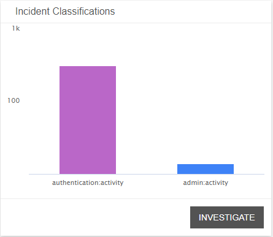
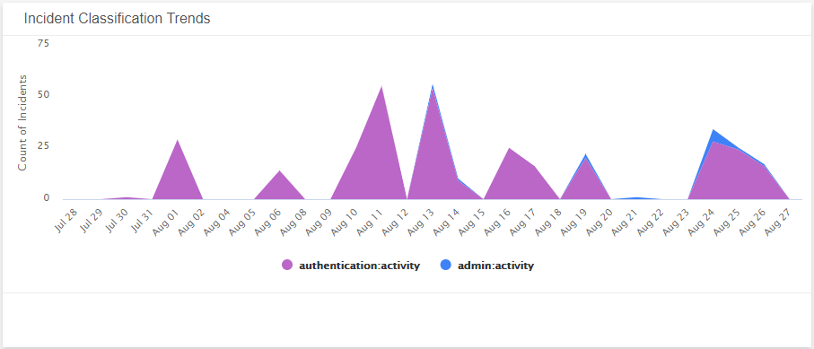
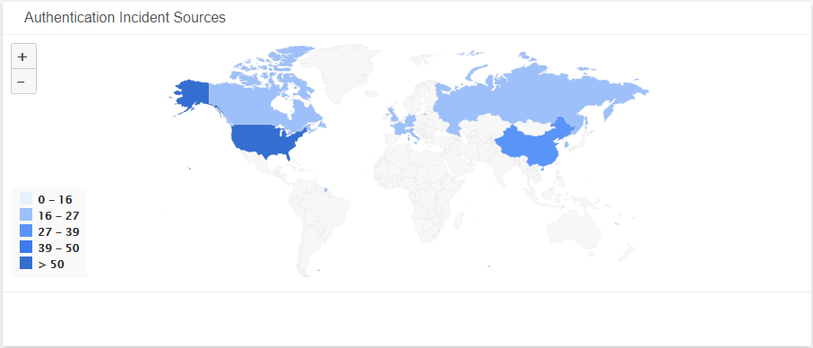
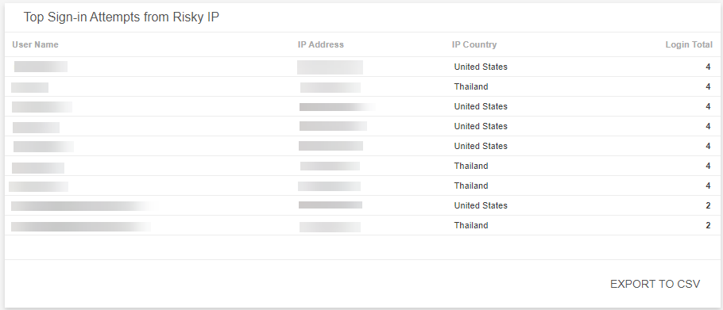
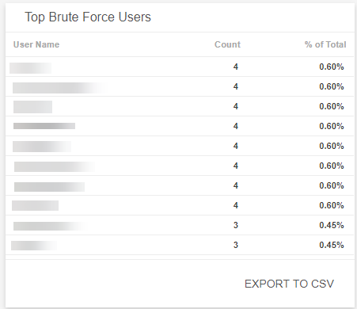
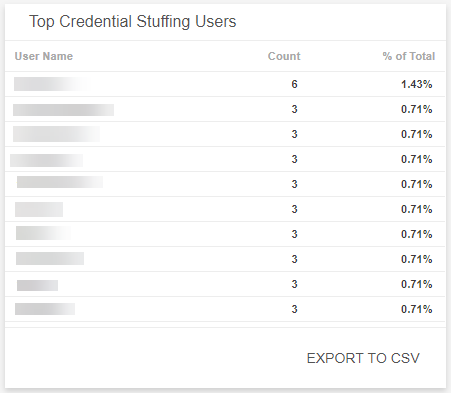
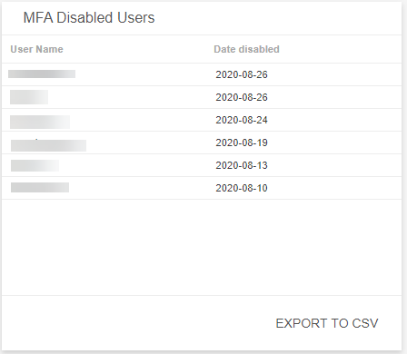

# Authentication Management Security

The Authentication Management Security dashboard provides a summary of your authentication security activity in your environment. Use this dashboard to gain insights into your user authentication attempts and login activity in your environment. To learn more about authentication security incidents, see [Authentication Application Security Incidents](../security-incidents.md).

## Access the Authentication Management Security dashboard

To access the Authentication Management Security  dashboard, in the Dashboards page, click the drop-down menu on the top left to see the list of available dashboards, and then click **Authentication Management Security**.

## Authentication Management Security visuals

For visuals with information in a list, you can click **EXPORT TO CSV** to export the data in CSV  format.

### Select date range

You can filter the date range you want to see in the visuals. Choose **7d**, **14d**, or **30d** to view data for the last 7 days, 14 days, or 30 days. You can also click the calendar icon () to select a customized date range with a specific start date.

### Authentication Incidents

This visual provides the total number of authentication incidents created during the selected date range.  Click **INVESTIGATE** to be redirected to the [Incidents](../incidents.md) page and see more information on those incidents.

### Incident Classification

This visual provides a bar graph for the distribution of the classification of authentication incidents during the selected date range. Click **INVESTIGATE** to be redirected to the [Incidents](../incidents.md) page and see more information on those incidents.

### Incident Classification Trends

This visual provides a graph of the daily  authentication incident classification pattern during the selected date range.

### Authentication Incident Sources

This visual provides map that presents the geolocation sources of user behavior anomalies where authentication incidents originate during the selected date range.

### Top Sign-in Attempts from Risky IP

This visual provides a list of the users with the highest number of logins from a risky IP with their IP address, IP country, and number of total logins during the selected date range.  Click **EXPORT TO CSV** to export the data in CSV format.

### Top Brute Force Users

This visual provides a list of the users with the highest number of brute force login attempts that Alert Logic observed with their count of attempts and percentage total during the selected date range.  Click **EXPORT TO CSV** to export the data in CSV format.

### Top Credential Stuffing Users

This visual provides a list of the users with the highest number of credential stuffing attempts that Alert Logic observed with their count of attempts and percentage total during the selected date range.  Click **EXPORT TO CSV** to export the data in CSV format.

### MFA Disabled Users

This visual provides a list of disabled multifactor authentication (MFA) and the date they were disabled during the selected date range.  Click **EXPORT TO CSV** to export the data in CSV format.

