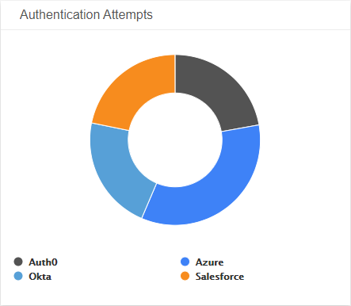
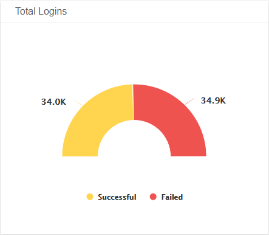
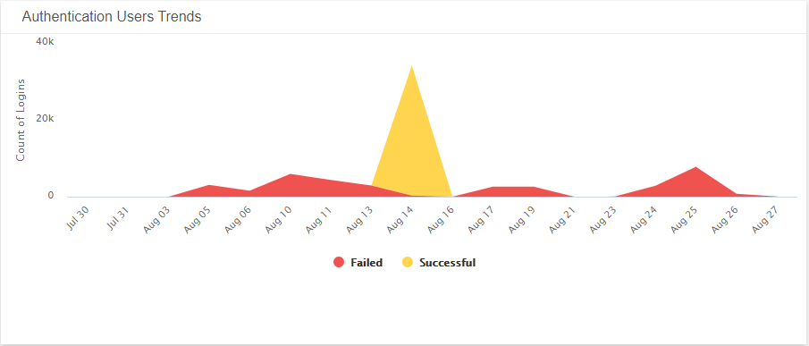
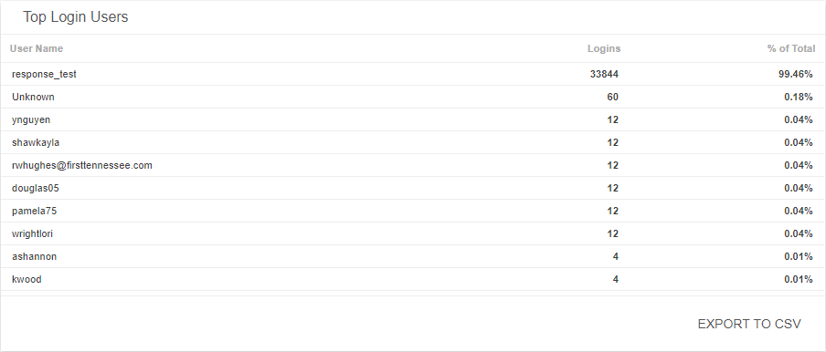

# Authentication Management Summary

The Authentication Management Summary dashboard provides a summary of your authentication management application security incidents in your environment. Use this dashboard to gain insights into your management efforts of your authentication security incidents, and focus your resources on threats and anomalies in user login trends and activities in your environment. To learn more about authentication security incidents, see [Authentication Application Security Incidents](../security-incidents.md).

## Access the Authentication Management Summary dashboard

To access the  Authentication Management Summary dashboard, in the Dashboards page, click the drop-down menu on the top left to see the list of available dashboards, and then click ** Authentication Management Summary**.

## Authentication Management Summary visuals

If available, you can click **INVESTIGATE** in the visuals to be redirected to the corresponding page in the Alert Logic console and to take further action if necessary. You can also hover over an item in a visual to see a tooltip with additional details. You can also click items in the visuals to be redirected to the corresponding page in the Alert Logic console and to take further action if necessary.  The corresponding page is already filtered with the data from the visual you clicked.

For visuals with information in a list, you can click **EXPORT TO CSV** to export the data in CSV  format.

### Select date range

You can filter the date range you want to see in the visuals. Choose **7d**, **14d**, or **30d** to view data for the last 7 days, 14 days, or 30 days. You can also click the calendar icon () to select a customized date range with a specific start date.

### Authentication Attempts

This visual provides a donut chart with the total number of failed and successful authentication attempts for each authentication application during the selected date range.

### Total Logins

This visual provides the total number of successful user logins and number of failed user logins during the selected date range.

### Authentication User Trends

This visual provides a graph of the daily trends for specific authentication actions during the selected date range.

### Top Login Users

This visual provides a list of the top ten users with the highest number of successful logins  and the percentage total of logins  from all authentication applications during the selected date range. Click **EXPORT TO CSV** to export the data in CSV format.

### Top Failed Login Users

This visual provides a list of the top ten users with the highest number of failed logins  and the percentage total of failed logins from all authentication applications during the selected date range.  Click **EXPORT TO CSV** to export the data in CSV format.

