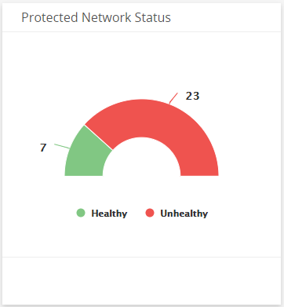
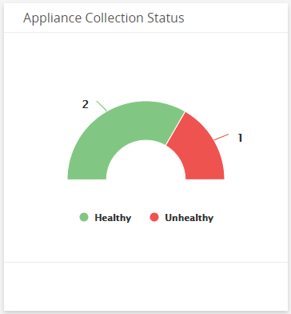
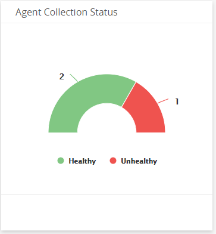
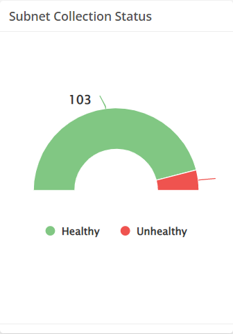
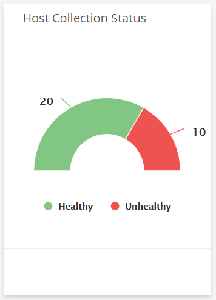
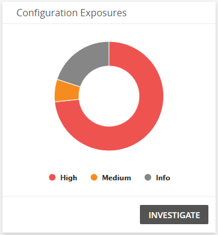
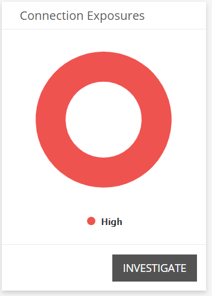
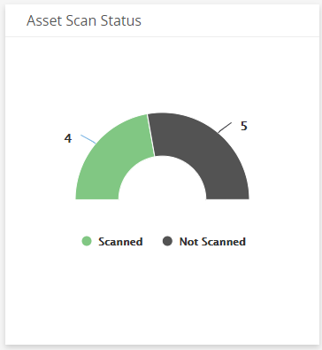
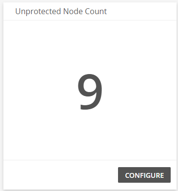

# Coverage and Health Dashboard

The Coverage and Health dashboard provides insight into statuses in your environment and your [entitlement usage](../reports/service/entitlement/entitlement-summary.md). Use this dashboard to improve network protection, fix configuration issues, and support optimization efforts in your environment. This dashboard includes visuals of the following data:

* Network and collection statuses
* Open configuration exposures
* Unprotected node count

The Coverage and Health Dashboard is a new dashboard that is part of the Dashboard feature. For more information about Dashboards, see [Dashboards](../dashboards.md).

## Access the Coverage and Health dashboard

To access the Coverage and Health dashboard, browse to  the Dashboards page in the Alert Logic console, click the drop-down menu on the top left to see the list of available dashboards, and then click  **Coverage and Health**.

## Coverage and Health visuals

If available, you can click **CONFIGURE** or **INVESTIGATE** in the visuals to be redirected to the corresponding page in the Alert Logic console and take further action if necessary. You can hover over an item in a visual to see a detailed level and a tooltip. Click an item to be redirected to the corresponding page in the Alert Logic console with the data already filtered for you.

### Protected Network Status

This visual provides the counts for networks that are healthy and  unhealthy, indicating whether the network has significant issues that Alert Logic identified. Click an item in the visual to see specific data related to that status in the [Health](../health.md) page.

### Appliance Collection Status

This visual provides the counts of appliance collections that are healthy and unhealthy, indicating whether the appliance collection has significant issues that Alert Logic identified. Click  an item  in the visual to see specific data related to that status in the [Health](../health.md) page.

### Agent Collection Status

This visual provides the counts of agent collections that are healthy and unhealthy, indicating whether the collection has significant issues that Alert Logic identified. Click an item in the visual to see specific data related to that status in the [Health](../health.md) page.

### Collector Collection Status

This visual provides the counts of [Application Registry](../../configure/application-registry.md) collectors that are healthy and unhealthy, indicating whether the collection has significant issues that Alert Logic identified. Click an item in the visual to see specific data related to that status in the [Health](../health.md) page.

### Subnet Collection Status

This visual provides the counts of collector subnets that are healthy and unhealthy, indicating whether the collection has significant issues that Alert Logic identified. Click an item in the visual to see specific data related to that status in the [Health](../health.md) page.

### Host Collection Status

This visual provides the counts of collector hosts that are healthy and unhealthy, indicating whether the collection has significant issues that Alert Logic identified. Click an item in the visual to see specific data related to that status in the [Health](../health.md) page.

### Configuration Exposures

This visual provides the count of open configuration exposures in each threat level. Click **INVESTIGATE** to be redirected to the [Health](../health.md) page to see more information on the exposures in the visual, or click an item to see data specific to that exposure in the Health page.

### Connection Exposures

This visual provides the count of open connection exposures in each threat level. Click **INVESTIGATE** to be redirected to the [Health](../health.md) page to see more information on the exposures in the visual, or click an item to see data specific to that exposure in the Health page.

### Asset Scan Status

This visual provides the status of scanned assets in your environment.

### Unprotected Node Count 

This visual provides the count of nodes that Alert Logic discovered in your environment that do not have a protection level selected. To configure the [protection level](../../get-started/subscriptions-addons.md) of your networks, click **CONFIGURE**. You will be redirected to the [Deployments](../../get-started/deployments.md) page.

