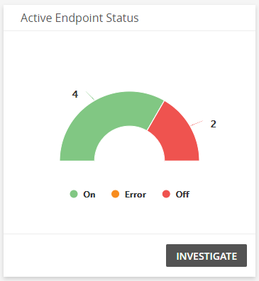
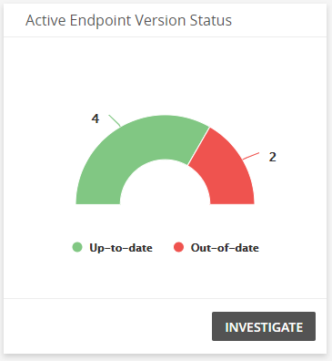
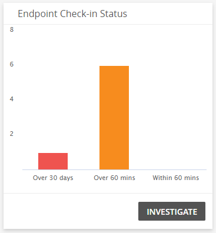
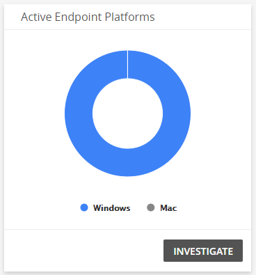
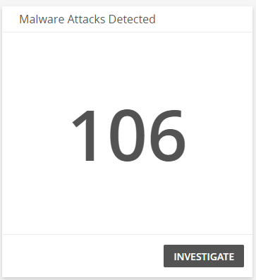
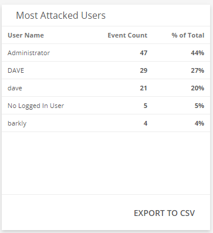
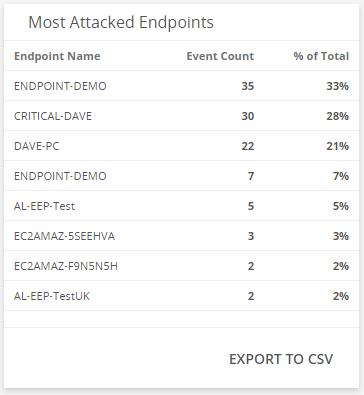
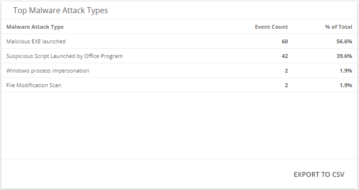
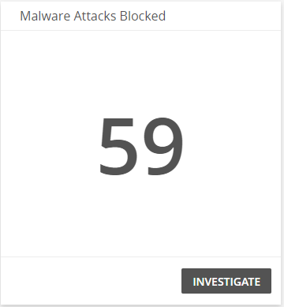
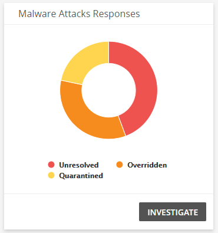

# Endpoint Protection Dashboard

The Endpoint Protection dashboard provides a summary of your endpoint activity in your environment. Use this dashboard to gain insights into your endpoint activity, learn about attack patterns, and analyze the effectiveness of your current threat and incident management process.  This dashboard includes visuals of the following data:

* Endpoint statuses
* Active platforms
* Malware attacks detected
* Most attacked users and endpoints
* Top attack types
* Blocked attacks
* Responses to attacks

The Endpoint Protection is a new dashboard that is part of the Dashboard feature. For more information about Dashboards, see [Dashboards](../dashboards.md).

The Endpoint Protection dashboard feeds from data in your Extended Endpoint Protection product. You must have an endpoint agent installed to a workstation or server to get value from this dashboard. To learn more about configuring Extended Endpoint Protection, see [Get Started with Alert Logic Extended Endpoint Protection](../../get-started/endpoint-protection.md).

## Access the Endpoint Protection dashboard

To access the Endpoint Protection dashboard, in the Alert Logic console, in the Dashboards page, click the drop-down menu on the top left to see the list of available dashboards, and then click **Endpoint Protection**.

## Endpoint Protection visuals

If available, you can click **INVESTIGATE** in the visuals to be redirected to the corresponding page in the Alert Logic console and to take further action if necessary. You can also hover over an item in a visual to see a tooltip with additional details. You can also click items in the visuals to be redirected to the corresponding page in the Alert Logic console and to take further action if necessary.  The corresponding page is already filtered with the data from the visual you clicked.

For visuals with information in a list, you can click **EXPORT TO CSV** to export the data in CSV  format.

### Active Endpoint Status

This visual provides the count of endpoints in each status. Click **INVESTIGATE** to be redirected to the [Extended Endpoint Protection](../../get-started/endpoint-protection.md) page and see more information on all the endpoint statuses in the visual, or click on an item to see specific data related to that status.

### Active Endpoint Version Status

This visual provides the count of endpoints that are up-to-date or out-of-date. Click **INVESTIGATE** to be redirected to the [Extended Endpoint Protection](../../get-started/endpoint-protection.md) page and see more information on all the endpoint statuses in the visual, or click on an item to see specific data related to that status.

### Endpoint Check-in Status

This visual provides a bar graph of when the endpoints last checked in. Click **INVESTIGATE** to be redirected to the [Extended Endpoint Protection](../../get-started/endpoint-protection.md) page and see more information on all the endpoint check-in statuses in the visual, or click on an item to see specific data related to that check-in status.

### Active Endpoint Platforms

This visual provides the count of the active endpoint platforms that are being used. Click **INVESTIGATE** to be redirected to the [Extended Endpoint Protection](../../get-started/endpoint-protection.md) page and see more information on all the endpoint platforms in the visual, or click on an item to see specific data related to that platform.

### Malware Attacks Detected

This visual provides the counts of malware attacks Alert Logic detected. Click **INVESTIGATE** to be redirected to the  [Extended Endpoint Protection](../../get-started/endpoint-protection.md) page and see more information on the malware attacks.

### Most Attacked Users

This visual provides a list of users that have the highest event count and the percentage of total attacks. Click **EXPORT TO CSV** to export the data in CSV format.

### Most Attacked Endpoints

This visual provides a list of most attacked endpoints that have the highest event count, and the percentage of total attacks. Click **EXPORT TO CSV** to export the data in CSV format.

### Top Malware Attack Types

This visual provides a list of malware attack types that have the highest event count, and the percentage of total attacks. Click **EXPORT TO CSV** to export the data in CSV format.

### Malware Attacks Blocked

This visual provides the count of malware attacks that Alert Logic blocked. Click **INVESTIGATE** to be redirected to the [Extended Endpoint Protection](../../get-started/endpoint-protection.md) page to see more information on the blocked attacks.

### Malware Attacks Responses

This visual provides the count of malware attacks that Alert Logic responded to. Click **INVESTIGATE** to be redirected to the [Extended Endpoint Protection](../../get-started/endpoint-protection.md) page and see more information on the responses to these attacks.

