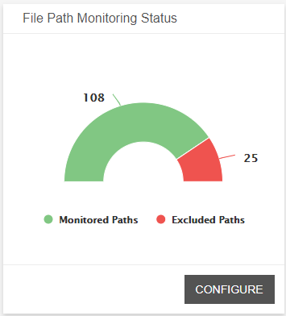
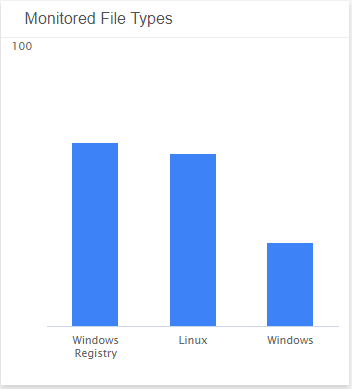
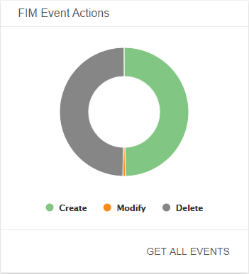
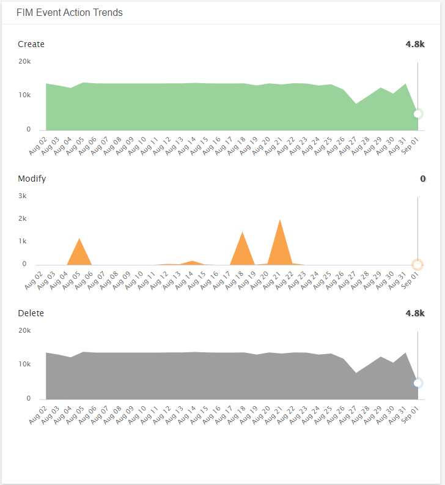
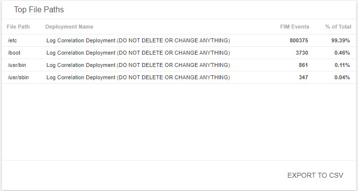
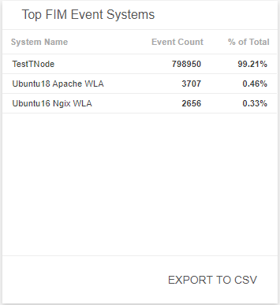

# File Integrity Monitoring Dashboard 

The File Integrity Monitoring dashboard provides a summary of your file monitoring activity and issues found in your environment. Use this dashboard to gain insights into your file monitoring scope and status, focus your resources on specific systems or users that may need further investigation, and identify patterns or anomalies in your environment. To learn more about File Integrity Monitoring (FIM), see [File Integrity Monitoring ](../../configure/file-integrity-monitoring.md).

The File Integrity Monitoring Dashboard is only offered to Managed Detection and Response Professional customers. To learn more about Alert Logic subscriptions, see [Get Started with Alert Logic   Subscriptions and Add-ons](../../get-started/subscriptions-addons.md).

## Access the File Integrity Monitoring dashboard

To access the File Integrity Monitoring dashboard, in the Dashboards page, click the drop-down menu on the top left to see the list of available dashboards, and then click **File Integrity Monitoring**.

## FIM visuals

You can click **CONFIGURE** in the visuals to be redirected to the corresponding page in the Alert Logic console and to take further action if necessary. You can also hover over an item in a visual to see a tooltip with additional details. You can also click items in the visuals to be redirected to the corresponding page in the Alert Logic console and to take further action if necessary.  The corresponding page is already filtered with the data from the visual you clicked.

For visuals with information in a list, you can click **EXPORT TO CSV** to export the data in CSV  format.

### Select date range

You can filter the date range you want to see in the visuals. Choose **7d**, **14d**, or **30d** to view data for the last 7 days, 14 days, or 30 days. You can also click the calendar icon () to select a customized date range with a specific start date.

### File Path Monitoring Status

This visual provides the current count of monitored paths and the count of excluded paths. Click **CONFIGURE** to be redirected to the Deployments page, and then select the deployment for which you want to view FIM.

### Monitored File Types

This visual provides a bar graph for the current count of monitored files paths in each system file.

### FIM Event Actions

This visual provides a donut chart for the count of actions (create, modified, delete) performed on the files you are monitoring during the specified date range. Click **GET ALL EVENTS**, and then click the download icon () to export data of all of the actions in CSV format.

The CSV download contains a maximum of 500,000 events. If you need to export more events, change the date range  to return narrow results within certain time periods.

### FIM Event Actions Trends

This visual provides a graph for the actions you performed on the files during the specified date range.

### Top File Paths

This visual provides a list of the file paths associated with the highest event count in your deployment and the total percentage of events. Click **EXPORT TO CSV** to export the data in CSV format.

### Top FIM Events Systems

This visual provides a list of the systems associated with the highest event count and the percentage of total events. Click **EXPORT TO CSV** to export the data in CSV format.

