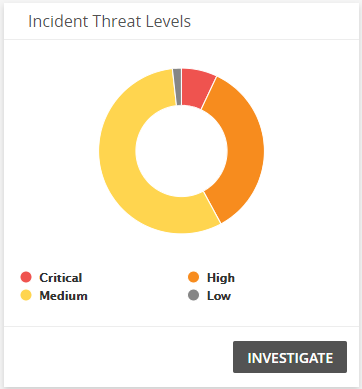
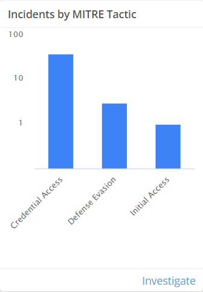
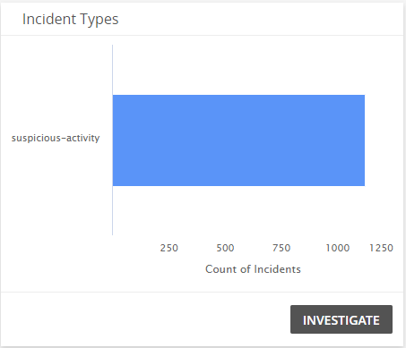
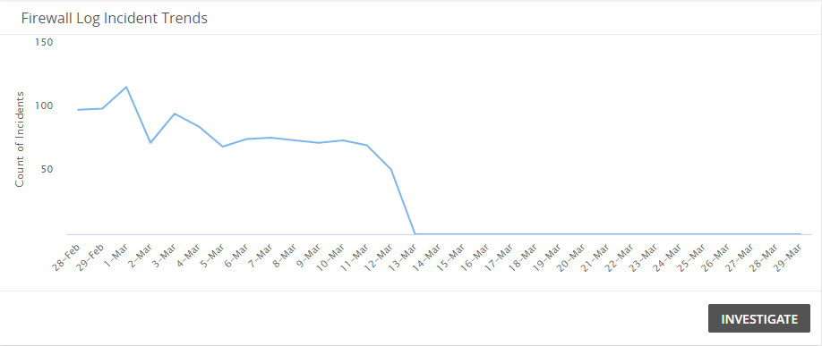
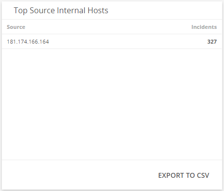

# Firewall Log Security Analysis Dashboard

The Firewall Log Security Analysis dashboard provides insights into the firewall security incidents generated from analyzing firewall logs in  your environment. Use this dashboard to quickly identify the types of firewall incidents that were detected,  analyze the effectiveness of your current firewall incident response efforts, and learn about emerging threats. This dashboard includes visuals of the following data:

* Count and percentages of incident threat level categories
* Count of incidents in each classification
* Trend of firewall security incidents over time
* List of source internal hosts with the most incidents
* List of targeted internal hosts with the most incidents

The Firewall Log Security Analysis Dashboard is only offered to Managed Detection and Response Professional customers. You must have your firewall applications and log collection instances configured to see data in this dashboard. To learn more about firewall incidents, see [Firewall Incidents and Log Configuration](../firewall-incidents.md).

## Access the Firewall Log Security Analysis dashboard

To access the Firewall Log Security Analysis dashboard, in the Alert Logic console, in the Dashboards page, click the drop-down menu on the top left to see the list of available dashboards, and then click **Firewall Log Security Analysis**.

## Firewall Log Security Analysis visuals

If available, you can click **INVESTIGATE** in the visuals to be redirected to the corresponding page in the Alert Logic console and to take further action if necessary. You can also hover over an item in a visual to see a tooltip with additional details. You can also click items in the visuals to be redirected to the corresponding page in the Alert Logic console and to take further action if necessary.  The corresponding page is already filtered with the data from the visual you clicked.

For visuals with information in a list, you can click **EXPORT TO CSV** to export the data in CSV  format.

### Select date range

You can filter the date range you want to see in the visuals. Choose **7d**, **14d**, or **30d** to view data for the last 7 days, 14 days, or 30 days. You can also click the calendar icon () to select a customized date range with a specific start date.

### Incident Threat Levels

This visual provides the count of open firewall security incidents in each threat level that were created over the course of the selected date range. Click **INVESTIGATE** to be redirected to the [Incidents](../incidents.md) page to see more information on the firewall security incident threat levels in the visual, or click on an item to see specific data related to that incident threat level.

### Incidents by MITRE Tactic

This visual provides a bar chart with the number of incidents by MITRE Tactic. Click **INVESTIGATE** to be redirected to the [Incidents](../incidents.md) page and see more information on all the MITRE Tactics in the visual, or click on an item to see specific data related to that MITRE Tactic.

### Incident Types

This visual provides a bar graph with the number of open firewall security incidents in each classification type over the course of the selected date range.  Click **INVESTIGATE** to be redirected to the [Incidents](../incidents.md) page to see more information on the firewall security incident types in the visual, or click on an item to see specific data related to that incident type.

### Firewall Log Incident Trends

This visual provides a line graph that shows the firewall incident trend count over the course of the selected date range. Click **INVESTIGATE** to be redirected to the [Incidents](../incidents.md) page to see more information on the firewall security incident for the selected date range, or click on an item to see specific data related to that date.

### Top Source Internal Hosts

This visual provides a list of the source internal hosts with the most firewall security incidents over the course of the selected date range. Click **EXPORT TO CSV** to export the data in CSV format.

### Top Targeted Internal Hosts

This visual provides a list of the targeted internal hosts with the most firewall security incidents over the course of the selected date range. Click **EXPORT TO CSV** to export the data in CSV format.

