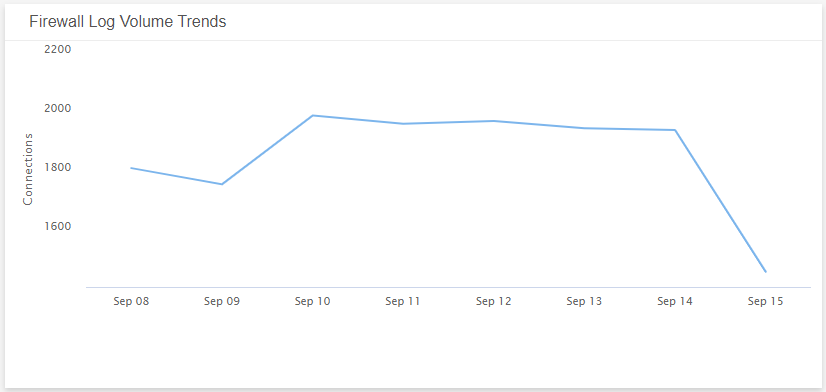
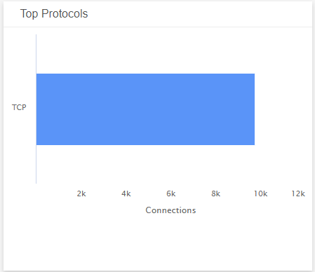
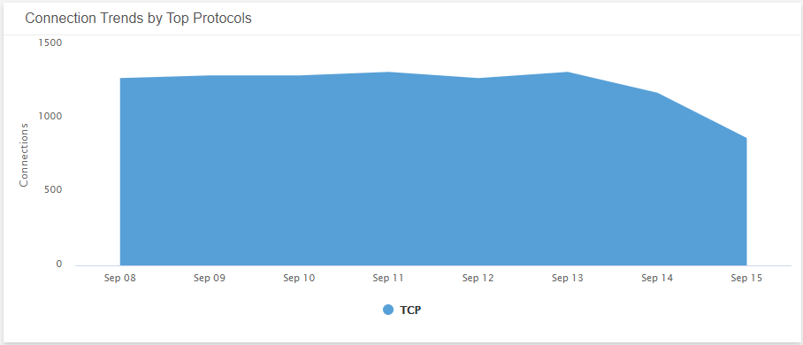
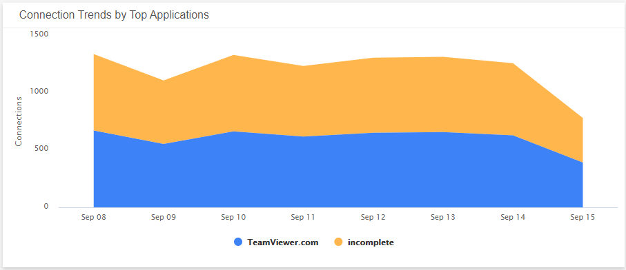
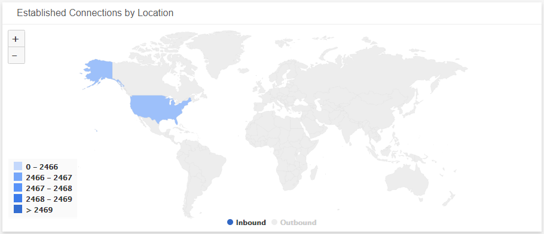
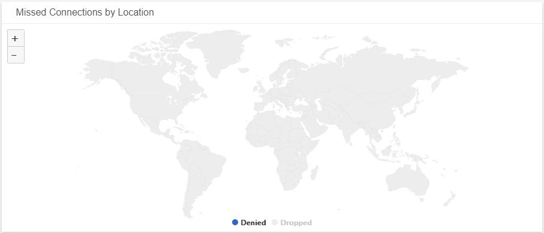
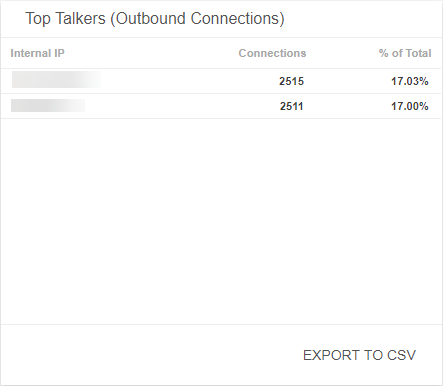
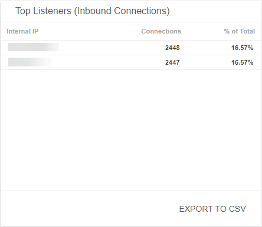

# Firewall Log Traffic Analysis Dashboard

The Firewall Log Traffic Analysis dashboard provides insights into the firewall traffic  connections found from analyzing firewall logs in  your environment. Use this dashboard to identify the types of connections that were detected,  trends that require  further investigations, and learn about emerging threats. This dashboard includes visuals of the following data:

* Trend of firewall traffic over time
* Top protocol connections and application connections
* Trends of connection  by top protocols and applications
* List of connections
* Maps of established and missed connection locations

The Firewall Log Traffic Analysis Dashboard is only offered to Managed Detection and Response Professional customers. You must have your firewall applications and log collection instances configured to see data in this dashboard. To learn more about firewall incidents, see [Firewall Incidents and Log Configuration](../firewall-incidents.md).

## Access the Firewall Log Traffic Analysis dashboard

To access the Firewall Log Traffic Analysis dashboard, in the Alert Logic console, in the Dashboards page, click the drop-down menu on the top left to see the list of available dashboards, and then click **Firewall Log Traffic Analysis**.

## Firewall Log Traffic Analysis visuals

For visuals with information in a list, you can click **EXPORT TO CSV** to export the data in CSV  format.

### Select date range

You can filter the date range you want to see in the visuals. Choose **7d**, **14d**, or **30d** to view data for the last 7 days, 14 days, or 30 days. You can also click the calendar icon () to select a customized date range with a specific start date.

### Firewall Log Volume Trends

This visual provides a line graph that shows the volume trend of the daily connection count over the course of the selected date range.

### Top Protocols

This visual provides a bar graph with the number of top protocol connections established during the selected date range.

### Top Applications

This visual provides a bar graph with the number of top application connections established during the selected date range.

### Connection Trends by Top Protocols

This visual provides a graph that shows the daily trend of the top protocol connections count over the course of the selected date range.

### Connection Trends by Top Applications 

This visual provides a graph that shows the daily trend of the top application connections count over the course of the selected date range.

### Established Connections by Location

This visual provides a map that presents the countries where connections were established.

### Missed Connections by Location

This visual provides a map that presents the countries where connections were denied or dropped.

### Top Talkers (Outbound Connections)

This visual provides a list of outbound connections detected during the selected date range. The list is organized by internal IP address, connection count, and the total percentage of the outbound connections. Click **EXPORT TO CSV** to export the data in CSV format.

### Top Listeners (Inbound Connections)

This visual provides a list of inbound connections detected during the selected date range. The list is organized by internal IP address, connection count, and the total percentage of the inbound connections. Click **EXPORT TO CSV** to export the data in CSV format.

