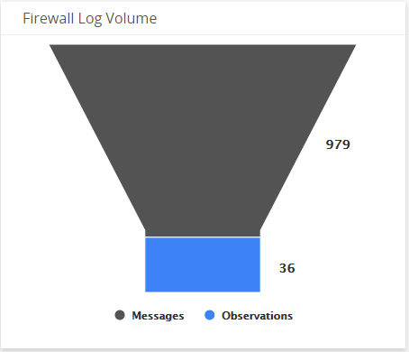
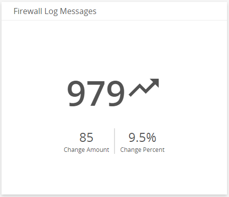
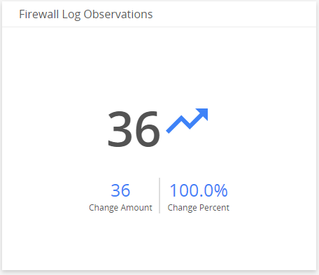
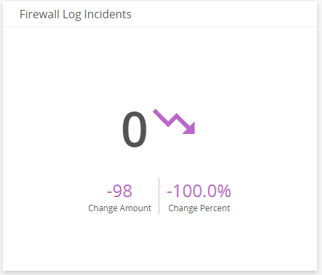
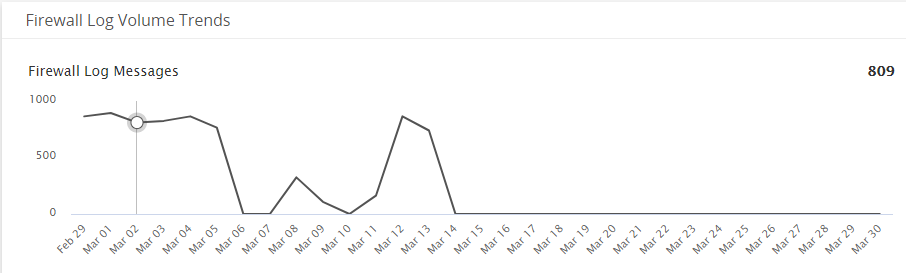
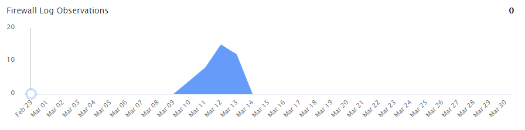
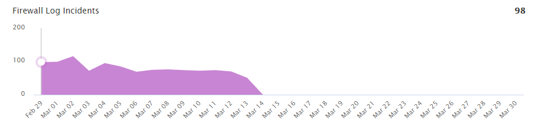

# Firewall Log Volume Analysis Dashboard

The Firewall Log Volume Analysis dashboard provides insights into the volume of firewall log messages, firewall security incidents and observations in your environment. Use this dashboard to quickly identify  patterns, trends and anomalies that require immediate response or further investigations. This dashboard includes visuals of the following data:

* Change amount and percentage of firewall log messages, observations and incidents
* Trends for firewall log messages, observations, and incidents

Alert Logic identifies relevant security information derived from one or multiple sources from the log data collected, which are referred to as observations. For more information about observations, see [Firewall observations](../firewall-incidents.md#Firewall-observations).

The Firewall Log Volume Analysis Dashboard is only offered to Managed Detection and Response Professional customers. You must have your firewall applications and log collection instances configured to see data in this dashboard. To learn more about firewall incidents, see [Firewall Incidents and Log Configuration](../firewall-incidents.md).

## Access the Firewall Log Volume Analysis dashboard

To access the Firewall Log Volume Analysis dashboard, in the Alert Logic console, in the Dashboards page, click the drop-down menu on the top left to see the list of available dashboards, and then click **Firewall Log Volume Analysis**.

## Firewall Log Volume Analysis visuals

You can hover over an item in a visual to see a tooltip with additional details.

### Select date range

You can filter the date range you want to see in the visuals. Choose **7d**, **14d**, or **30d** to view data for the last 7 days, 14 days, or 30 days. You can also click the calendar icon () to select a customized date range with a specific start date.

### Firewall Log Volume 

This visual provides the current total volume for your firewall log messages, observations, and security incidents.

### Firewall Log Messages 

This visual provides the change amount and percentage of total number of firewall log messages over the course of the selected date range.

### Firewall Log Observations

This visual provides the change amount and percentage of total number of firewall log observations over the course of the selected date range.

### Firewall Log Incidents

This visual provides the change amount and percentage of total number of firewall security incidents over the course of the selected date range.

### Firewall Log Messages Trends

This visual, under Firewall Log Volume, provides a line graph that shows the firewall log messages trend count in over the course of the selected date range.

### Firewall Log Observations Trends

This visual,  under Firewall Log Volume, provides a graph that shows the firewall log observations trend count in over the course of the selected date range.

### Firewall Log Incidents Trends

This visual,  under Firewall Log Volume, provides a graph that shows the firewall security incidents trend count in over the course of the selected date range.

