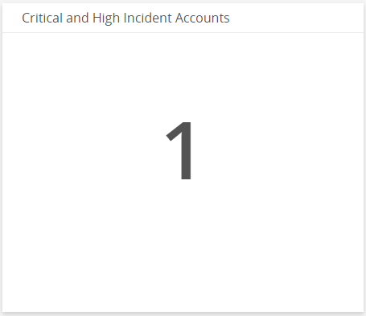
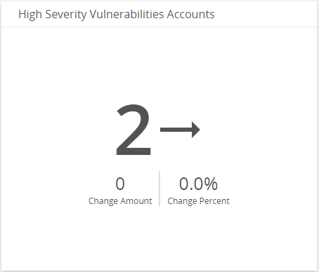
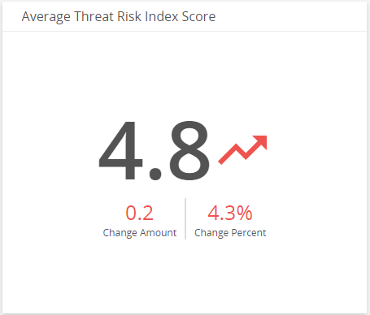
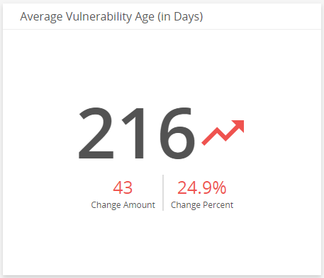
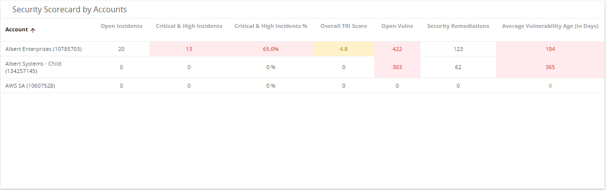
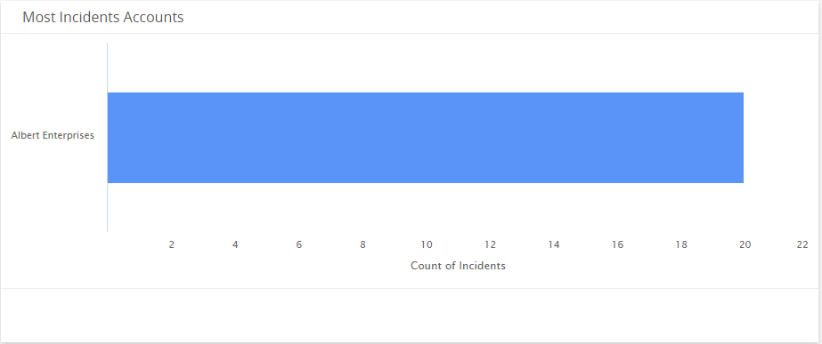
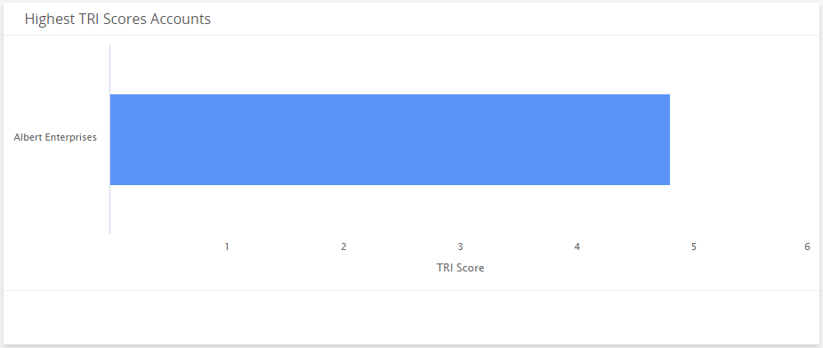
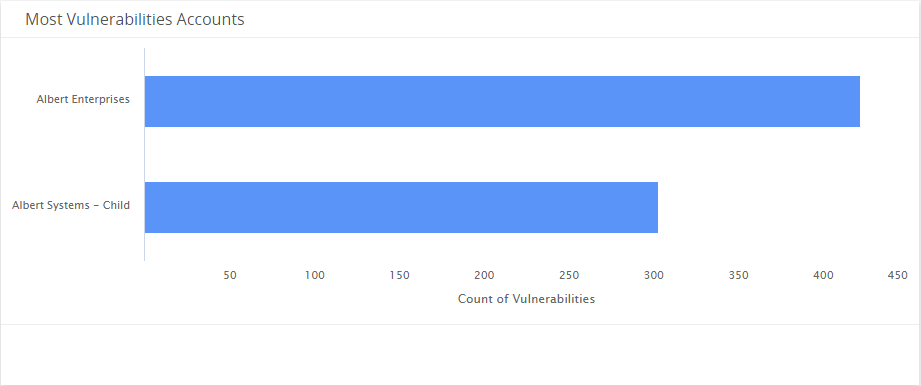
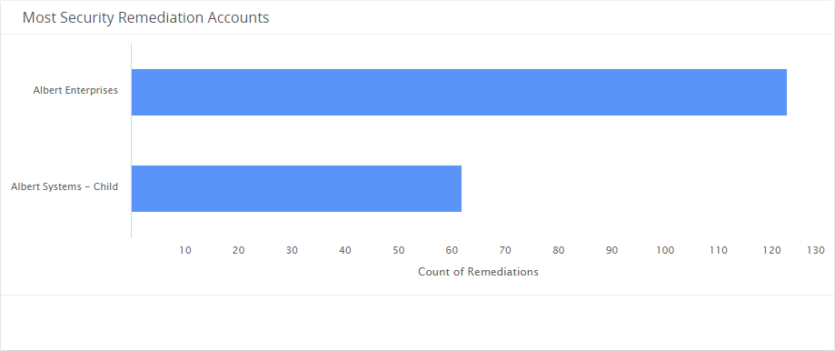

# Managed Accounts Security Summary Dashboard

The Managed Accounts Security Summary dashboard provides insights into the recent security status of the accounts you manage. The visuals includes information about incidents, vulnerabilities, Threat Risk Index (TRI) scores, and security remediations. Use this dashboard to quickly identify risky accounts, patterns, and anomalies that require immediate response or further investigations. This dashboard includes visuals of the following data:

* Total accounts with critical and high incidents
* Change amount and percentage of current high severity vulnerabilities, the average TRI score, and the average age of vulnerabilities
* Scorecards of incidents and vulnerabilities data for each account
* Top accounts with the most incidents, highest TRI scores, most vulnerabilities, and most security remediations

The Managed Accounts Security Summary Dashboard is an additional dashboard only offered to partners and customers with managed accounts. To learn about the other dashboard offered to partners and customers with managed accounts, see [Managed Accounts Health Summary Dashboard](managed-accounts-security-summary.md/managed-accounts/managed-accounts-health-summary.md). For customers with single accounts, see [Dashboards](../../dashboards.md).

## Access the Managed Accounts Security Summary dashboard

To access the Managed Accounts Security Summary dashboard, in the Alert Logic console, you need to opt into the Dashboards beta. When you see the pop-up message about Dashboards, click **TRY NEW DASHBOARDS**. In the Dashboards page, click the drop-down menu on the top left to see the list of available dashboards, and then click **Managed Accounts Security Summary**.

## Managed Accounts Security Summary visuals

You can also hover over an item in a visual to see a tooltip with additional details.

You can also click items in the visuals to be redirected to the corresponding page in the Alert Logic console and to take further action if necessary.  The corresponding page is already filtered with the data from the visual you clicked.

### Select date range

You can filter the date range you want to see in the visuals. Choose **7d**, **14d**, or **30d** to view data for the last 7 days, 14 days, or 30 days. You can also click the calendar icon () to view data of up to 90 days from the current date.

### Critical and High Incident Accounts

This visual provides the total number of your accounts with open critical and high incidents for the selected date range.

### High Severity Vulnerability Accounts

This visual provides the change amount and percentage of total number of your accounts with open high severity vulnerabilities over the course of the selected date range.

### Average Threat Risk Index Score

This visual provides the change amount and percentage of the average TRI score of your accounts combined over the course of the selected date range

### Average Vulnerability Age (in Days)

This visual provides the change amount and percentage of the average days that vulnerabilities went unaddressed in your accounts combined over the course of the selected date range.

### Security Scorecard by Accounts

This color-coded table provides the following data for each of your account:

* Count of current open incidents that were created over the course of the selected date range
* Count of current open incidents with critical and high threat level that were created over the course of the selected date range
* Percentage of current open incidents with critical and high threat level that were created over the course of the selected date range
* Current overall TRI scores
* Count of current open security vulnerabilities or exposures
* Count of current open security remediations
* Count of average number of days vulnerabilities went unaddressed

### Most Incidents Accounts

This visual provides a bar graph that shows the top accounts with the most open incidents that were created over the course of the selected date range.

###  Highest TRI Scores Account

This visual provides a bar graph that shows the top accounts with the highest current TRI scores over the course of the selected date range.

###  Most Vulnerabilities Accounts

This visual provides a bar graph that shows the top accounts with the most current open vulnerabilities.

### Most Security Remediations Accounts

This visual provides a bar graph that shows the top accounts with the most open security remediations.

