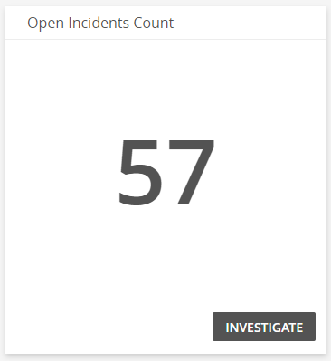
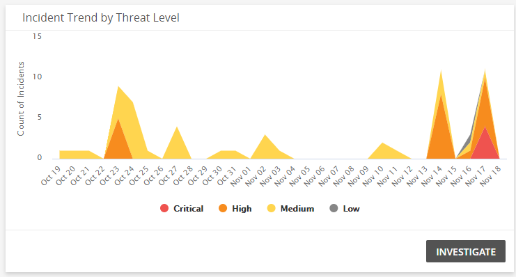
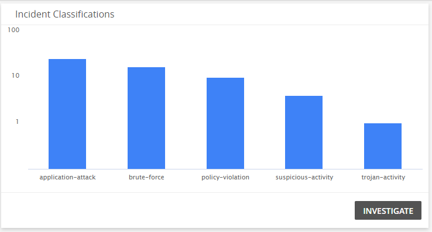
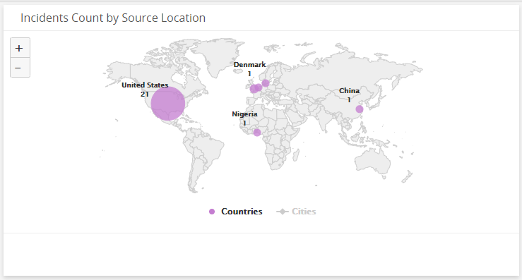
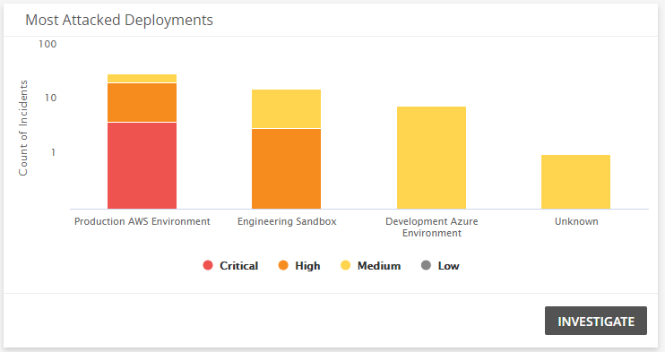
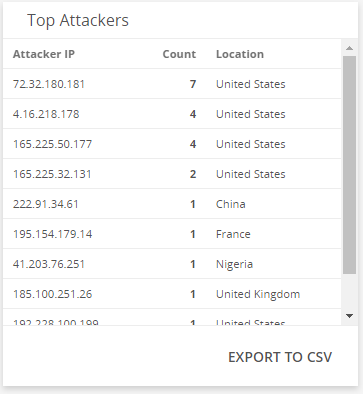
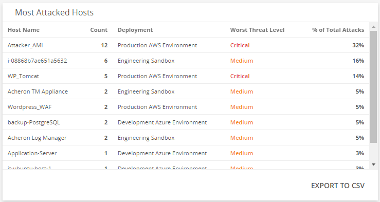

# Threat Summary Dashboard

The Threat Summary dashboard provides visibility into threats and incidents in your environment. Use this dashboard to gain insights into the types of incidents that were detected,  analyze the effectiveness of your current incident response efforts, and learn about emerging threats. This dashboard includes visuals of the following data:

* Open incidents
* Incident threat levels and trend
* Classification of your incidents
* Countries where incidents originate
* Most attacked deployments and hosts
* Top attackers
* Peer incident classification comparison

The Threat Summary is a new dashboard that is part of the Dashboard feature. For more information about Dashboards, see [Dashboards](../dashboards.md).

## Access the Threat Summary dashboard

To access the Threat Summary dashboard, in the Alert Logic console,   in the Dashboards page, click the drop-down menu on the top left to see the list of available dashboards, and then click **Threat Summary**.

## Threat Summary visuals

If available, you can click **INVESTIGATE** in the visuals to be redirected to the corresponding page in the Alert Logic console and to take further action if necessary. You can also hover over an item in a visual to see a tooltip with additional details. You can also click items in the visuals to be redirected to the corresponding page in the Alert Logic console and to take further action if necessary.  The corresponding page is already filtered with the data from the visual you clicked.

For visuals with information in a list, you can click **EXPORT TO CSV** to export the data in CSV  format.

### Open Incidents Count 

This visual provides the count of open incidents that Alert Logic identified in your environment. Click **INVESTIGATE** to go to the [Incidents](../incidents.md) page and see more information on those incidents.

### Incident Threat Levels

This visual provides the count of incidents in each threat level. Click **INVESTIGATE** to be redirected to the [Incidents](../incidents.md) page to see more information on all the incident threat levels in the visual, or click on an item to see specific data related to that incident threat level.

### Incident Trend by Threat Level

This visual provides a graph that presents the incident, and threat level of those incidents, over the course of the last 30 days.  Click **INVESTIGATE** to be redirected to the [Incidents](../incidents.md) page to see more information on all incident threat levels in this visual, or click on an item to see specific data related to that incident.

### Incidents by MITRE Tactic

This visual provides a bar chart with the number of incidents by MITRE Tactic. Click **INVESTIGATE** to be redirected to the [Incidents](../incidents.md) page and see more information on all the MITRE Tactics in the visual, or click on an item to see specific data related to that MITRE Tactic.

### Incident Classifications

This visual provides a bar chart with the number of incidents in each classification type. Click **INVESTIGATE** to be redirected to the [Incidents](../incidents.md) page and see more information on all the classifications in the visual, or click on an item to see specific data related to that classification.

### Incident Count by Source Location

This visual provides map that presents the countries where incidents originate.

### Most Attacked Deployments

This visual provides a bar graph that shows the count of incidents, and threat levels of those incidents, in each of your deployments. Click **INVESTIGATE** to be redirected to the [Incidents](../incidents.md) page and see more information on all the incidents in the visual, or click on an item to see specific data related to that incident threat level or deployment in the Incidents page.

### Top Attackers

This visual provides a list of top attackers seen the most in your environment. Click **EXPORT TO CSV** to export the data in CSV format.

### Most Attacked Hosts

This visual provides a list of hosts that have the most incidents, the worst threat level on each host, and the percentage of total attacks. Click **EXPORT TO CSV** to export the data in CSV format.

### Peer Incident Classification

This visual provides a bar and line graph that presents a comparison of where you stand based on attacks by classification percentage.

