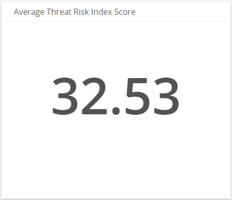
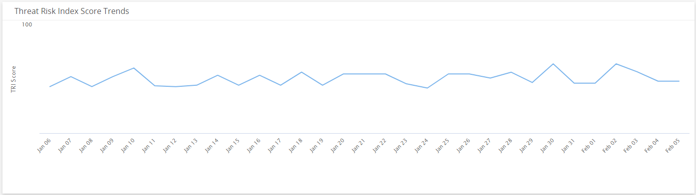
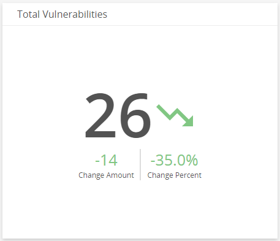
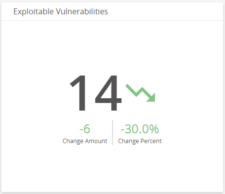
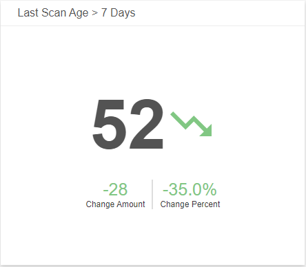
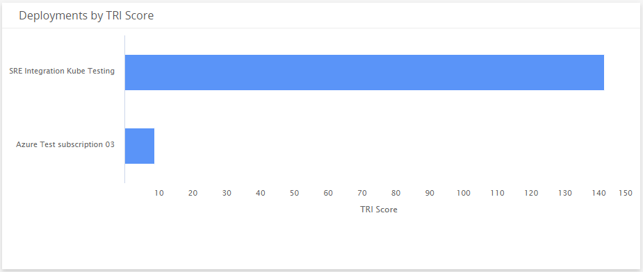
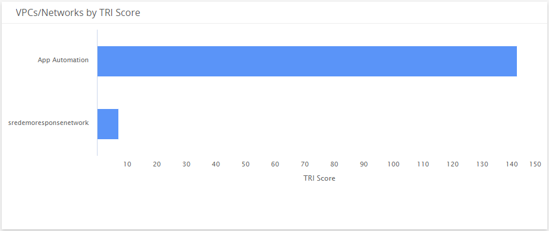
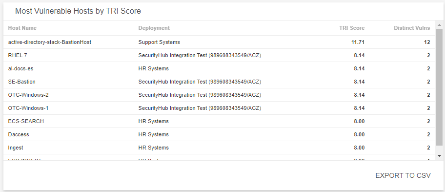
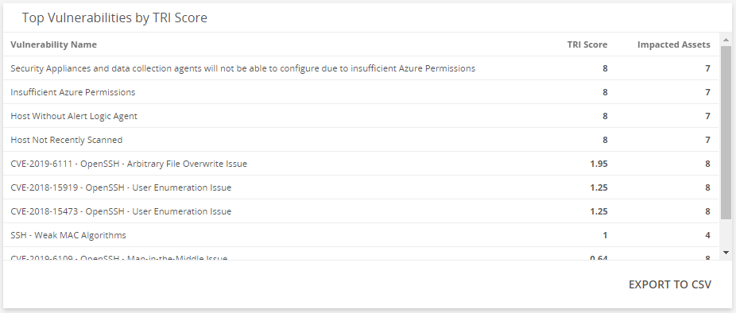

# Threat Risk Index Summary

The Threat Risk Index (TRI) Summary dashboard provides insights into the recent TRI scores of your environment, including the average TRI score and trends, vulnerabilities changes, last scanned asset changes, and TRI scores by assets. This dashboard includes visuals of the following data:

* Current average TRI score
* Trend of TRI scores
* Current total vulnerabilities count with change amount and percentage
* Current last scanned assets count with change amount and percentage
* TRI scores for deployments, and VPCs/networks
* Most vulnerable hosts by TRI score
* Top vulnerabilities by TRI score

For more about how Alert Logic calculates TRI scores, see [Threat Risk Index Score Factors](../TRI-score-factors.md).

The Threat Risk Index Summary Dashboard is a new dashboard that is part of the Dashboard feature. For more information about Dashboard, see [Dashboards](../dashboards.md).

## Access the TRI Summary dashboard

In the Dashboards page, click the drop-down menu on the top left to see the list of available dashboards, and then click **TRI Summary**.

## TRI visuals

If available, you can click **INVESTIGATE** in the visuals to be redirected to the corresponding page in the Alert Logic console and to take further action if necessary. You can also hover over an item in a visual to see a tooltip with additional details. You can also click items in the visuals to be redirected to the corresponding page in the Alert Logic console and to take further action if necessary.  The corresponding page is already filtered with the data from the visual you clicked.

For visuals with information in a list, you can click **EXPORT TO CSV** to export the data in CSV  format.

### Select date range

You can filter the date range you want to see in the visuals. Choose **7d**, **14d**, or **30d** to view information for the past seven days, 14 days, or 30 days. You can also click the calendar icon () to select a customized date range.

### Average Threat Risk Index Score

This visual provides the average TRI score of your environment for the selected date range.

### Threat Risk Index Score Trends 

This visual provides the daily TRI score trend for the selected date range.

### Total Vulnerabilities

This visual provides the change amount and percentage of total vulnerabilities identified in your environment over the course of the selected date range.

### Exploitable Vulnerabilities 

This visual provides the change amount and percentage of vulnerabilities with known exploit codes available in your environment over the course of the selected date range.

### Internet-facing Vulnerabilities 

This visual provides the change amount and percentage of vulnerabilities found as a result of external scans in your environment over the course of the selected date range.

### Last Scanned

This visual provides the change amount and percentage of assets that were last scanned over seven days in your environment over the course of the selected date range.

### Deployments by TRI Score

This visual provides a bar graph that shows the TRI score in each of your deployments for the selected date range.

### VPCs/Networks by TRI Score

This visual provides a bar graph that shows the TRI score in each of your VPCs or networks for the selected date range.

### Most Vulnerable Hosts by TRI Score

This visual provides a list of hosts that have the highest TRI score and the most impacted assets for the selected date range. Click **EXPORT TO CSV** to export the data in CSV format.

### Top Vulnerabilities by TRI Score

This visual provides a list of vulnerabilities that have the highest TRI score and the most impacted assets for the selected date range. Click **EXPORT TO CSV** to export the data in CSV format.

