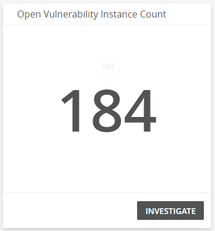
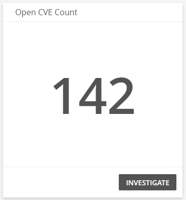
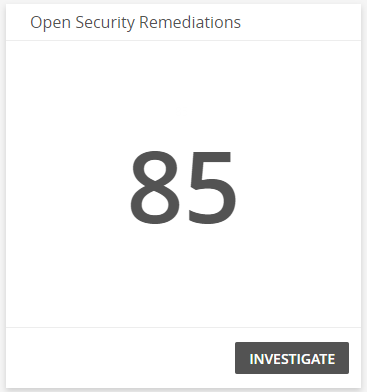
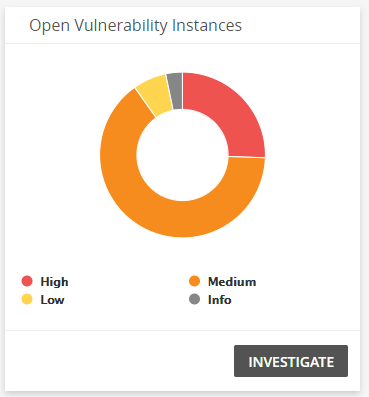
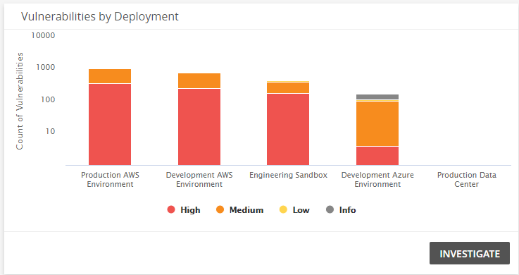
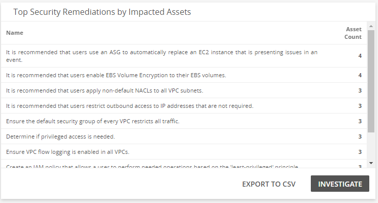
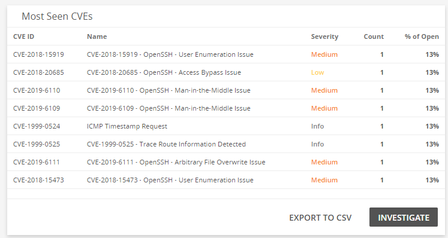
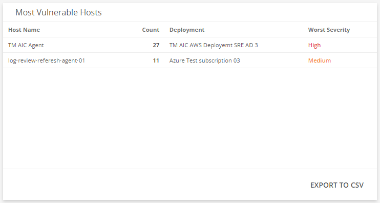

# Vulnerability Summary Dashboard

The Vulnerability Summary dashboard provides visibility into vulnerable software and cloud infrastructure in your environment. Use this dashboard to gain insights into the effectiveness of your current vulnerability management efforts, learn about new vulnerabilities and emerging threats, help prioritize your remediation plans, and focus on specific areas in your environment. This dashboard includes visuals of the following data:

* Vulnerability, exposure, and remediation counts
* Vulnerability severity trends
* Vulnerabilities by threat levels
* Vulnerabilities by deployments
* Top security remediations
* Most seen exposures
* Most vulnerable hosts

The Vulnerability Summary is a new dashboard that is part of the Dashboard feature. For more information about Dashboards, see [Dashboards](../dashboards.md).

## Access the Vulnerability Summary dashboard

To access the Vulnerability Summary dashboard,  in the Alert Logic console, in the Dashboards page, click the drop-down menu on the top left to see the list of available dashboards, and then click **Vulnerability Summary**.

## Vulnerability Summary visuals

If available, you can click **INVESTIGATE** in the visuals to be redirected to the corresponding page in the Alert Logic console and to take further action if necessary. You can also hover over an item in a visual to see a tooltip with additional details. You can also click items in the visuals to be redirected to the corresponding page in the Alert Logic console and to take further action if necessary.  The corresponding page is already filtered with the data from the visual you clicked.

For visuals with information in a list, you can click **EXPORT TO CSV** to export the data in CSV  format.

### Open Vulnerability Instance Count

This visual provides the count of individual vulnerabilities that Alert Logic identified from each of your assets in your environment. Click **INVESTIGATE** to be redirected to the [Exposures](../exposures.md) page and see more information on the open vulnerabilities.

### Open CVE Count

This visual provides the count of open exposures that Alert Logic identified in your environment. Click **INVESTIGATE** to be redirected to the [Exposures](../exposures.md) page and see more information on the open exposures.

### Open Security Remediations 

This visual provides the count of open security remediations that Alert Logic identified in your environment. Click **INVESTIGATE** to be redirected to the [Exposures](../exposures.md) page and see more information on the open security remediations.

### Vulnerability Trend by Severity 

This visual provides a line graph that shows the vulnerability trend count in each threat level over the course of the last 30 days.

### Open Vulnerability Instances

This visual provides the count of open vulnerabilities in each threat level. Click **INVESTIGATE** to be redirected to the [Exposures](../exposures.md) page and see more information on all the open vulnerabilities and threat levels in the visual, or click on an item to see specific data related to that vulnerability.

### Vulnerabilities by Deployment

This visual provides a bar graph that shows the count of vulnerabilities, and the threat levels of those vulnerabilities, in each of your deployments. Click **INVESTIGATE** to be redirected to the [Exposures](../exposures.md) page and see more information on all the vulnerabilities in the visual, or click on an item to see specific data related to that deployment or vulnerability category in the Exposures page.

### Top Security Remediations by Impacted Assets

This visual provides a list of security remediations that has the potential to resolve the most issues based on the number of impacted assets it affects. Click **INVESTIGATE** to be redirected to the [Exposures](../exposures.md) page and see more information on all remediations in the list, or click on an item to see specific data related to that remediation. Click **EXPORT TO CSV** to export the data in CSV format.

### Most Seen CVEs

This visual provides a list of exposures seen the most in your environment. Click **INVESTIGATE** to be redirected to the [Exposures](../exposures.md) page and see more information on all exposures in the list, or click on an item to see specific data related to that exposure. Click **EXPORT TO CSV** to export the data in CSV format.

### Most Vulnerable Hosts

This visual provides a list of hosts with the most  vulnerabilities and highest severity rankings. Click **INVESTIGATE** to be redirected to the [Exposures](../exposures.md) page and see more information on all the hosts in the list, or click on an item to see specific data related to that host. Click **EXPORT TO CSV** to export the data in CSV format.

