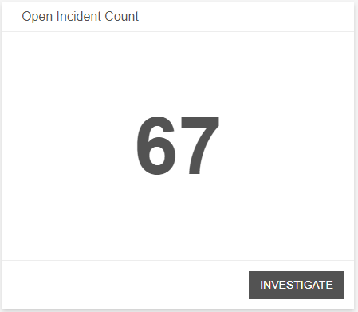
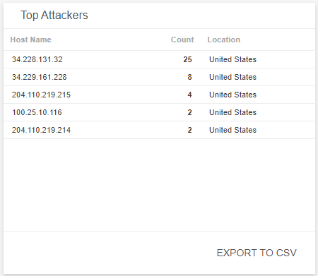
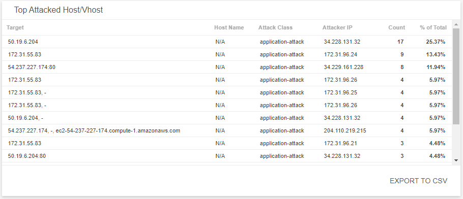
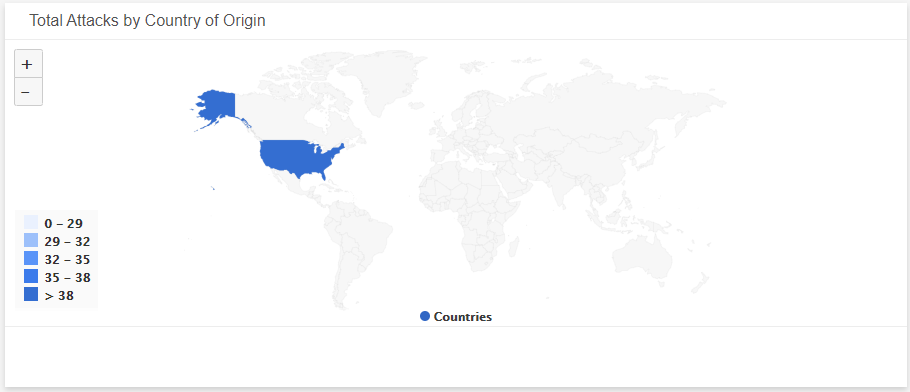
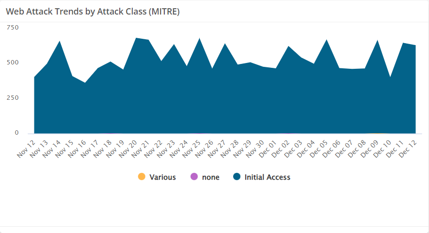
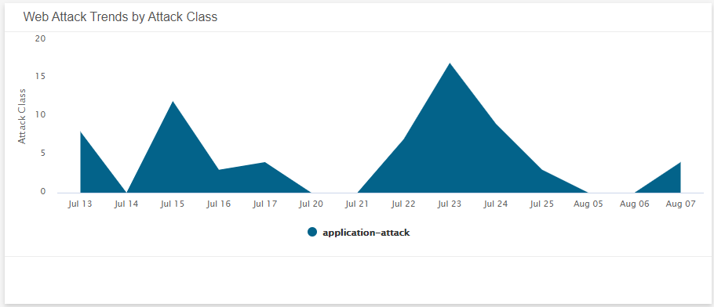
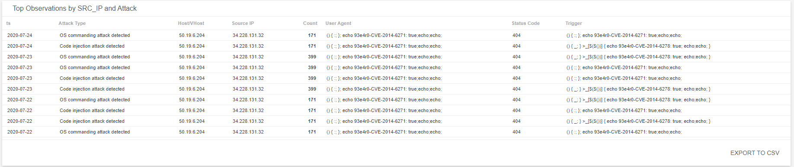

# Web Log Analytics Dashboard

The Web Log Analytics (WLA) dashboard provides visibility into threats, incidents, and observations detected from your WLA instance in your environment. Use this dashboard to gain insights into the types of incidents detected in your environment,  analyze the effectiveness of your current incident response efforts, and learn about emerging threats. This dashboard includes visuals of the following data:

* Count of open WLA incidents
* List of most seen attackers
* List of most attacked hosts
* Countries where WLA incidents originate
* Web attack trends
* Top observations

The Web Log Analytics (WLA) Dashboard is only offered to Managed Detection and Response Professional customers. You must have WLA deployed and flat file logs configured to see data in this dashboard. To learn more about WLA, see [About Alert Logic Web Log Analytics (WLA)](../../get-started/about-wla.md).

## Access the Web Log Analytics dashboard

To access the  Authentication Management Summary dashboard, in the Dashboards page, click the drop-down menu on the top left to see the list of available dashboards, and then click **Web Log Analytics**.

## Web Log Analytics visuals

If available, you can click **INVESTIGATE** in the visuals to be redirected to the corresponding page in the Alert Logic console and to take further action if necessary. You can also hover over an item in a visual to see a tooltip with additional details. You can also click items in the visuals to be redirected to the corresponding page in the Alert Logic console and to take further action if necessary.  The corresponding page is already filtered with the data from the visual you clicked.

For visuals with information in a list, you can click **EXPORT TO CSV** to export the data in CSV  format.

### Select date range

You can filter the date range you want to see in the visuals. Choose **7d**, **14d**, or **30d** to view data for the last 7 days, 14 days, or 30 days. You can also click the calendar icon () to select a customized date range with a specific start date.

### Open Incidents Count 

This visual provides the count of WLA incidents that Alert Logic identified in your environment during the selected date range. Click **INVESTIGATE** to be redirected to the [Incidents](../incidents.md) page to see more information on the open WLA incidents.

### Top Attackers

This visual provides a list of known attacking IPs, their count, and location, which were seen the most in your environment during the selected date range. Click **EXPORT TO CSV** to export the data in CSV format.

### Top Attacked Host/Vhost

This visual provides a list of hosts and virtual hosts that were identified as the most targeted based on their incident count during the selected date range. The list is organized by target, host name, attacker class and attacker IP, incident count and total percentage of attacks. Click **EXPORT TO CSV** to export the data in CSV format.

### Incident Count by Source Location

This visual provides a map that presents the countries where WLA incidents originate during the selected date range.

### Web Attack Trends by MITRE Tactic

This visual provides a bar chart with the number of incidents by MITRE Tactic. Click **INVESTIGATE** to be redirected to the [Incidents](../incidents.md) page and see more information on all the MITRE Tactics in the visual, or click on an item to see specific data related to that MITRE Tactic.

### Web Attack Trends by Attack Class

This visual provides a graph that presents the daily trends of incidents and their classification during the selected date range.

### Top Observations by SRC_IP and Attack

This visual provides a list of observations derived daily from WLA log data during the selected date range. The list is organized by date, attack type, host/virutal host attacked, source IP, count of attacks, user agent, status code, and trigger. Click **EXPORT TO CSV** to export the data in CSV format.

