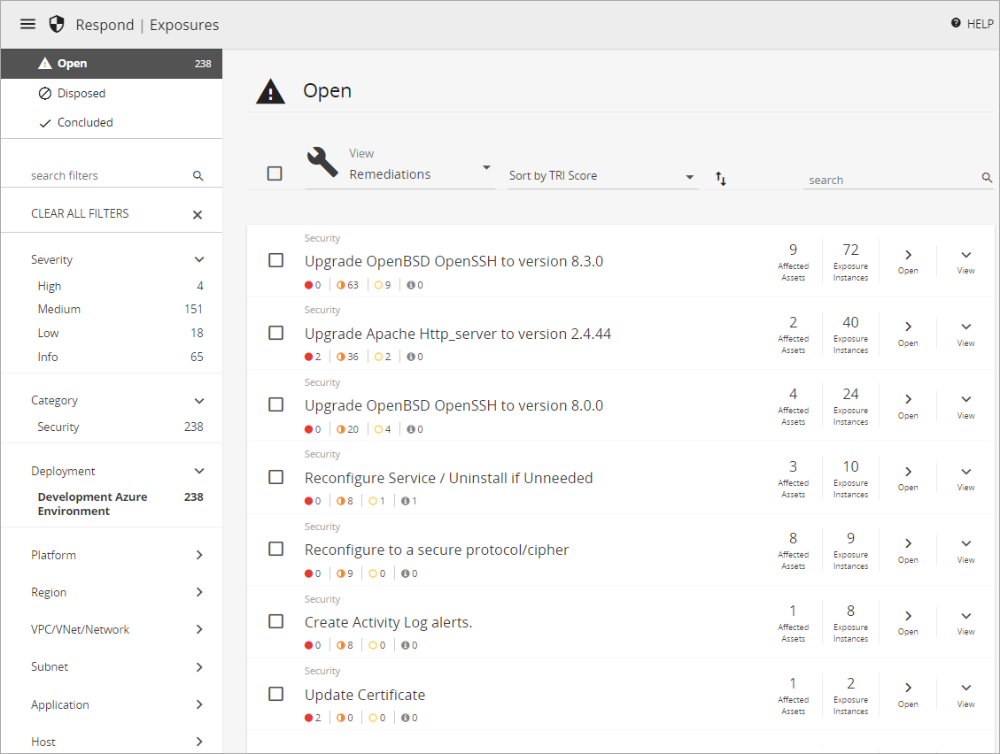

# Exposures

Exposures has replaced the Remediations page as part of Dashboards. Exposures has the same functionality as Remediations, but with improvements.

The Exposures page, listed under **Respond** in the Alert Logic console, provides you with the information you need to analyze and address exposures in your environment. The page lists exposures found in your deployments and provides details about the exposure, evidence, and affected assets. The page also lists remediations to resolve an exposure or a group of exposures.

You can access a filtered Exposures page that shows you relevant issues in your deployments from links in visuals in the [Vulnerability Summary Dashboard](dashboard/vulnerability-summary.md).

To help you investigate security exposures in your environment, the Exposures page organizes information in the following lists:

* [Open list](#Openlist)—Lists security exposures and suggested remediation details
* [Disposed list](#Disposedlist)—Lists disposed security exposures
* [Concluded list](#Concludedlist)—Lists concluded security exposures

After you investigate one or more exposures and suggested remediations, you can dispose or conclude the exposure.

## Exposure severity

The Exposures page uses colors and icons to help you easily identify the severity of the exposures. Alert Logic categorizes severity of exposures with the following icons and colors:

*  High
*  Medium
*  Low
*  Info

## Exposure categories

The Exposures page lists several exposure categories:

* Security
* External
* IAM Access Analyzer

    The Health page lists exposures related to configuration or connection problems that disrupt access to Alert Logic product capabilities. For more information, see [Health](health.md).    ### Security exposures

Security exposures are issues related to vulnerabilities identified in an internal scan, such as misconfigured cloud configurations or known Common Vulnerabilities and Exposures (CVE) vulnerabilities that can lead to a breach if not addressed. The following are examples of security exposures:

* Unrestricted Inbound Access
* Root account not using Virtual MFA
* CVE-2020-9490 - Apache HTTP Server - Denial of Service Issue

### External exposures

External exposures are issues related to  vulnerabilities on your Internet-facing devices during an external scan, such as a vulnerability that can be exploited from the Internet and lead to a breach if not addressed. The following are examples of external exposures:

* SSL certificate chain of authority cannot be verified
* SSL does not use strong cryptography
* HTTP Strict Transport Security (HSTS) is missing

### IAM Access Analyzer exposures

IAM Access Analyzer is an AWS feature that identifies potential security risks by analyzing any trust policies applied to an IAM role. If that role is accessible by another AWS account or by a user that is not in your AWS account, the analyzer generates a finding. The following are examples of IAM Access Analyzer exposures:

* IAM Access Analyzer S3 Bucket Finding
* IAM Access Analyzer KMS Bucket Finding
* IAM Access Analyzer Full Administrative Access

## Filters

On the Exposures page, you can select a status filter  in the left navigation to narrow the list of items:

* **Open**—Click **Open** to view a list of open exposures or remediations in your deployments. The number indicates the total amount of open exposure instances  that match selected filters.
* **Disposed**—Click **Disposed** to view items for each deployment that were disposed and removed from the Open list. Disposed means that a user in your organization assessed an item and indicated that it does not need to be resolved for a specified time period.
* **Concluded**—Click **Concluded** to view items for each deployment that are considered resolved.

You can also select one or more additional filters such as Category, Severity, or Platform to further narrow your list of items. Filter by Deployment to see additional asset filters such as Network, Subnet, Host, Application, and Tag.

The number of exposure instances associated with a filter appears next to the name. The active filter is in bold format. Select one or more of the active filters to remove them. You can also select **CLEAR ALL FILTERS** to remove all the active filters.

## Sort by

Sort options vary according to the selected list and view. To change how a list is sorted, click **Sort by** and then choose another option. To switch between descending or ascending order, click the order icon ( ).

## Open list

The Exposures page opens to the list of Open remediations by default. The Remediations view lists open remediations for the filters you select. Remediations provide a recommended action to resolve one or multiple exposures. You can also  view exposures, which list the individual, open exposures found in your environment. From the list, you can view more details about an item, perform immediate actions to remediate the exposure, and export listed details.

### Remediations view

To view the list of remediations, click **Remediation** in the **View** list. Remediations provide recommended actions to resolve one exposure or a group of exposures. Addressing a remediation can usually resolve multiple exposures.

Remediations are sorted by [TRI score](TRI-score-factors.md) in descending order. You can also  sort  by number of exposure instances, number of affected assets, or name and change to ascending or descending order. Each listed item includes the following information:

* Exposure category
* Severity counts for the exposures affected by the remediation
* Number of affected assets
* Number of exposure instances affected by the remediation

    The numbers of affected assets and exposure instances often match. The number of exposure instances is greater in some cases, such as when an exposure is detected on more than one port on an affected asset.    #### View more information

In the list of remediations, you can click **View** to see additional summary information about the remediation, including the list of exposures and their severity and Common Vulnerability Scoring System (CVSS) score,  account, and affected deployments. If more than four exposures are affected by the remediation, open the remediation to see the full exposure list.

#### Open the remediation detail page

In the list of remediations, you can click **Open** to open the detail page for the remediation. To open the remediation detail page in a separate browser tab, hold down **Ctrl** or **Command**, and then click **Open**.

The page includes details about the recommended remediation action, a list of exposures, affected assets, and evidence  for each exposure instance. You can dispose of the remediation or mark it as concluded from the detail page.

### Exposures view

To view the list of exposures, click **Exposures** in the **View** list. One exposure can affect multiple assets, and multiple exposures can be associated with one remediation. You can resolve an exposure by addressing the recommended remediation action and  also resolve all of the exposures associated with that remediation.

Exposures are sorted by severity in descending order. You can also  sort  by number of exposure instances, number of affected assets, or name and change to ascending or descending order.

Each listed item includes the following information:

* Exposure category
* Severity rating, icon, and CVSS  score
* Number of affected assets
* Number of exposure instances

    The numbers of affected assets and exposure instances often match. The number of exposure instances is greater in some cases, such as when an exposure is detected on more than one port on an affected asset.    #### View more information

In the list of exposures, you can click **View** to see additional summary information about the exposure, including the account, affected deployments, CVE ID, and CVSS score.

#### Open the exposure detail page

In the list of exposures, you can click **Open** to open the detail page for the exposure.  To open the exposure detail page in a separate browser tab, hold down **Ctrl** or **Command**, and then click **Open**.

The page includes the following information:

* CVE ID
* Description of the exposure
* Severity, CVSS score, and metrics
* Common Weakness Enumeration (CWE)
* Impact of the exposure
* Resolution details with recommendations
* Affected assets
* Evidence  for each exposure instance

You can dispose of the exposure or mark it as concluded from this page. You can also go to the remediation from this page to resolve the exposure and other similar exposures.

### Dispose

If you want to defer resolving an exposure or remediation for a certain period or forever, you can mark an item as disposed. Disposing an item moves it from the Open list to the Disposed list. Alert Logic excludes the calculated risk of disposed item vulnerabilities from the overall risk of your deployment.

After a disposal period expires, Alert Logic no longer hides the item, which will appear again in the Open list.

You can click the restore icon () on a disposed item to review items and restore them to the Open list.

To dispose a remediation or exposure:

1. In the Open list, click **Open** next to the item you want to dispose to open the exposure or remediation detail page.
To open the exposure or remediation detail page in a separate browser tab, hold down **Ctrl** or **Command**, and then click **Open**.9. (Optional) On the exposure or remediation detail page, select or clear filters on the left to include more assets or narrow the list to a single asset.
10. In the Affected Assets area, select one or more assets for which you want to dispose an exposure or remediation. You can click the selection box () above the list to select all listed items.
11. (Optional) If you selected all assets and also want to include all assets added later that match the selected filters, select the **All Future Assets** check box.  If you leave the check box cleared, only the current assets listed are selected for the dispose action.
12. Click the dispose icon ().
13. In the Dispose Remediation or Dispose Exposure slideout panel, choose an assessment type:
   * Acceptable Risk
   * False Positive
   * Compensating Control—A compensating control is in place
15. Select how long you want to dispose the remediation or exposure:
   * A Day
   * 1 Week
   * 1 Month
   * 3 Months
   * 6 Months
   * 1 Year
   * Forever
17. (Optional) Add notes about your assessment.
18. Click **DISPOSE**.

To dispose exposures or remediations in bulk:

You can dispose one or more exposures directly from the Open list. This method disposes exposure instances for all assets currently affected by selected items. If you want to select specific assets or if you want to select future assets that match selected filters, see the previous steps instead.

1. (Optional) Filter the Open list to select exposures or remediations you want to dispose.
2. In the Open list, select one or more items or click the selection box () above the list to select all listed items.
3. Click the dispose icon (), and then complete the Dispose Remediation or Dispose Exposure slideout panel as described in the previous procedure.

### Conclude

After you remediate an exposure, you can mark the item as concluded. Concluding an item moves it from the Open list to the Concluded list. Alert Logic verifies the exposure no longer exists during the next scan.

You can click the restore icon () on a concluded item to review items and restore them to the Open list.

To conclude a remediation or exposure:

1. In the Open list, click **Open** next to the item you want to dispose to open the exposure or remediation detail page.
To open the exposure or remediation detail page in a separate browser tab, hold down **Ctrl** or **Command**, and then click **Open**.9. (Optional) In the exposure or remediation detail page, select or clear filters on the left to include more assets or narrow the list to a single asset.
10. In the Affected Assets area, select one or more assets for which you want to conclude an exposure or remediation. You can click the selection box () above the list to select all listed items.
11. Leave **All Future Assets** cleared. This setting applies only to the dispose action.
12. (Optional) If you selected all current assets and also want to include all assets added later that match the selected filters, select the **All Future Assets** check box.  If you leave the check box cleared, only the current assets listed are selected for the conclude action.
13. Click the conclude icon ().
14. Click **CONCLUDE** to confirm.

To conclude exposures or remediations in bulk:

You can conclude one or more exposures directly from the Open list. This method disposes exposure instances for all assets currently affected by selected items. If you want to select specific assets or if you want to select future assets that match selected filters, see the previous steps instead.

1. (Optional) Filter the Open list to select exposures or remediations you want to dispose.
2. In the Open list, select one or more items or click the selection box () above the list to select all listed items.
3. Click the conclude icon ().
4. Click **CONCLUDE** to confirm.

## Disposed list

The Disposed list includes items removed from the Open list after a user from your organization assessed the exposure and indicated it does not need to be resolved for a certain time period or forever. You can view disposed items by remediations or exposures.

Disposed items are sorted by the date the dispose action expires in ascending order. You can also  sort  by other criteria and change to ascending or descending order. In addition to exposure or remediation details, each listed item includes information about when the item was disposed, who disposed it, and when the dispose action expires. For more information, see [Dispose](#Dispose), [Remediations view](#Remediationsview), or [Exposures view](#Exposuresview).

## Concluded list

The Concluded list includes exposures that are considered resolved. You can view concluded items by remediations or exposures. In addition to exposure or remediation details, each listed item includes information about when the item was concluded and who concluded it. For more information, see [Conclude](#Conclude), [Remediations view](#Remediationsview), or [Exposures view](#Exposuresview).

## Export details

You can export one or more items on the Exposures page to a CSV file to view later or to share with others in your organization. From any list, you can click the selection box () above the list to select all listed items. If you hover over or click the icon or selection box next to an item, you can select it for a single export.
