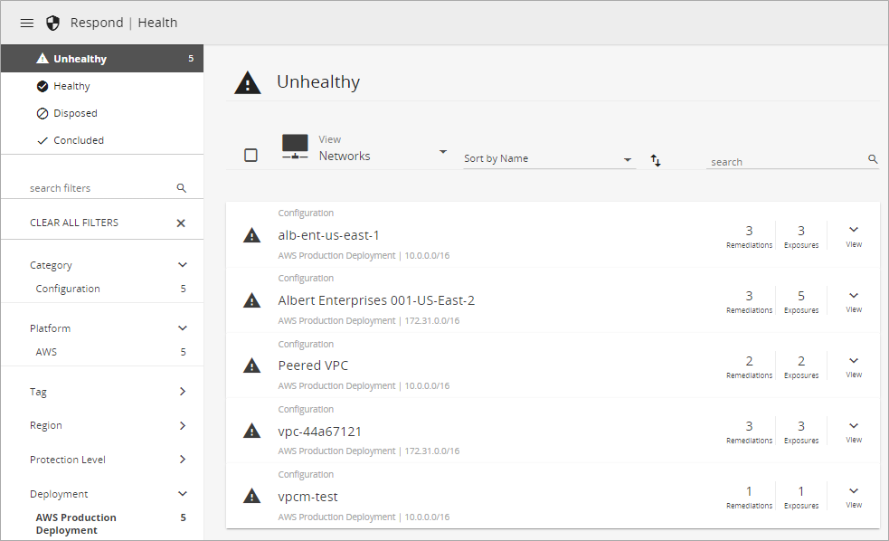
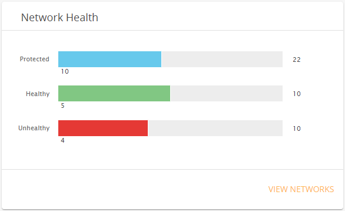
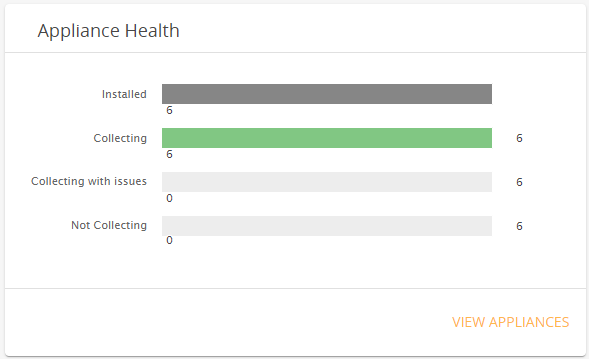
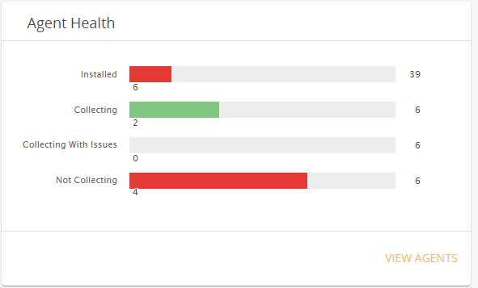

# Health

The Health page, listed under **Respond** in the Alert Logic console,  provides detailed information about your environment to ensure that your deployments are configured correctly. The Health page provides the information you need to analyze and respond to health exposures in your environment. Health exposures result from configuration or connection problems that disrupt access to  Alert Logic product capabilities.

You can access a filtered Health page that shows you relevant issues in your deployments from links in visuals in the [Coverage and Health Dashboard](dashboard/coverage-health.md).

To help you investigate the health of your environment, the Health page organizes information in the following lists:

* [Unhealthy list](#Unhealthylist)—Lists unhealthy assets and includes health exposure and suggested remediation details
* [Healthy list](#Healthylist)—Lists your healthy assets
* [Disposed list](#Disposedlist)—Lists disposed health exposures
* [Concluded list](#Concludedlist)—Lists concluded health exposures

After you investigate one or more health exposures and suggested remediations, you can dispose or conclude the exposure.

## Healthy versus unhealthy

The Health page displays information about assets in your deployments, which can include networks, appliances, agents, hosts with no agent, and  collectors, to ensure the following:

* Networks have an appliance provisioned and their traffic is captured.
* Agents are assigned to an appliance, all assets are present and protected, and hosts are scanned and checked.
* Appliances are  deployed, provisioned, and capturing Network IDS traffic for protected networks.
* Third-party applications integrated with Alert Logic through the [Application Registry](../configure/application-registry.md) are  connected and sending logs.
* The configuration process is complete, and you can start gaining security value.

Alert Logic lists assets in your deployments as  Healthy when they are properly configured and connected. Assets that have a connection or configuration problem, referred to as a health exposure, appear in the  Unhealthy list.

## Exposure severity

The Health page uses colors and icons to help you easily identify the severity of the exposures in the Exposures view and detail view for an unhealthy asset. Alert Logic categorizes severity of exposures with the following icons and colors:

*  High
*  Medium
*  Low
*  Info

## Health exposure categories

For each unhealthy asset listed, you can see the health exposure category: connection or configuration.

    The Exposures page lists security exposures detected by internal and external vulnerability scans. For more information, see [Exposures](exposures.md).    ### Connection exposures

A connection exposure indicates that an asset such as a network appears to be offline. For example, an agent cannot connect to the appliance, or an appliance cannot connect to the Alert Logic back-end environment. Hosts with expired SSL certificates also appear as connection exposures.

### Configuration exposures

A  configuration exposure indicates an issue in your deployment  that can hinder Alert Logic from delivering service properly, such as:

* No appliance installations
* Hosts with no agent
* Misconfiguration preventing an appliance from connecting to the Alert Logic back-end server
* Hosts that have not been recently scanned
* Insufficient policy and role privileges
* Integrated third-party applications with incorrect access credentials
* AWS Config is not enabled in all regions

## Filters

In the Health page, you can select a status filter in the left navigation to narrow the list of items:

* **Unhealthy**—Click **Unhealthy** to view a list of unhealthy assets and investigate health exposures or remediations in your deployments. The number indicates the total amount of unhealthy assets that match selected filters.
* **Healthy**—Click **Healthy** to view a list of healthy assets. You can use this information to confirm which assets in your deployments are not experiencing connection or configuration issues.
* **Disposed**—Click **Disposed** to view items for each deployment that were disposed and removed from the Unhealthy list. Disposed means that a user in your organization assessed the exposure and indicated it does not need to be resolved for a specified time period.
* **Concluded**—Click **Concluded** to view items for each deployment that are considered resolved.

You can also select one or more additional filters such as Category, Platform, and Protection Level  to narrow your list of items. Filter by Deployment to see additional asset filters such as Network, Subnet, Host, Application, and Tag.

The number of items associated with a filter appears next to the name. The active filter is in bold format. Select one or more of the active filters to remove them. You can also select **CLEAR ALL FILTERS** to remove all the active filters.

    If you integrated SaaS collectors through the Application Registry, an Alert Logic Collector Support Deployment  appears in the Deployment filters. Alert Logic creates this deployment to support collector filtering  because collectors are outside your deployments.     ## Sort by

Sort options vary according to the selected list and view. To change how a list is sorted, click **Sort by** and then choose another option. To switch between descending or ascending order, click the sort order icon ( ).

## Unhealthy list

The Unhealthy list displays a list of items with health exposures that Alert Logic found in your environment for the filters you select. You can view the list by asset type, remediations, or exposures. From the list, you can view more details about an item, perform immediate actions to remediate the exposure, and export listed details.

### Asset views

To view a list of unhealthy assets, click one of these asset types in the **View** list:

* **Networks**—Amazon Web Services (AWS) VPCs, Microsoft Azure VNets, or networks in your Data Center deployments
* **Appliances**—Alert Logic appliances installed in your deployments to collect Network IDS data, provide WAF services, and in some cases, collect log data
* **Agents**—Alert Logic agents deployed on your hosts to collect network traffic and log data
* **Hosts with No Agent**—Hosts in your deployments with no Alert Logic agent installed. In AWS and Azure deployments, any host that you want Alert Logic to protect should have an agent installed on it. For Data Center deployments, an agent is not required if your network automatically forwards network traffic to your appliances through port mirroring. Agents are required if you want to collect logs from Windows platforms in a Data Center deployment.
* **Collectors**—API-based application collectors integrated with Alert Logic through the Application Registry

Unhealthy assets are sorted by name in ascending order. You can change to descending order. Each listed item includes the exposure category, information about the asset, number of remediations, and number of exposures. For appliances and agents, a chart shows the Network IDS traffic from the last 24 hours. For agents and collectors, a chart shows the log traffic for the last 24 hours.

#### View more information

In an unhealthy asset list, you can click **View** to see additional summary information and perform actions to remediate listed exposures. The information includes details about the asset, a list of remediations and exposures (including the severity icon), and the number of assets the exposure affects.

#### Open the remediation detail page

When you click **View** to see more summary information, you can click a listed remediation and exposure to open the detail page for the remediation. To open the remediation detail page in a separate browser tab, hold down **Ctrl** or **Command**, and then click the remediation and exposure.

The detail page shows details about the recommended remediation action, a list of exposures, affected assets, and evidence for each exposure instance. You can dispose of the remediation or mark it as concluded from the detail page.

### Remediations view

To view the list of remediations, click **Remediations** in the **View** list. Remediations provide recommended actions to resolve one exposure or a group of exposures. Addressing a remediation can usually resolve multiple exposures.

Remediations are sorted by [TRI score](TRI-score-factors.md) in  descending order. You can also  sort  by number of exposure instances, number of affected assets, or name  and change to ascending or descending order.

Each listed item includes the following information:

* Exposure category
* Severity counts for the exposures affected by the remediation
* Number of affected assets
* Number of exposure instances affected by the remediation

    The numbers of affected assets and exposure instances often match. The number of exposure instances is greater in some cases, such as when an exposure is detected on more than one port on an affected asset.    #### View more information

In the list of remediations, you can click **View** to see additional summary information about the remediation, including the list of exposures and their severity and Common Vulnerability Scoring System (CVSS) score,  account, and affected deployments. If more than four exposures are affected by the remediation, open the remediation to see the full exposure list.

#### Open the remediation detail page

In the list of remediations, you can click **Open** to open the detail page for the remediation. To open the remediation detail page in a separate browser tab, hold down **Ctrl** or **Command**, and then click **Open**.

The page includes details about the recommended remediation action, a list of exposures, affected assets, and evidence  for each exposure instance. You can dispose of the remediation or mark it as concluded from the detail page.

### Exposures view

To view the list of exposures, click **Exposures** in the **View** list. One exposure can affect multiple assets, and multiple exposures can be associated with one remediation. You can resolve an exposure by addressing the recommended remediation action and  also resolve all of the exposures associated with that remediation.

Exposures are sorted by severity in descending order. You can also  sort  by number of exposure instances, number of affected assets, or name and change to ascending or descending order.

Each listed item includes the following information:

* Exposure category
* Severity rating, icon, and  CVSS score
* Number of affected assets
* Number of exposure instances

    The numbers of affected assets and exposure instances often match. The number of exposure instances is greater in some cases, such as when an exposure is detected on more than one port on an affected asset.    #### View more information

In the list of exposures, you can click **View** to see additional summary information about the exposure, including the account, affected deployments, Common Vulnerability and Exposures ID (CVE ID), and CVSS score.

#### Open the exposure detail page

In the list of exposures, you can click **Open** to open the detail page for the exposure.  To open the exposure detail page in a separate browser tab, hold down **Ctrl** or **Command**, and then click **Open**.

The page includes the following information:

* CVE ID
* Description of the exposure
* Severity, CVSS score, and metrics
* Common Weakness Enumeration (CWE)
* Impact of the exposures
* Resolution details with recommendations
* Affected assets
* Evidence  for each exposure instance

You can dispose of the exposure or mark it as concluded from this page. You can also go to the remediation from this page to resolve the exposure and other similar exposures.

### Dispose

If you want to defer resolving an exposure or remediation for a certain period or forever, you can mark an item as disposed. Disposing an item moves it from the Unhealthy list to the Disposed list. Alert Logic excludes the calculated risk of disposed item vulnerabilities from the overall risk of your deployment.

After a disposal period expires, Alert Logic no longer hides the item, which will appear again in the Unhealthy list.

You can click the restore icon () on a disposed item to review items and restore them to the Unhealthy list.

To dispose a remediation or exposure:

1. Open the remediation or exposure detail page with one of these methods:
   * In the Unhealthy list, select the **Exposures** or **Remediations** view, and then click **Open** next to the item you want to dispose.  To open the detail page in a separate browser tab, hold down **Ctrl** or **Command**, and then click **Open**.
   * In the Unhealthy list, select the asset view of interest, click **View** next to the asset, and then click the remediation and exposure that you want to dispose for the asset. To open the detail page in a separate browser tab, hold down **Ctrl** or **Command**, and then click the remediation and exposure.
3. (Optional) On the exposure or remediation detail page,  select or clear filters on the left to include more assets or narrow the list to a single asset.
4. In the Affected Assets area, select one or more assets for which you want to dispose an exposure or remediation. You can click the selection box () above the list to select all listed items.
5. (Optional) If you selected all assets and also want to include all assets added later that match the selected filters, select the **All Future Assets** check box.  If you leave the check box cleared, only the current assets listed are selected for the dispose action.
6. Click the dispose icon ().
7. In the Dispose Remediation or Dispose Exposure slideout panel, choose an assessment type:
   * Acceptable Risk
   * False Positive
   * Compensating Control—A compensating control is in place
9. Select how long you want to dispose the remediation or exposure:
   * A Day
   * 1 Week
   * 1 Month
   * 3 Months
   * 6 Months
   * 1 Year
   * Forever
11. (Optional) Add notes about your assessment.
12. Click **DISPOSE**.

To dispose exposures or remediations in bulk:

You can dispose one or more exposures directly from the Unhealthy list. This method disposes exposure instances for all assets currently affected by selected items. If you want to select specific assets or if you want to select future assets that match selected filters, see the previous steps instead.

1. In the Unhealthy list, select the **Remediations** view or the **Exposures** view.
2. (Optional) Filter the Unhealthy list to select exposures or remediations you want to dispose.
3. In the Unhealthy list, select one or more items or click the selection box () above the list to select all listed items.
4. Click the dispose icon (), and then complete the Dispose Remediation or Dispose Exposure slideout panel as described in the previous procedure.

### Conclude

After you remediate an exposure, you can mark the item as concluded. Concluding an item moves it from the Unhealthy list to the Concluded list. Alert Logic verifies the exposure no longer exists during the next scan.

You can click the restore icon () on a concluded item to review items and restore them to the Unhealthy list.

To conclude a remediation or exposure:

1. Open the remediation or exposure detail page with one of these methods:
   * In the Unhealthy list, select the **Exposures** or **Remediations** view, and then click **Open** next to the item you want to dispose. To open the detail page in a separate browser tab, hold down **Ctrl** or **Command**, and then click **Open**.
   * In the Unhealthy list, select the asset view of interest, click **View** next to the asset, and then click the remediation and exposure that you want to dispose for the asset. To open the detail page in a separate browser tab, hold down **Ctrl** or **Command**, and then click the remediation and exposure.
3. (Optional) In the Exposures or Remediations page, select or clear filters on the left to include more assets or narrow the list to a single asset.
4. In the Affected Assets area, select one or more assets for which you want to conclude an exposure or remediation. You can click the selection box () above the list to select all listed items.
5. Leave **All Future Assets** cleared. This setting applies only to the dispose action.
6. (Optional) If you selected all assets and also want to include all assets added later that match the selected filters, select the **All Future Assets** check box.  If you leave the check box cleared, only the current assets listed are selected for the conclude action.
7. Click the conclude icon ().
8. Click **CONCLUDE** to confirm.

To conclude exposures or remediations in bulk:

You can conclude one or more exposures directly from the Unhealthy list. This method disposes exposure instances for all assets currently affected by selected items. If you want to select specific assetsor if you want to select future assets that match selected filters, see the previous steps instead.

1. (Optional) Filter the Unhealthy list to select exposures or remediations you want to dispose.
2. In the Unhealthy list, select one or more items or click the selection box () above the list to select all listed items.
3. Click the conclude icon ().
4. Click **CONCLUDE** to confirm.

## Healthy list

The Healthy list displays a list of healthy assets  found in your environment for the selected filters. You can view your healthy assets by asset type.  Healthy assets are sorted by name in ascending order. You can change to descending order. For appliances and agents, a chart shows the Network IDS traffic from the last 24 hours. For agents and collectors, a chart shows the log traffic for the last 24 hours.

Click **View** next to an item to see detailed information about the asset.

## Disposed list

The Disposed list includes items removed from the Unhealthy list after a user from your organization assessed the exposure and indicated it does not need to be resolved for a certain time period or forever. You can view disposed items by remediations or exposures.

Disposed items are sorted by the date the dispose action expires in ascending order. You can also  sort  by other criteria and change to ascending or descending order. In addition to exposure or remediation details, each listed item includes information about when the item was disposed, who disposed it, and when the dispose action expires. For more information, see [Dispose](#Dispose), [Remediations view](#Remediationsview), or [Exposures view](#Exposuresview).

## Concluded list

The Concluded list includes exposures that are considered resolved. You can view concluded items by remediations or exposures. In addition to exposure or remediation details, each listed item includes information about when the item was concluded and who concluded it. For more information, see [Conclude](#Conclude), [Remediations view](#Remediationsview), or [Exposures view](#Exposuresview).

## Export details

You can export one or more items on the Health page to a CSV file to view later or to share with others in your organization. From any list, you can click the selection box () above the list to select all listed items. If you hover over or click the icon or selection box next to an item, you can select it for a single export.

## Summary 

The Summary page provides an overview of the current health of your network, appliances, and agent  health in bar graphs to identify problems in your deployments. You can specify for which deployment you want to view the health in the drop-down menu. Click on specific rows in the bar graphs to delve deeper into specific issues of your networks, appliances, or agents.

### Network Health

The Network Health dashboard displays the total number of networks and the number of those that are protected, healthy, and unhealthy. Click on a row to be redirected to the Networks page with that category filtered,  or click **VIEW NETWORKS** to view all categories in the Networks page. For more information, see Network health.

### Appliance Health

The Appliance Health dashboard displays the total number of appliances and the number of those that are installed, collecting, collecting with issues, and not collecting. Click on a row to be redirected to the Appliance Health page with that category filtered  or click **VIEW APPLIANCES** to view all categories in the Appliances and Agents page. For more information, see Appliances health.

### Agent Health

The Agent Health dashboard displays the total number of networks and the number of those that are installed, collecting, collecting with issues, and not collecting. Click on a row to be redirected to the Appliances and Agents page with that category filtered  or click **VIEW AGENT** to view all categories in the Appliances and Agents  page. For more information, see Agents health.

