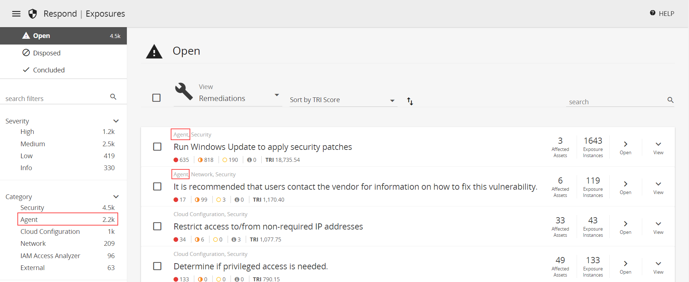

# Agent-Based Scanning

Agent-based scanning enables users to leverage the vulnerability assessment coverage of authenticated network scanning without the need to manage credentials and with a reduction in network traffic and impact.

**State Monitor**—

**OSQuery**—

**OVALdi**—

## Upgrades to the scanning experience

The agent-based scan upgrade  improves the efficiency, accuracy, and usability of Alert Logic vulnerability scanning features.

### No Credential Management

Agent-based scanning does not require credential management. Users of authenticated network scans had to configure access and manage credentials for assets and networks. The agent is installed on the host and does not require any further credential management to maintain.

### Reduced Network Traffic

Agent-based scanning reduces network traffic. Agent-based scanning reduces network traffic by running locally on the host before sending results to Alert Logic for final analysis.

### Limited Network and Host Processing Impact

The  network scan will not run redundant vulnerability assessments when agent-based scan is active on a host. Agent-based scanning reduces network impacts by running locally on the host and limits host processing impact to less than 5 minutes. For detailed information on host impacts, see [Requirements for the Alert Logic agent with scan components](#RequirementsfortheAlertLogicagentwithscancomponents).

**Increased Host-Target Availability**: You can deploy the agent on hosts that are impossible or impractical to scan from the network.

### Better Vulnerability Accuracy

Agent-based scanning increases the  accuracy and reliability of vulnerability scan results. Improved coverage includes better operating system, application, patch, and kernel level vulnerability assessment. The agent is able to assess false positives. For more information, see [Scan-based vulnerability assessment coverage details](#Scan-basedvulnerabilityassessmentcoveragedetails).

### No redundant vulnerability assessment

Agent-based scans and credentialed network scans provide similar  vulnerability assessment coverage for OS, application, patch, and kernel level vulnerabilities. To reduce impact to the network and host, when a network scan begins scanning a particular host, it checks in with that host for the presence of agent-based scan configuration.

**If agent-based scan is configured on the host**:

The network scan will not run redundant vulnerability assessments for the host. The agent will evaluate OS, application, patch and kernel vulnerabilities. The credentialed network scan will evaluate vulnerabilities for configuration checks, web applications testing, and active exploit, SQL injects, etc.

**If  agent-based scan is not configured on the host**:

The network scan runs  vulnerability assessments as configured (with or without credentials) against the host.

## Requirements

A host must meet the following criteria to support agent-based scanning.

### Node subscription level

The host node must be configured for Essentials, Alert Logic MDR Professional, or Alert Logic MDR Enterprise level of protection. You can verify or change the protection levels by using [Entitlement Summary](../reports/service/entitlement/entitlement-summary.md) or [Change Protection Level of an Asset](../../deploy/change-protection.md).

### Host operating system

The host must run a supported Windows or Linux operating system.

    The container agent can install the scan components but does not run the scan function. Hosts with only the Extended Endpoint Protection agent  do not install the agent-based scan components.    
The agent-based scanning components are supported on the following operating systems. Older Linux and Windows operating systems may work, but will report a large amount of vulnerabilities.

| Operating System | **Versions** | Installation Guide |
|---|---|---|
| Amazon Linux | 1.x, 2.x | [Install the Alert Logic Agent for Linux](../../prepare/alert-logic-agent-linux.md) |
| CentOS | 6.x, 7.x, 8.x | [Install the Alert Logic Agent for Linux](../../prepare/alert-logic-agent-linux.md) |
| Debian | 9.x, 10.x | [Install the Alert Logic Agent for Linux](../../prepare/alert-logic-agent-linux.md) |
| Red Hat Enterprise Linux (RHEL) | 6.x, 7.x, 8.x | [Install the Alert Logic Agent for Linux](../../prepare/alert-logic-agent-linux.md) |
| Ubuntu | 16.x, 18.x, 20.x | [Install the Alert Logic Agent for Linux](../../prepare/alert-logic-agent-linux.md) |
| SUSE | 11.3, 11.4, 12.0, 12.1 | [Install the Alert Logic Agent for Linux](../../prepare/alert-logic-agent-linux.md) |
| Windows 7 | All | [Install the Alert Logic Agent for Windows](../../prepare/alert-logic-agent-windows.md) |
| Windows 8 | All | [Install the Alert Logic Agent for Windows](../../prepare/alert-logic-agent-windows.md) |
| Windows 10 | All | [Install the Alert Logic Agent for Windows](../../prepare/alert-logic-agent-windows.md) |
| Windows Server 2008 | All | [Install the Alert Logic Agent for Windows](../../prepare/alert-logic-agent-windows.md) |
| Windows Server 2012 | All | [Install the Alert Logic Agent for Windows](../../prepare/alert-logic-agent-windows.md) |
| Windows Server 2016 | All | [Install the Alert Logic Agent for Windows](../../prepare/alert-logic-agent-windows.md) |
| Windows Server 2019 | All | [Install the Alert Logic Agent for Windows](../../prepare/alert-logic-agent-windows.md) |

    If you have Amazon Web Services (AWS) Systems Manager managed instances, you can use [AWS Systems Manager Distributor](https://docs.aws.amazon.com/systems-manager/latest/userguide/distributor.html)     to install the  Alert Logic agent on the instances instead of installing the agent on each host manually. For more information, see [Automate Alert Logic Agent Installation with AWS Systems Manager Distributor](../../prepare/agent-install-automated-aws.md).    ### Installed agent and agent health

The agent must be installed on the host. The health status of the agent related to connectivity or resource issues may affect the installation and execution of agent-based scanning. You can verify the health and presence of an agent on a specific host using agent view on the [Topology](../topology.md) page.

You can also verify the health and presence of an agent on a specific host by using the [Health](../health.md) and the [Missing Agent Digest](../reports/service/health/missing-agent-digest.md) report.

### Requirements for the Alert Logic agent with scan components

Scan components of the agent require the following in addition to  the standard [Requirements for the Alert Logic Agent](../../requirements/agent.md).

| Requirement Type | Additional System Requirement for Scan Components | Total System Requirement (Agent + Scan Components) |
|---|---|---|
| Storage | 102MB | 652MB |

#### Processing requirements and host impact for running an agent-based scan

The agent-based scan runs at a different time than the network scan, though the results are not enumerated and delivered  until a network scan is complete with the host in scope. The host impact for processing requirements only occurs for the duration defined below, at run-time. For more information about the timing and frequency of running agent-based scanning, see [Agent-Based Scanning](#Agent-basedscanrun-timeandresultvisibility).

| Type | Operating Systems | Scan Components | System Requirement | Duration of Demand (Estimate) |
|---|---|---|---|---|
| RAM (Max) | Windows | OSQuery | 50MB | 5 seconds |
| OVALdi | 70MB | 3 minutes |
| Linux | OSQuery | 30-70MB | 5 seconds |
| OVALdi | 90MB | 4 minutes |
| CPU | Windows | Both | Up to 100%, running at low priority | 3-4 minutes |
| Linux | Both | Up to 100%, running at low priority | 4-5 minutes |

    Estimates are based on Amazon EC2 t2/3_small for Linux and t3_medium for Windows.    ## How to enable or disable agent-based scanning

Agent-based scanning is enabled and disabled by deployment. By default, agent-based scanning is disabled on all deployments. Once enabled, current and future agents will automatically install the new scan components as an update (using port 443) following [Agent or remote collector outbound rules](../../requirements/us-firewall-rules.md#Agentorremotecollectoroutboundrules) (US) or [Agent or remote collector outbound rules](../../requirements/uk-eu-firewall-rules.md#Agentoutbound) (UK).

**To enable agent-based scanning for an existing deployment**:

1. In the Alert Logic console, click the menu icon () to see the navigation menu.
2. Click **Configuration**, and then click **Deployments**.
3. Find the deployment you want to edit, and then click **EDIT**.
4. In the left navigation panel, click **Agent-based Scanning**.
5. Select **Enable Agent Based Scanning (recommended)**
6. Click **SAVE**.
7. In the confirmation window, click **ENABLE**.

**To disable agent-based scanning for an existing deployment**:

1. In the Alert Logic console, click the menu icon () to see the navigation menu.
2. Click **Configuration**, and then click **Deployments**.
3. Find the deployment you want to edit, and then click **EDIT**.
4. In the left navigation panel, click **Agent-based Scanning**.
5. Select **Disable Agent Based Scanning (default)**
6. Click **SAVE**.
7. In the confirmation window, click **DISABLE**.

    Allow up to 4 hours for hosts to disable agent-based scanning components. Any vulnerabilities detected by the agent-based scan while active will be removed from the Exposures page the next time a network scan completes. The vulnerabilities detected by the agent-based scan will remain on pages that track vulnerability history, such as [Vulnerabilities Reports](../reports/Vulnerabilities/reports.md) and [Remediations Reports](../reports/remediations/reports.md).    ## Scan using the Alert Logic agent

An internal scan of a host that meets the [Requirements](#Requirements) for agent-based scanning will optimize vulnerability assessment.

### Use internal scan schedules

The initial agent-based scan  will run within 12 hours after the install of the scan components on the host. Subsequent agent-based scan run-times are governed by the scan windows defined in Internal Scan schedules.

**If the scan window is set to scan any time (default)**:

The agent-based scan runs at every 12 hour interval from the initial execution. The results of the agent-based host scan visible in the Alert Logic console once an internal network scan completes.

**If the scan window is defined to specific start and end times**:

The agent-based scan runs at the start of the window. The results of the agent-based host scan are   visible in the Alert Logic console once the internal network scan completes for the window. For more information on asset scopes in scan schedules, see [Define the scope of the assets to scan](schedules.md#Definethescopeoftheassetstoscan).

### Use Scan Now

If you need to run a scan immediately, you can use the Scan Now feature on the Topology page. This feature scans the selected host right away or as soon as possible, outside the normal schedule.

    For hosts with [Agent-Based Scanning](#), Scan Now triggers an agent-based scan at the same time as the network scan. The results of both scan devices are merged once the l network scan completes.    
To see which scans are in progress, click the scan icon () to see the scan statuses of your assets. For more information about scan status, see [Customize the diagram display](../topology.md#customize-display).

**To use the Scan Now feature:**

1. On the Topology page, specify a deployment or region in the respective drop-down menus.
2. Click the host you want to scan immediately, if a scan is not in progress.
3. In the slideout panel, click **Actions**, and then click **SCAN NOW**.
If the host is excluded from scanning in the deployment scope of protection, a message prompts you to confirm whether to continue with the scan. If ports are excluded, a message prompts you to choose whether to honor or override the exclusions. If you choose to honor exclusions, the scanner does not scan the excluded ports.
4. Click **OK** to run the scan.

Scan Now may delay the scan for 5-25 minutes, depending on technological factors such as the current load on the scanner and the availability of a scan appliance. Alert Logic will always scan the host as soon as possible.

## View the results of an agent-based scan

Agent-based scan results are consolidated and made visible when a network scan is completed. Security vulnerability results  from consolidated agent-based and internal network scan have the "Agent" category on the [Exposures](../exposures.md) page.

    You should expect a significant increase in the number of detected vulnerabilities with a new agent-based scan if you did not previously use credentials for internal scans on the host.    

Agent-based scan results are also available in [Vulnerabilities Reports](../reports/Vulnerabilities/reports.md) and [Remediations Reports](../reports/remediations/reports.md).

## Scan-based vulnerability assessment coverage details

| Vulnerability Type | Host-based Scan (Agent) | Network Scan (no credentials) | Authenticated Network Scan (credentials) |
|---|---|---|---|
| System-level vulnerabilities | Yes | Partial | Yes |
| Application-level exposures | Yes |  | Yes |
| Configuration Check (TLS/Certificates, Common U/P) |  | Yes | Yes |
| Web Application Testing |  | Partial | Partial |
| Active Exploits/ SQL Injections/ Etc |  | Partial | Partial |

## Beta Feature Release Notes

Initial feature

Scan window feature

Topology feature

Essentials nodes

## Beta Details

Beta-flag and the agent-update process

### Comparison of Vulnerability Assessment Results

This section is a placeholder for a technical description of before and after results from unauth network scan or credentialed network scan to the agent-based scan addition, with some explanation.
