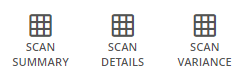

# Manage Scan Schedules

Alert Logic performs scans on all assets in your deployments.  When you [create a deployment](../../get-started/deployments.md), Alert Logic automatically creates default scan schedules to perform external and internal vulnerability scans on all non-excluded assets and ports that vary according to deployment type. A default discovery scan schedule also finds new assets in Data Center deployments.

You can also schedule when you want  to perform specific scans. From the Scan Schedules page in the Alert Logic console, you can edit the default schedule and create additional schedules for all or selected assets and ports within the scope of protection of the deployment.

For more information about scan types you can schedule and managing scan schedules, see:

* [Scan types](#Scantypes)
* [Default scan schedules](#Defaultscanschedules)
* [Create a scan schedule](#Createascanschedule)
* [View scan schedules and details](#Viewscanschedulesanddetails)
* [Stop a scan in progress](#Stopascaninprogress)
* [Activate or deactivate a scan schedule](#Activateordeactivateascanschedule)
* [Edit a scan schedule](#Editascanschedule)
* [Delete a scan schedule](#Deleteascanschedule)
* [Exclude assets and ports from scans](#Excludeassetsfromscans)

PCI scan management is not covered in this topic. For information about PCI scans, see [Manage PCI Scans](../../configure/pci-scans.md#Manage2).

Exclusions, scan frequency, and scheduling options apply only to assets that are scanned using Alert Logic appliances. Cloud configuration checks performed using cloud APIs, such as checks that are part of the CIS Foundations benchmark, are not affected.

## Scan types

You can schedule the following types of scans:

* Discovery Scans—Scan for new assets or asset changes on your networks. Discovery scans are available for Data Center deployments only.
* Internal Scans—Scan for vulnerable assets and ports, internally, from an Alert Logic appliance in your environment. Internal vulnerability scans are available for all deployments.
* External Scans—Scan for vulnerable assets and ports, externally, from the Alert Logic system against your environment. This type of scan simulates attacks from outside your network and identifies potential issues from these attack types. External scans are available for all deployments.

After you define the scope of protection for your deployment, you can create and manage your scan schedules at any time.

## Default scan schedules

Alert Logic default scan schedules vary according to deployment type.

### Data Center deployment

The default discovery scan schedule for a Data Center deployment scans all assets in the scope of protection once a week, at any time. You can change the scan frequency and window when you want the discovery scan to occur, but not the schedule name or scope. You cannot deactivate or delete the default discovery scan schedule.

The default internal and external vulnerability scan schedules for a Data Center deployment scan all assets in the scope of protection once a week, at any time. The default schedule for ports is the same and includes all TCP ports and common UDP ports  that are in the scope of protection. You can change the scan frequency, window, asset scope, and port scope of the default vulnerability scans but not the schedule name. You can make the default vulnerability scan schedules inactive, but you cannot delete them.

### AWS deployments

The default internal and external vulnerability scan schedules for AWS deployments scan all assets  in the scope of protection as often as necessary (once a day, or twice a day if significant changes  to an asset are detected), at any time. The default schedule for ports is the same and includes all ports in AWS security groups that are in the scope of protection. You can change the scan frequency, window, asset scope, and port scope of the default internal and external scans but not the schedule name. You can make the default vulnerability scan schedules inactive, but you cannot delete them.

### Azure deployments

The default internal and external vulnerability scan schedules for Azure deployments scan all assets in the scope of protection as often as necessary (once a day, or twice a day if significant changes  to an asset are detected), at any time. The default schedule for ports is the same and includes all TCP ports and common UDP ports  that are in the scope of protection. You can change the scan frequency, window, asset scope, and port scope of the default vulnerability scans but not the schedule name. You can make the default vulnerability scan schedules inactive, but you cannot delete them.

## Create a scan schedule

You can choose the frequency of scans and when you want Alert Logic to perform scans for each deployment.  For internal and external vulnerability scans,  you can choose whether to scan all or selected assets and ports within the scope of protection.

    Schedules with the same or overlapping scan windows result in one scan.    
**To create a scan schedule**:

1. In the Alert Logic console, click **Configure**, click **Deployments**, and then click the deployment for which you want to create a scan schedule.
2. On the side navigation, click **Scan Schedules**.
3. On the Scan Schedules page, click **Discovery Scanning**, **Internal Scanning**, or **External Scanning**.

For Amazon Web Services (AWS) deployments and Microsoft Azure deployments, internal and external vulnerability scans are the only options available.5. Click the add icon ().
6. Type a descriptive name for the scan schedule. The name cannot exceed 127 characters.
7. If you want the schedule to be active, leave  **Schedule Is Active** turned on. Turn it off if you want to save the schedule but not activate it yet.

### Discovery scans

#### Schedule how often to scan

To schedule how often you want  to scan for new networks or asset changes on your networks, choose one of the following scan frequency options:

* **Scan as often as necessary**—Select this option if you want to scan for new assets  on your networks up to twice a day or when significant changes are detected, such as the addition of a network. This option automatically scans all assets selected on the Scope tab at least once in a 24-hour period. The option attempts a second scan depending on resources and changes to your environment. Scans on networks or hosts added that day, for example, occur immediately and take priority over second scans. Assets that were not scanned twice take priority the next day.
* **Scan once a day**
* **Scan once a week**

#### Schedule when to scan

To schedule when you want  to scan for new networks or asset changes on your networks, choose one of the following scan window options:

* **Scan any time**—Select this option if you do not want to limit  scans to certain days or times.
* **Scan only during certain times**—Select this option to choose the specific days and hours for this scan. You can define multiple scan windows if you chose **Scan as often as necessary** or **Scan once a week** as the frequency. If all assets are not scanned during a window, the unscanned assets take priority at the start of the next scan window.

#### Define the scope of the scan

Alert Logic scans all current and future assets in the scope of protection by default. You can choose to scan specific assets for this schedule instead. To [exclude assets from all scans](#Excludeassetsfromscans), not just this schedule, exclude them on the Scope of Protection page for the deployment.

To select specific assets that you want  to scan within the scope of protection, click the **Scope** tab and choose one of the following options:

* **Scan all assets**—Click this option to scan all current and future assets in the scope of protection.
* **Scan only selected assets**—Click this option to search for and choose assets and AWS tags (for AWS deployments)  that you want to include in the scan schedule. You can also enter IP addresses, IP address ranges, or CIDRs. When finished selecting assets, click **ADD TO SCAN SCOPE**.

    If you select assets on this tab and later exclude them from the scope of protection, the assets remain selected   but will no longer be scanned.    
Click **SAVE**, and then click **NEXT**.

### Internal scans and External scans 

#### Schedule how often to scan

To schedule how often you want  to scan for vulnerabilities on your internal networks, choose one of the following scan frequency options:

* **Scan as often as necessary**—Select this option if you want  to scan assets for vulnerabilities up to twice  a day or when significant changes  to an asset are detected, such as the addition of a network. This option automatically scans all the assets you selected on the Scope tab at least once in a 24-hour period. The option attempts a second scan depending on resources and changes to your environment. Scans on networks or hosts added that day, for example, occur immediately and take priority over second scans. Assets that were not scanned twice take priority the next day.
* Scan once a day
* Scan once a week
* Scan once a month
* Scan once a quarter
* **Scan once**—Select this option if you want to scan assets selected on the Scope tab once, starting at a specific time. For example, to verify a patch or remediation action, you could use this option to schedule a scan of several assets to start within the next five minutes  instead of waiting for the next regularly scheduled scan.

#### Schedule when to scan

To schedule when you want  to scan for vulnerabilities, choose one of the following scan window options:

* **Scan any time**—Select this option if you do not want to limit  scans to certain days or times.
* **Scan only during certain times**—Select this option to choose the specific days and hours for this scan. For a quarterly scan, you can also choose the specific month of the quarter for this scan. You can define multiple scan windows if you chose **Scan as often as necessary**, **Scan once a week**, **Scan once a month**, or **Scan once a quarter** as the frequency.
* **Scan only during certain times on certain days** (available if you choose **Scan once a month** or **Scan once a quarter** as the scan frequency)
* **Scan only during a certain week on a certain day** (available if you choose **Scan once a month** as the scan frequency)

If you chose **Scan once** as the frequency, specify the time zone, start day and time, and an option for the end day and time for the scan:

* **No end date (scan until done)**
* **Specify end date and time**

#### Define the scope of the assets to scan

Alert Logic scans all current and future assets in the scope of protection by default. You can choose to scan specific assets for this schedule instead. To [exclude assets from all scans](#Excludeassetsfromscans), not just this schedule, exclude them on the Scope of Protection page for the deployment.

To select specific assets that you want  to scan within the scope of protection, click the **Scope** tab and choose one of the following options:

* **Scan all assets**—Click this option to scan all current and future assets in the scope of protection.
* **Scan only selected assets**—Click this option to search for and choose assets and AWS tags (for AWS deployments)  that you want to include in the scan schedule. You can also enter IP addresses, IP address ranges, or CIDRs. When finished selecting assets, click **ADD TO SCAN SCOPE**.

    If you select assets on this tab and later exclude them from the scope of protection, the assets remain selected   but will no longer be scanned.    #### Define the ports to scan

For Data Center and Azure deployments, Alert Logic scans all TCP ports and common UDP ports in the scope of protection by default. For AWS deployments, Alert Logic scans all current ports from your security groups included in the scope of protection by default. You can choose to scan specific ports for this schedule instead. You can choose one or more port groups to scan and/or enter a list of custom ports. For advice on scan frequencies, see [Port scan frequency recommendations](../../deploy/about-scans.md#Portscanfrequencyrecommendations). To [exclude ports from all scans](#Excludeassetsfromscans), not just this schedule, exclude them on the Scope of Protection page for the deployment.

To select specific ports that you want  to scan within the scope of protection, click the **Ports** tab and choose one of the following options:

* **Scan only ports from security groups**—(AWS deployments only) Click this option to scan all current ports from your AWS security groups.
* **Scan all TCP and common UDP ports**—Click this option to scan all TCP ports and common UDP ports. For specific ports included in these groups, see [Port groups](#Portgroups).
* **Scan selected ports**—Click this option if you want to select one or more specific port groups and/or a custom list of ports to scan. For specific ports included in groups listed under **Select Port Groups to Scan**, see [Port groups](#Portgroups). 
Under **Specify Custom Ports**, you can enter custom port lists.Custom ports can overlap with selected port groups and do not result in scanning the same port twice.

**To specify custom ports:**

1. Under **Specify Custom Ports**, select the port protocol: **UDP** or **TCP**.
2. In the **Port(s)** field, enter one or more ports that you want to include in the scan schedule. Use a dash or colon to indicate a range  (for example, 1-10001). Separate multiple ports or port ranges with a comma (for example, 11234, 11311, 12000- 12010).
3. Click **ADD CUSTOM PORTS**.

    If you want a custom set of both UDP and TCP ports, select **UDP** as the **Protocol**, list your ports, and then click **ADD CUSTOM PORTS**. Repeat the process for **TCP** ports.    
Click **SAVE**, and then click **NEXT**.

#### Port groups

| Port group name | Ports |
|---|---|
| Common TCP Ports (1000) | 1, 3, 4, 6, 7, 9, 13, 17, 19, 20, 21, 22, 23, 24, 25, 26, 30, 32, 33, 37, 42, 43, 49, 53, 70, 79, 80, 81, 82, 83, 84, 85, 88, 89, 90, 99, 100, 106, 109, 110, 111, 113, 119, 125, 135, 139, 143, 144, 146, 161, 163, 179, 199, 211, 212, 222, 254, 255, 256, 259, 264, 280, 301, 306, 311, 340, 366, 389, 406, 407, 416, 417, 425, 427, 443, 444, 445, 458, 464, 465, 481, 497, 500, 512, 513, 514, 515, 524, 541, 543, 544, 545, 548, 554, 555, 563, 587, 593, 616, 617, 625, 631, 636, 646, 648, 666, 667, 668, 683, 687, 691, 700, 705, 711, 714, 720, 722, 726, 749, 765, 777, 783, 787, 800, 801, 808, 843, 873, 880, 888, 898, 900, 901, 902, 903, 911, 912, 981, 987, 990, 992, 993, 995, 999, 1000, 1001, 1002, 1007, 1009, 1010, 1011, 1021, 1022, 1023, 1024, 1025, 1026, 1027, 1028, 1029, 1030, 1031, 1032, 1033, 1034, 1035, 1036, 1037, 1038, 1039, 1040, 1041, 1042, 1043, 1044, 1045, 1046, 1047, 1048, 1049, 1050, 1051, 1052, 1053, 1054, 1055, 1056, 1057, 1058, 1059, 1060, 1061, 1062, 1063, 1064, 1065, 1066, 1067, 1068, 1069, 1070, 1071, 1072, 1073, 1074, 1075, 1076, 1077, 1078, 1079, 1080, 1081, 1082, 1083, 1084, 1085, 1086, 1087, 1088, 1089, 1090, 1091, 1092, 1093, 1094, 1095, 1096, 1097, 1098, 1099, 1100, 1102, 1104, 1105, 1106, 1107, 1108, 1110, 1111, 1112, 1113, 1114, 1117, 1119, 1121, 1122, 1123, 1124, 1126, 1130, 1131, 1132, 1137, 1138, 1141, 1145, 1147, 1148, 1149, 1151, 1152, 1154, 1163, 1164, 1165, 1166, 1169, 1174, 1175, 1183, 1185, 1186, 1187, 1192, 1198, 1199, 1201, 1213, 1216, 1217, 1218, 1233, 1234, 1236, 1244, 1247, 1248, 1259, 1271, 1272, 1277, 1287, 1296, 1300, 1301, 1309, 1310, 1311, 1322, 1328, 1334, 1352, 1417, 1433, 1434, 1443, 1455, 1461, 1494, 1500, 1501, 1503, 1521, 1524, 1533, 1556, 1580, 1583, 1594, 1600, 1641, 1658, 1666, 1687, 1688, 1700, 1717, 1718, 1719, 1720, 1721, 1723, 1755, 1761, 1782, 1783, 1801, 1805, 1812, 1839, 1840, 1862, 1863, 1864, 1875, 1900, 1914, 1935, 1947, 1971, 1972, 1974, 1984, 1998, 1999, 2000, 2001, 2002, 2003, 2004, 2005, 2006, 2007, 2008, 2009, 2010, 2013, 2020, 2021, 2022, 2030, 2033, 2034, 2035, 2038, 2040, 2041, 2042, 2043, 2045, 2046, 2047, 2048, 2049, 2065, 2068, 2099, 2100, 2103, 2105, 2106, 2107, 2111, 2119, 2121, 2126, 2135, 2144, 2160, 2161, 2170, 2179, 2190, 2191, 2196, 2200, 2222, 2251, 2260, 2288, 2301, 2323, 2366, 2381, 2382, 2383, 2393, 2394, 2399, 2401, 2492, 2500, 2522, 2525, 2557, 2601, 2602, 2604, 2605, 2607, 2608, 2638, 2701, 2702, 2710, 2717, 2718, 2725, 2800, 2809, 2811, 2869, 2875, 2909, 2910, 2920, 2967, 2968, 2998, 3000, 3001, 3003, 3005, 3006, 3007, 3011, 3013, 3017, 3030, 3031, 3052, 3071, 3077, 3128, 3168, 3211, 3221, 3260, 3261, 3268, 3269, 3283, 3300, 3301, 3306, 3322, 3323, 3324, 3325, 3333, 3351, 3367, 3369, 3370, 3371, 3372, 3389, 3390, 3404, 3476, 3493, 3517, 3527, 3546, 3551, 3580, 3659, 3689, 3690, 3703, 3737, 3766, 3784, 3800, 3801, 3809, 3814, 3826, 3827, 3828, 3851, 3869, 3871, 3878, 3880, 3889, 3905, 3914, 3918, 3920, 3945, 3971, 3986, 3995, 3998, 4000, 4001, 4002, 4003, 4004, 4005, 4006, 4045, 4111, 4125, 4126, 4129, 4224, 4242, 4279, 4321, 4343, 4443, 4444, 4445, 4446, 4449, 4550, 4567, 4662, 4848, 4899, 4900, 4998, 5000, 5001, 5002, 5003, 5004, 5009, 5030, 5033, 5050, 5051, 5054, 5060, 5061, 5080, 5087, 5100, 5101, 5102, 5120, 5190, 5200, 5214, 5221, 5222, 5225, 5226, 5269, 5280, 5298, 5357, 5405, 5414, 5431, 5432, 5440, 5500, 5510, 5544, 5550, 5555, 5560, 5566, 5631, 5633, 5666, 5678, 5679, 5718, 5730, 5800, 5801, 5802, 5810, 5811, 5815, 5822, 5825, 5850, 5859, 5862, 5877, 5900, 5901, 5902, 5903, 5904, 5906, 5907, 5910, 5911, 5915, 5922, 5925, 5950, 5952, 5959, 5960, 5961, 5962, 5963, 5987, 5988, 5989, 5998, 5999, 6000, 6001, 6002, 6003, 6004, 6005, 6006, 6007, 6009, 6025, 6059, 6100, 6101, 6106, 6112, 6123, 6129, 6156, 6346, 6389, 6502, 6510, 6543, 6547, 6565, 6566, 6567, 6580, 6646, 6666, 6667, 6668, 6669, 6689, 6692, 6699, 6779, 6788, 6789, 6792, 6839, 6881, 6901, 6969, 7000, 7001, 7002, 7004, 7007, 7019, 7025, 7070, 7100, 7103, 7106, 7200, 7201, 7402, 7435, 7443, 7496, 7512, 7625, 7627, 7676, 7741, 7777, 7778, 7800, 7911, 7920, 7921, 7937, 7938, 7999, 8000, 8001, 8002, 8007, 8008, 8009, 8010, 8011, 8021, 8022, 8031, 8042, 8045, 8080, 8081, 8082, 8083, 8084, 8085, 8086, 8087, 8088, 8089, 8090, 8093, 8099, 8100, 8180, 8181, 8192, 8193, 8194, 8200, 8222, 8254, 8290, 8291, 8292, 8300, 8333, 8383, 8400, 8402, 8443, 8500, 8600, 8649, 8651, 8652, 8654, 8701, 8800, 8873, 8888, 8899, 8994, 9000, 9001, 9002, 9003, 9009, 9010, 9011, 9040, 9050, 9071, 9080, 9081, 9090, 9091, 9099, 9100, 9101, 9102, 9103, 9110, 9111, 9200, 9207, 9220, 9290, 9415, 9418, 9485, 9500, 9502, 9503, 9535, 9575, 9593, 9594, 9595, 9618, 9666, 9876, 9877, 9878, 9898, 9900, 9917, 9929, 9943, 9944, 9968, 9998, 9999, 10000, 10001, 10002, 10003, 10004, 10009, 10010, 10012, 10024, 10025, 10082, 10180, 10215, 10243, 10566, 10616, 10617, 10621, 10626, 10628, 10629, 10778, 11110, 11111, 11967, 12000, 12174, 12265, 12345, 13456, 13722, 13782, 13783, 14000, 14238, 14441, 14442, 15000, 15002, 15003, 15004, 15660, 15742, 16000, 16001, 16012, 16016, 16018, 16080, 16113, 16992, 16993, 17877, 17988, 18040, 18101, 18988, 19101, 19283, 19315, 19350, 19780, 19801, 19842, 20000, 20005, 20031, 20221, 20222, 20828, 21571, 22939, 23502, 24444, 24800, 25734, 25735, 26214, 27000, 27352, 27353, 27355, 27356, 27715, 28201, 30000, 30718, 30951, 31038, 31337, 32768, 32769, 32770, 32771, 32772, 32773, 32774, 32775, 32776, 32777, 32778, 32779, 32780, 32781, 32782, 32783, 32784, 32785, 33354, 33899, 34571, 34572, 34573, 35500, 38292, 40193, 40911, 41511, 42510, 44176, 44442, 44443, 44501, 45100, 48080, 49152, 49153, 49154, 49155, 49156, 49157, 49158, 49159, 49160, 49161, 49163, 49165, 49167, 49175, 49176, 49400, 49999, 50000, 50001, 50002, 50003, 50006, 50300, 50389, 50500, 50636, 50800, 51103, 51493, 52673, 52822, 52848, 52869, 54045, 54328, 55055, 55056, 55555, 55600, 56737, 56738, 57294, 57797, 58080, 60020, 60443, 61532, 61900, 62078, 63331, 64623, 64680, 65000, 65129, 65389 |
| Common UDP Ports (108) | 7, 9, 17, 19, 49, 53, 67, 68, 69, 80, 88, 103, 104, 105, 111, 120, 123, 135, 136, 137, 138, 139,158, 161, 162, 177, 427, 443, 445, 497, 500, 514, 515, 518, 520, 593, 601, 623, 626, 631, 660996, 997, 998, 999, 1022, 1023, 1025, 1026, 1027, 1028, 1029, 1030, 1433, 1434, 1645,1646, 1701, 1718, 1719, 1812, 1813, 1900, 2000, 2048, 2049, 2222, 2223, 3283, 3456,3703, 4444, 4500, 5000, 5060, 5353, 5632, 9200, 10000, 17185, 20031, 30718, 31337,32768, 32769, 32771, 32815, 33281, 49152, 49153, 49154, 49156, 49181, 49182, 49185,49186, 49188, 49190, 49191, 49192, 49193, 49194, 49200, 49201, 50924, 51704, 52768, 65024 |
| Typically Vulnerable TCP Ports (10,071) | 1-10001, 10008, 10110, 10202-10203, 11234, 11311, 12000, 12010, 12168, 12174, 12221, 12345, 12397, 12401, 12754, 13701, 13722, 13724, 13782, 13838, 14206, 14247, 14942, 15104, 16102, 16388, 16660, 17000, 17781, 18264, 18302, 19300, 20031, 20101, 20222, 20432, 21700, 23472, 25072, 27017, 27374, 27665, 28017, 29005, 32982, 33270, 33567-33568, 34443-34444, 36010, 36794, 36890, 37452, 38292, 40080, 40180, 41002, 4 1080, 41443, 41523, 42800, 50000-50001, 51100, 54345, 55555, 57772, 60008, 62078 |
| Typically Vulnerable UDP Ports (108) | 7, 9, 17, 19, 49, 53, 67, 68, 69, 80, 88, 103, 104, 105, 111, 120, 123, 135, 136, 137, 138, 139,158, 161, 162, 177, 427, 443, 445, 497, 500, 514, 515, 518, 520, 593, 601, 623, 626, 631, 660996, 997, 998, 999, 1022, 1023, 1025, 1026, 1027, 1028, 1029, 1030, 1433, 1434, 1645,1646, 1701, 1718, 1719, 1812, 1813, 1900, 2000, 2048, 2049, 2222, 2223, 3283, 3456,3703, 4444, 4500, 5000, 5060, 5353, 5632, 9200, 10000, 17185, 20031, 30718, 31337,32768, 32769, 32771, 32815, 33281, 49152, 49153, 49154, 49156, 49181, 49182, 49185,49186, 49188, 49190, 49191, 49192, 49193, 49194, 49200, 49201, 50924, 51704, 52768, 65024 |
| All TCP Ports | 1-65535 |

## View scan schedules and details

In the Scan Schedules page, you can view a list of all scan schedules, including default scan schedules, in your deployment. When you browse the list, you can see the following information:

* Indication of the scan cadence, such as automatic, daily, weekly, monthly, or once
* Scan progress, which includes the last scan date, an indication that the scan is in progress, or notice that the last scan was incomplete
* Number of targets in the scan scope. This is the number of target CIDRs (for a discovery scan) or target hosts (for a vulnerability scan) in the assets selected on the Scope tab.
* Scan schedule status: Active or Inactive

You can sort the list of scan schedules by:

* Schedule name
* Active or inactive schedule
* Latest scan
* Next scan
* Number of assets included in the scope

You can also  stop a scan in progress, activate or deactivate the schedule, and view additional schedule details from the list.

### Access the Scan Schedules page

To access the Scan Schedules page and view your list of schedules, access the deployment for which you want to view scan schedules, and then click **Scan Schedules** on the side navigation.

### View the details of a scan schedule 

In the Scan Schedules page, click **View** next to a listed schedule to see  scan schedule details, scan frequency and window, asset scope, and ports.

Scan schedule details

* Date created
* Last scan date
* Next scan date
* Scan targets last scanned (number of successfully scanned assets in scope)

Scan frequency and window

* Scan frequency
* Scan window
* Time Zone
* Start date and time
* End date and time

### View and export scan results

To view and export scan schedule breakdown reports in a new tab, click the report that you want to access in the bottom left of the scan schedule details view.

## Stop a scan in progress

You can stop a scan that is already in progress from the Scan Schedules page.

### To stop a scan 

1. Access the deployment for which you want to stop the scan, and then click **Scan Schedules** on the side navigation.
2. In the Scan Schedules page, find the scheduled scan that is in progress.
3. Click **STOP THIS SCAN**.

    This feature stops the current scan that is in progress. If you want to stop future scans, deactivate the scan schedule instead. You can also delete a scan schedule unless it is an Alert Logic default scan, as indicated in the schedule name.    ## Activate or deactivate a scan schedule

You can make a schedule active or inactive from the Scan Schedules page.

### To activate or deactivate a scan schedule 

1. Access the deployment for which you want to activate or deactivate the scan schedule, and then click **Scan Schedules** on the side navigation.
2. In the Scan Schedules page, find the scheduled scan that you want to activate or deactivate.
3. Choose **Active** to activate the schedule or **Inactive** to deactivate it.

## Edit a scan schedule

You can edit a schedule from the Scan Schedules page.

### To edit a scan schedule 

1. Access the deployment for which you want to edit the scan schedule, and then click **Scan Schedules** on the side navigation.
2. In the Scan Schedules page, find the scan schedule that you want to edit.
3. Click **View** next to the schedule, and then click the **EDIT** icon.
4. In the Edit a Scan Schedule page, change any of the settings, and then click **SAVE**.

    The name for an Alert Logic default scan schedule  cannot be changed.     ## Delete a scan schedule

You can delete scan schedules that you create. The default scan schedules that Alert Logic creates cannot be deleted.

### To delete a scan schedule 

1. Access the deployment from which you want to delete the scan schedule, and then click **Scan Schedules** on the side navigation.
2. In the Scan Schedules page, find the scan schedule that you want to delete.
3. Click **View** next to the schedule, and then click the **DELETE** icon.

## Exclude assets and ports from scans

You can exclude deployment assets and ports from external and internal vulnerability scanning. By setting exclusions globally, you can avoid managing them in each schedule. Excluding an asset or port from scans prevents future scans of the assets or ports, but does not stop scans in progress. Exposures from previous scans are still reflected on the excluded assets and ports.

To access **EXCLUSIONS**:

1. In the Alert Logic console, click **Configure**, click **Deployments**, and then click the deployment that contains the assets or ports you want to exclude.
2. On the side navigation, click **Scope of Protection**, and then in the page, click **EXCLUSIONS**.

### Exclusions from external scanning 

**To exclude assets or ports from external scanning:**

1. Select the **External Scanning** tab.
2. To exclude assets, click **ASSETS** to search for available assets to exclude, and then click **EXCLUDE** for the asset you want to exclude.
      You can remove an asset from the exclusion list at any time to include the asset in scanning. To remove an asset from the exclusion list, click **CANCEL**.      6. To exclude ports, click **PORTS**, and then do the following:
   1. Search for the host, subnet, or network that has the ports you want to exclude from external scanning.
   2. In the **Protocol** field, select the port protocol: **UDP** or **TCP**.
   3. Enter one or more ports that you want to exclude. Use a dash or colon to indicate a range  (for example, 1-10001). Separate multiple ports or port ranges with a comma (for example, 11234, 11311, 12000-12010).
   4. Click **EXCLUDE AND ADD ANOTHER**.
      You can remove ports from the exclusion list at any time to include the ports in scanning. To remove ports from the exclusion list, click **REMOVE**.      11. After you apply your exclusions, close the **Exclusions** window.
12. On the **Scope of Protection** page, click **SAVE**.

    If you exclude assets or ports that are selected in the Scope or Ports tab in an active scan schedule, the assets or ports remain selected   but are not included in future scans.    ### Exclusions from internal scanning

**To exclude assets, ports, or AWS tags from internal scanning:**

1. Select the **Internal Scanning** tab.
2. To exclude assets, click **ASSETS** to search for available assets to exclude, and then click **EXCLUDE** for the asset you want to exclude.
      You can remove an asset from the exclusion list at any time to include the asset in scanning. To remove an asset from the exclusion list, click **CANCEL**.      6. To exclude ports, click **PORTS**, and then do the following:
   1. Search for the host, subnet, or network that has the ports you want to exclude from internal scanning.
   2. In the **Protocol** field, select the port protocol: **UDP** or **TCP**.
   3. Enter one or more ports that you want to exclude. Use a dash or colon to indicate a range  (for example, 1-10001). Separate multiple ports or port ranges with a comma (for example, 11234, 11311, 12000-12010).
   4. Click **EXCLUDE AND ADD ANOTHER**.
      You can remove ports from the exclusion list at any time to include the ports in scanning. To remove ports from the exclusion list, click **REMOVE**.      11. (AWS deployments only) To exclude assets by using AWS tags, click **TAGS** to search for available tags to exclude, and then click **EXCLUDE** for the tag you want to exclude.
      You can remove a tag from the exclusion list at any time to include the tag in scanning. To remove a tag from the exclusion list, click **CANCEL**.      15. After you apply your exclusions, close the **Exclusions** window.
16. On the **Scope of Protection** page, click **SAVE**.

    If you exclude assets, tags, or ports that are selected  in the Scope or Ports tab in an active scan schedule, the items remain selected   but are not included in future scans.
