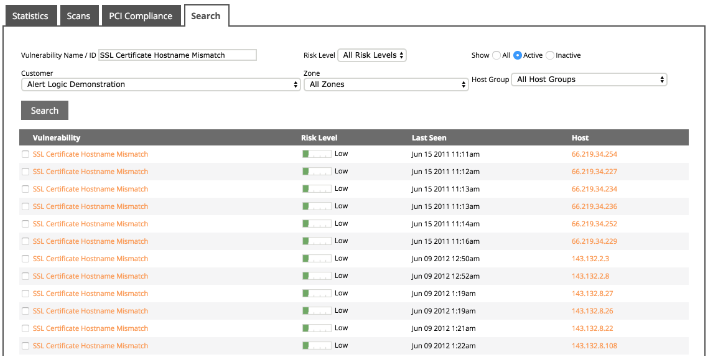

# How to work with scans and scan results

You can access detailed information about network and host vulnerabilities discovered during internal and external scans from the Scans tab on the Scans page in the Alert Logic console. From the Scans tab, you can create new scans, edit existing scan definitions, and view scan results.

For information about PCI scans, see [Manage PCI Scans](../configure/pci-scans.md#Manage2).

### Access  Alert Logic scans

You can access most scan-related features from the Scans page in the Alert Logic console. These features include creating and scheduling scans, managing scan results, and processing steps for PCI compliance.

To access scans and scan results:

1. In the Alert Logic console,   click **OVERVIEW**, and then click **Scans**.
2. On the Scans page, use the tabs to access scan features, as follows:
   * **Statistics**: Access summarized vulnerability information for your environment from overall scan results. See [View vulnerability statistics](#viewHighLevelVulnerability).
   * **Scans**: [Create and update scan definitions](#Manage) and [access scan results](#Manage3).
   * **PCI Compliance**: Create PCI scans and access PCI scan results. See [Manage PCI scans](../../../product-guides/scans/pci-scans.md).
   * **Search**: Search scan results for criteria such as vulnerability name and risk levels. See [Search scan results](#searchScansHistory).

### View scans

From the Scans tab on the Scans page, you can view scheduled vulnerability scans, scan status and results, and links to disable, enable, and delete the scans. To view vulnerability scans:1. In the Alert Logic console,   click **OVERVIEW**, and then click **Scans**.
2. On the Scans page, click the **Scans** tab.
3. If you manage more than one customer, in the **Customer** drop-down list, select the customer, and then click **Go**.
Scheduled scans, scan status and results, and links to disable, enable, and delete the scans are displayed.
4. (Optional) To change the definition of a scan, see [Modify scan definition](#modifyScan).
5. (Optional) To change the status of a scan, see [Modify scan status](#Modify).

### Define a scan

You can define and schedule scans to run on a regular basis to help you identify vulnerabilities across your organization. From the Scans tab, you can define and schedule internal and external scans.

For information about setting up PCI scans, see [Manage PCI Scans](../configure/pci-scans.md).

#### Create a new scan

1. In the Alert Logic console,   click **OVERVIEW**, and then click **Scans**.
2. On the Scans page, click the **Scans** tab.
3. If you have access to more than one entity, use the drop down menu to select the entity you want to scan.
4. Click **Schedule New Scan**.
5. Fill in the information according to the instructions below.
6. Click **Submit scan job**.

**Scan Details**

1. In **Scan Title**, type a descriptive name for the scan.
2. In the **Type of Scan** drop-down list, select one of the following options:
   * **Internal Scan**: This scan originates inside your network, behind your firewall, and shows an insider threat perspective.
   * **External Scan**: This scan originates from Alert Logic, outside your network, and shows an outside threat perspective.
4. If you chose **Internal Scan**, choose **Appliances** for your scan. The **Unavailable Appliances** box lists all appliances that are offline or deactivated. If you chose **External Scan**, the **Appliances** option is not available.
5. Under **How to Scan**, choose one of the following options:
   * **Full Scan** is a complete scan on all in-scope devices.
   * **Uphost only scan** is a scan that detects only the alive/offline status of each host.

**What to Scan**

Choose whether to scan by **Zones**, **Host Groups**, or **Individual IPs**, and then choose the appropriate item(s) from the list that appears.

* **Zones** are created around Alert Logic appliances. Set up zones on the **[Management](../prepare/users-roles.md#specifyTheZone)** page.
   * Choose one or more zones from the list. Press and hold the Ctrl key to select multiple items. To select adjacent items, click the first item, press and hold the Shift key, and then click the last item.
* **Host Groups** are sets of one or more hosts. Multiple host groups may reside within a single zone. Set up host groups on the **[Management](../prepare/users-roles.md#createAHostGroup)** page.
   * Choose one or more host groups from the list. Press and hold the Ctrl key to select multiple items. To select adjacent items, click the first item, press and hold the Shift key, and then click the last item.
* **Individual IPs** allow you to select the specific IPs to scan.
   * You may enter addresses, subnets, or address ranges. When you are done typing the information, click **Add the above hosts to the scan** to add them to the list. You may add more hosts or remove them from the list.

**Scan Credentials**

Enter user credential information to ensure the scanner has access to all necessary parts of your network. Alert Logic recommends adding user credentials for the most accurate scan. The prompt accepts information for **Windows Credentials**, **SSH Credentials**, and **SNMP Community Names**. For more information on authenticated scanning, click [here](../reference/scans-technical-description.md#authScanning).

If you selected an External or Uphost only scan under Scan Details, you can not enter user credentials.

**Port Scan Options**

In the **Port Scan Options** menu, choose one or more port groups to scan, or enter a list of custom ports. Make a selection from the drop-down list and then click **Add port selection**. The table below the drop-down menu shows the port groups you selected and indicates if they are **Fast** or **Heavy** scans. You may add more groups or remove them from the list.

Enter custom port lists either as a range (e.g., 1-10001) or as a comma separated list (e.g., 11234, 11311, 12000, 12010)

If you want a custom set of both TCP and UDP ports, select **Custom TCP Ports** and list your ports, and then click **Add port selection**. Repeat the process to add your list of **Custom UDP Ports**.

**Scan frequency recommendations:**

| Scan frequency | Common TCP and UDP ports | Typically Vulnerable TCP and UDP ports | All TCP and UDP ports |
|---|---|---|---|
| Internal scan | External scan | Internal scan | External scan | Internal scan | External scan |
|---|---|---|---|---|---|
| Daily |  | x |  |  |  |  |
| Weekly | x |  |  | x |  |  |
| Monthly |  |  | x |  |  | x |
| Quarterly |  |  |  |  | x |  |
| After configuration change |  |  |  |  | x | x |
| Suspicion of break or infection |  |  |  |  | x | x |

Options include:

| Port group name | TCP ports | UDP ports |
|---|---|---|
| Typically Vulnerable TCP (10,071) &amp; UDP (108) Ports | 1-10001, 10008, 10110, 10202-10203, 11234, 11311, 12000, 12010, 12168, 12174, 12221, 12345, 12397, 12401, 12754, 13701, 13722, 13724, 13782, 13838, 14206, 14247, 14942, 15104, 16102, 16388, 16660, 17000, 17781, 18264, 18302, 19300, 20031, 20101, 20222, 20432, 21700, 23472, 25072, 27017, 27374, 27665, 28017, 29005, 32982, 33270, 33567-33568, 34443-34444, 36010, 36794, 36890, 37452, 38292, 40080, 40180, 41002, 4 1080, 41443, 41523, 42800, 50000-50001, 51100, 54345, 55555, 57772, 60008, 62078 | 7, 9, 17, 19, 49, 53, 67, 68, 69, 80, 88, 103, 104, 105, 111, 120, 123, 135, 136, 137, 138, 139,158, 161, 162, 177, 427, 443, 445, 497, 500, 514, 515, 518, 520, 593, 601, 623, 626, 631, 660996, 997, 998, 999, 1022, 1023, 1025, 1026, 1027, 1028, 1029, 1030, 1433, 1434, 1645,1646, 1701, 1718, 1719, 1812, 1813, 1900, 2000, 2048, 2049, 2222, 2223, 3283, 3456,3703, 4444, 4500, 5000, 5060, 5353, 5632, 9200, 10000, 17185, 20031, 30718, 31337,32768, 32769, 32771, 32815, 33281, 49152, 49153, 49154, 49156, 49181, 49182, 49185,49186, 49188, 49190, 49191, 49192, 49193, 49194, 49200, 49201, 50924, 51704, 52768, 65024 |
| Typically Vulnerable TCP Ports (10,071) | 1-10001, 10008, 10110, 10202-10203, 11234, 11311, 12000, 12010, 12168, 12174, 12221, 12345, 12397, 12401, 12754, 13701, 13722, 13724, 13782, 13838, 14206, 14247, 14942, 15104, 16102, 16388, 16660, 17000, 17781, 18264, 18302, 19300, 20031, 20101, 20222, 20432, 21700, 23472, 25072, 27017, 27374, 27665, 28017, 29005, 32982, 33270, 33567-33568, 34443-34444, 36010, 36794, 36890, 37452, 38292, 40080, 40180, 41002, 4 1080, 41443, 41523, 42800, 50000-50001, 51100, 54345, 55555, 57772, 60008, 62078 | None |
| Common TCP (1,000) &amp; UDP (108) Ports | 1, 3, 4, 6, 7, 9, 13, 17, 19, 20, 21, 22, 23, 24, 25, 26, 30, 32, 33, 37, 42, 43, 49, 53, 70, 79, 80, 81, 82, 83, 84, 85, 88, 89, 90, 99, 100, 106, 109, 110, 111, 113, 119, 125, 135, 139, 143, 144, 146, 161, 163, 179, 199, 211, 212, 222, 254, 255, 256, 259, 264, 280, 301, 306, 311, 340, 366, 389, 406, 407, 416, 417, 425, 427, 443, 444, 445, 458, 464, 465, 481, 497, 500, 512, 513, 514, 515, 524, 541, 543, 544, 545, 548, 554, 555, 563, 587, 593, 616, 617, 625, 631, 636, 646, 648, 666, 667, 668, 683, 687, 691, 700, 705, 711, 714, 720, 722, 726, 749, 765, 777, 783, 787, 800, 801, 808, 843, 873, 880, 888, 898, 900, 901, 902, 903, 911, 912, 981, 987, 990, 992, 993, 995, 999, 1000, 1001, 1002, 1007, 1009, 1010, 1011, 1021, 1022, 1023, 1024, 1025, 1026, 1027, 1028, 1029, 1030, 1031, 1032, 1033, 1034, 1035, 1036, 1037, 1038, 1039, 1040, 1041, 1042, 1043, 1044, 1045, 1046, 1047, 1048, 1049, 1050, 1051, 1052, 1053, 1054, 1055, 1056, 1057, 1058, 1059, 1060, 1061, 1062, 1063, 1064, 1065, 1066, 1067, 1068, 1069, 1070, 1071, 1072, 1073, 1074, 1075, 1076, 1077, 1078, 1079, 1080, 1081, 1082, 1083, 1084, 1085, 1086, 1087, 1088, 1089, 1090, 1091, 1092, 1093, 1094, 1095, 1096, 1097, 1098, 1099, 1100, 1102, 1104, 1105, 1106, 1107, 1108, 1110, 1111, 1112, 1113, 1114, 1117, 1119, 1121, 1122, 1123, 1124, 1126, 1130, 1131, 1132, 1137, 1138, 1141, 1145, 1147, 1148, 1149, 1151, 1152, 1154, 1163, 1164, 1165, 1166, 1169, 1174, 1175, 1183, 1185, 1186, 1187, 1192, 1198, 1199, 1201, 1213, 1216, 1217, 1218, 1233, 1234, 1236, 1244, 1247, 1248, 1259, 1271, 1272, 1277, 1287, 1296, 1300, 1301, 1309, 1310, 1311, 1322, 1328, 1334, 1352, 1417, 1433, 1434, 1443, 1455, 1461, 1494, 1500, 1501, 1503, 1521, 1524, 1533, 1556, 1580, 1583, 1594, 1600, 1641, 1658, 1666, 1687, 1688, 1700, 1717, 1718, 1719, 1720, 1721, 1723, 1755, 1761, 1782, 1783, 1801, 1805, 1812, 1839, 1840, 1862, 1863, 1864, 1875, 1900, 1914, 1935, 1947, 1971, 1972, 1974, 1984, 1998, 1999, 2000, 2001, 2002, 2003, 2004, 2005, 2006, 2007, 2008, 2009, 2010, 2013, 2020, 2021, 2022, 2030, 2033, 2034, 2035, 2038, 2040, 2041, 2042, 2043, 2045, 2046, 2047, 2048, 2049, 2065, 2068, 2099, 2100, 2103, 2105, 2106, 2107, 2111, 2119, 2121, 2126, 2135, 2144, 2160, 2161, 2170, 2179, 2190, 2191, 2196, 2200, 2222, 2251, 2260, 2288, 2301, 2323, 2366, 2381, 2382, 2383, 2393, 2394, 2399, 2401, 2492, 2500, 2522, 2525, 2557, 2601, 2602, 2604, 2605, 2607, 2608, 2638, 2701, 2702, 2710, 2717, 2718, 2725, 2800, 2809, 2811, 2869, 2875, 2909, 2910, 2920, 2967, 2968, 2998, 3000, 3001, 3003, 3005, 3006, 3007, 3011, 3013, 3017, 3030, 3031, 3052, 3071, 3077, 3128, 3168, 3211, 3221, 3260, 3261, 3268, 3269, 3283, 3300, 3301, 3306, 3322, 3323, 3324, 3325, 3333, 3351, 3367, 3369, 3370, 3371, 3372, 3389, 3390, 3404, 3476, 3493, 3517, 3527, 3546, 3551, 3580, 3659, 3689, 3690, 3703, 3737, 3766, 3784, 3800, 3801, 3809, 3814, 3826, 3827, 3828, 3851, 3869, 3871, 3878, 3880, 3889, 3905, 3914, 3918, 3920, 3945, 3971, 3986, 3995, 3998, 4000, 4001, 4002, 4003, 4004, 4005, 4006, 4045, 4111, 4125, 4126, 4129, 4224, 4242, 4279, 4321, 4343, 4443, 4444, 4445, 4446, 4449, 4550, 4567, 4662, 4848, 4899, 4900, 4998, 5000, 5001, 5002, 5003, 5004, 5009, 5030, 5033, 5050, 5051, 5054, 5060, 5061, 5080, 5087, 5100, 5101, 5102, 5120, 5190, 5200, 5214, 5221, 5222, 5225, 5226, 5269, 5280, 5298, 5357, 5405, 5414, 5431, 5432, 5440, 5500, 5510, 5544, 5550, 5555, 5560, 5566, 5631, 5633, 5666, 5678, 5679, 5718, 5730, 5800, 5801, 5802, 5810, 5811, 5815, 5822, 5825, 5850, 5859, 5862, 5877, 5900, 5901, 5902, 5903, 5904, 5906, 5907, 5910, 5911, 5915, 5922, 5925, 5950, 5952, 5959, 5960, 5961, 5962, 5963, 5987, 5988, 5989, 5998, 5999, 6000, 6001, 6002, 6003, 6004, 6005, 6006, 6007, 6009, 6025, 6059, 6100, 6101, 6106, 6112, 6123, 6129, 6156, 6346, 6389, 6502, 6510, 6543, 6547, 6565, 6566, 6567, 6580, 6646, 6666, 6667, 6668, 6669, 6689, 6692, 6699, 6779, 6788, 6789, 6792, 6839, 6881, 6901, 6969, 7000, 7001, 7002, 7004, 7007, 7019, 7025, 7070, 7100, 7103, 7106, 7200, 7201, 7402, 7435, 7443, 7496, 7512, 7625, 7627, 7676, 7741, 7777, 7778, 7800, 7911, 7920, 7921, 7937, 7938, 7999, 8000, 8001, 8002, 8007, 8008, 8009, 8010, 8011, 8021, 8022, 8031, 8042, 8045, 8080, 8081, 8082, 8083, 8084, 8085, 8086, 8087, 8088, 8089, 8090, 8093, 8099, 8100, 8180, 8181, 8192, 8193, 8194, 8200, 8222, 8254, 8290, 8291, 8292, 8300, 8333, 8383, 8400, 8402, 8443, 8500, 8600, 8649, 8651, 8652, 8654, 8701, 8800, 8873, 8888, 8899, 8994, 9000, 9001, 9002, 9003, 9009, 9010, 9011, 9040, 9050, 9071, 9080, 9081, 9090, 9091, 9099, 9100, 9101, 9102, 9103, 9110, 9111, 9200, 9207, 9220, 9290, 9415, 9418, 9485, 9500, 9502, 9503, 9535, 9575, 9593, 9594, 9595, 9618, 9666, 9876, 9877, 9878, 9898, 9900, 9917, 9929, 9943, 9944, 9968, 9998, 9999, 10000, 10001, 10002, 10003, 10004, 10009, 10010, 10012, 10024, 10025, 10082, 10180, 10215, 10243, 10566, 10616, 10617, 10621, 10626, 10628, 10629, 10778, 11110, 11111, 11967, 12000, 12174, 12265, 12345, 13456, 13722, 13782, 13783, 14000, 14238, 14441, 14442, 15000, 15002, 15003, 15004, 15660, 15742, 16000, 16001, 16012, 16016, 16018, 16080, 16113, 16992, 16993, 17877, 17988, 18040, 18101, 18988, 19101, 19283, 19315, 19350, 19780, 19801, 19842, 20000, 20005, 20031, 20221, 20222, 20828, 21571, 22939, 23502, 24444, 24800, 25734, 25735, 26214, 27000, 27352, 27353, 27355, 27356, 27715, 28201, 30000, 30718, 30951, 31038, 31337, 32768, 32769, 32770, 32771, 32772, 32773, 32774, 32775, 32776, 32777, 32778, 32779, 32780, 32781, 32782, 32783, 32784, 32785, 33354, 33899, 34571, 34572, 34573, 35500, 38292, 40193, 40911, 41511, 42510, 44176, 44442, 44443, 44501, 45100, 48080, 49152, 49153, 49154, 49155, 49156, 49157, 49158, 49159, 49160, 49161, 49163, 49165, 49167, 49175, 49176, 49400, 49999, 50000, 50001, 50002, 50003, 50006, 50300, 50389, 50500, 50636, 50800, 51103, 51493, 52673, 52822, 52848, 52869, 54045, 54328, 55055, 55056, 55555, 55600, 56737, 56738, 57294, 57797, 58080, 60020, 60443, 61532, 61900, 62078, 63331, 64623, 64680, 65000, 65129, 65389 | 7, 9, 17, 19, 49, 53, 67, 68, 69, 80, 88, 103, 104, 105, 111, 120, 123, 135, 136, 137, 138, 139,158, 161, 162, 177, 427, 443, 445, 497, 500, 514, 515, 518, 520, 593, 601, 623, 626, 631, 660996, 997, 998, 999, 1022, 1023, 1025, 1026, 1027, 1028, 1029, 1030, 1433, 1434, 1645,1646, 1701, 1718, 1719, 1812, 1813, 1900, 2000, 2048, 2049, 2222, 2223, 3283, 3456,3703, 4444, 4500, 5000, 5060, 5353, 5632, 9200, 10000, 17185, 20031, 30718, 31337,32768, 32769, 32771, 32815, 33281, 49152, 49153, 49154, 49156, 49181, 49182, 49185,49186, 49188, 49190, 49191, 49192, 49193, 49194, 49200, 49201, 50924, 51704, 52768, 65024 |
| Common UDP Ports (108) | None | 7, 9, 17, 19, 49, 53, 67, 68, 69, 80, 88, 103, 104, 105, 111, 120, 123, 135, 136, 137, 138, 139,158, 161, 162, 177, 427, 443, 445, 497, 500, 514, 515, 518, 520, 593, 601, 623, 626, 631, 660996, 997, 998, 999, 1022, 1023, 1025, 1026, 1027, 1028, 1029, 1030, 1433, 1434, 1645,1646, 1701, 1718, 1719, 1812, 1813, 1900, 2000, 2048, 2049, 2222, 2223, 3283, 3456,3703, 4444, 4500, 5000, 5060, 5353, 5632, 9200, 10000, 17185, 20031, 30718, 31337,32768, 32769, 32771, 32815, 33281, 49152, 49153, 49154, 49156, 49181, 49182, 49185,49186, 49188, 49190, 49191, 49192, 49193, 49194, 49200, 49201, 50924, 51704, 52768, 65024 |
| Common TCP Ports (1,000) | 1, 3, 4, 6, 7, 9, 13, 17, 19, 20, 21, 22, 23, 24, 25, 26, 30, 32, 33, 37, 42, 43, 49, 53, 70, 79, 80, 81, 82, 83, 84, 85, 88, 89, 90, 99, 100, 106, 109, 110, 111, 113, 119, 125, 135, 139, 143, 144, 146, 161, 163, 179, 199, 211, 212, 222, 254, 255, 256, 259, 264, 280, 301, 306, 311, 340, 366, 389, 406, 407, 416, 417, 425, 427, 443, 444, 445, 458, 464, 465, 481, 497, 500, 512, 513, 514, 515, 524, 541, 543, 544, 545, 548, 554, 555, 563, 587, 593, 616, 617, 625, 631, 636, 646, 648, 666, 667, 668, 683, 687, 691, 700, 705, 711, 714, 720, 722, 726, 749, 765, 777, 783, 787, 800, 801, 808, 843, 873, 880, 888, 898, 900, 901, 902, 903, 911, 912, 981, 987, 990, 992, 993, 995, 999, 1000, 1001, 1002, 1007, 1009, 1010, 1011, 1021, 1022, 1023, 1024, 1025, 1026, 1027, 1028, 1029, 1030, 1031, 1032, 1033, 1034, 1035, 1036, 1037, 1038, 1039, 1040, 1041, 1042, 1043, 1044, 1045, 1046, 1047, 1048, 1049, 1050, 1051, 1052, 1053, 1054, 1055, 1056, 1057, 1058, 1059, 1060, 1061, 1062, 1063, 1064, 1065, 1066, 1067, 1068, 1069, 1070, 1071, 1072, 1073, 1074, 1075, 1076, 1077, 1078, 1079, 1080, 1081, 1082, 1083, 1084, 1085, 1086, 1087, 1088, 1089, 1090, 1091, 1092, 1093, 1094, 1095, 1096, 1097, 1098, 1099, 1100, 1102, 1104, 1105, 1106, 1107, 1108, 1110, 1111, 1112, 1113, 1114, 1117, 1119, 1121, 1122, 1123, 1124, 1126, 1130, 1131, 1132, 1137, 1138, 1141, 1145, 1147, 1148, 1149, 1151, 1152, 1154, 1163, 1164, 1165, 1166, 1169, 1174, 1175, 1183, 1185, 1186, 1187, 1192, 1198, 1199, 1201, 1213, 1216, 1217, 1218, 1233, 1234, 1236, 1244, 1247, 1248, 1259, 1271, 1272, 1277, 1287, 1296, 1300, 1301, 1309, 1310, 1311, 1322, 1328, 1334, 1352, 1417, 1433, 1434, 1443, 1455, 1461, 1494, 1500, 1501, 1503, 1521, 1524, 1533, 1556, 1580, 1583, 1594, 1600, 1641, 1658, 1666, 1687, 1688, 1700, 1717, 1718, 1719, 1720, 1721, 1723, 1755, 1761, 1782, 1783, 1801, 1805, 1812, 1839, 1840, 1862, 1863, 1864, 1875, 1900, 1914, 1935, 1947, 1971, 1972, 1974, 1984, 1998, 1999, 2000, 2001, 2002, 2003, 2004, 2005, 2006, 2007, 2008, 2009, 2010, 2013, 2020, 2021, 2022, 2030, 2033, 2034, 2035, 2038, 2040, 2041, 2042, 2043, 2045, 2046, 2047, 2048, 2049, 2065, 2068, 2099, 2100, 2103, 2105, 2106, 2107, 2111, 2119, 2121, 2126, 2135, 2144, 2160, 2161, 2170, 2179, 2190, 2191, 2196, 2200, 2222, 2251, 2260, 2288, 2301, 2323, 2366, 2381, 2382, 2383, 2393, 2394, 2399, 2401, 2492, 2500, 2522, 2525, 2557, 2601, 2602, 2604, 2605, 2607, 2608, 2638, 2701, 2702, 2710, 2717, 2718, 2725, 2800, 2809, 2811, 2869, 2875, 2909, 2910, 2920, 2967, 2968, 2998, 3000, 3001, 3003, 3005, 3006, 3007, 3011, 3013, 3017, 3030, 3031, 3052, 3071, 3077, 3128, 3168, 3211, 3221, 3260, 3261, 3268, 3269, 3283, 3300, 3301, 3306, 3322, 3323, 3324, 3325, 3333, 3351, 3367, 3369, 3370, 3371, 3372, 3389, 3390, 3404, 3476, 3493, 3517, 3527, 3546, 3551, 3580, 3659, 3689, 3690, 3703, 3737, 3766, 3784, 3800, 3801, 3809, 3814, 3826, 3827, 3828, 3851, 3869, 3871, 3878, 3880, 3889, 3905, 3914, 3918, 3920, 3945, 3971, 3986, 3995, 3998, 4000, 4001, 4002, 4003, 4004, 4005, 4006, 4045, 4111, 4125, 4126, 4129, 4224, 4242, 4279, 4321, 4343, 4443, 4444, 4445, 4446, 4449, 4550, 4567, 4662, 4848, 4899, 4900, 4998, 5000, 5001, 5002, 5003, 5004, 5009, 5030, 5033, 5050, 5051, 5054, 5060, 5061, 5080, 5087, 5100, 5101, 5102, 5120, 5190, 5200, 5214, 5221, 5222, 5225, 5226, 5269, 5280, 5298, 5357, 5405, 5414, 5431, 5432, 5440, 5500, 5510, 5544, 5550, 5555, 5560, 5566, 5631, 5633, 5666, 5678, 5679, 5718, 5730, 5800, 5801, 5802, 5810, 5811, 5815, 5822, 5825, 5850, 5859, 5862, 5877, 5900, 5901, 5902, 5903, 5904, 5906, 5907, 5910, 5911, 5915, 5922, 5925, 5950, 5952, 5959, 5960, 5961, 5962, 5963, 5987, 5988, 5989, 5998, 5999, 6000, 6001, 6002, 6003, 6004, 6005, 6006, 6007, 6009, 6025, 6059, 6100, 6101, 6106, 6112, 6123, 6129, 6156, 6346, 6389, 6502, 6510, 6543, 6547, 6565, 6566, 6567, 6580, 6646, 6666, 6667, 6668, 6669, 6689, 6692, 6699, 6779, 6788, 6789, 6792, 6839, 6881, 6901, 6969, 7000, 7001, 7002, 7004, 7007, 7019, 7025, 7070, 7100, 7103, 7106, 7200, 7201, 7402, 7435, 7443, 7496, 7512, 7625, 7627, 7676, 7741, 7777, 7778, 7800, 7911, 7920, 7921, 7937, 7938, 7999, 8000, 8001, 8002, 8007, 8008, 8009, 8010, 8011, 8021, 8022, 8031, 8042, 8045, 8080, 8081, 8082, 8083, 8084, 8085, 8086, 8087, 8088, 8089, 8090, 8093, 8099, 8100, 8180, 8181, 8192, 8193, 8194, 8200, 8222, 8254, 8290, 8291, 8292, 8300, 8333, 8383, 8400, 8402, 8443, 8500, 8600, 8649, 8651, 8652, 8654, 8701, 8800, 8873, 8888, 8899, 8994, 9000, 9001, 9002, 9003, 9009, 9010, 9011, 9040, 9050, 9071, 9080, 9081, 9090, 9091, 9099, 9100, 9101, 9102, 9103, 9110, 9111, 9200, 9207, 9220, 9290, 9415, 9418, 9485, 9500, 9502, 9503, 9535, 9575, 9593, 9594, 9595, 9618, 9666, 9876, 9877, 9878, 9898, 9900, 9917, 9929, 9943, 9944, 9968, 9998, 9999, 10000, 10001, 10002, 10003, 10004, 10009, 10010, 10012, 10024, 10025, 10082, 10180, 10215, 10243, 10566, 10616, 10617, 10621, 10626, 10628, 10629, 10778, 11110, 11111, 11967, 12000, 12174, 12265, 12345, 13456, 13722, 13782, 13783, 14000, 14238, 14441, 14442, 15000, 15002, 15003, 15004, 15660, 15742, 16000, 16001, 16012, 16016, 16018, 16080, 16113, 16992, 16993, 17877, 17988, 18040, 18101, 18988, 19101, 19283, 19315, 19350, 19780, 19801, 19842, 20000, 20005, 20031, 20221, 20222, 20828, 21571, 22939, 23502, 24444, 24800, 25734, 25735, 26214, 27000, 27352, 27353, 27355, 27356, 27715, 28201, 30000, 30718, 30951, 31038, 31337, 32768, 32769, 32770, 32771, 32772, 32773, 32774, 32775, 32776, 32777, 32778, 32779, 32780, 32781, 32782, 32783, 32784, 32785, 33354, 33899, 34571, 34572, 34573, 35500, 38292, 40193, 40911, 41511, 42510, 44176, 44442, 44443, 44501, 45100, 48080, 49152, 49153, 49154, 49155, 49156, 49157, 49158, 49159, 49160, 49161, 49163, 49165, 49167, 49175, 49176, 49400, 49999, 50000, 50001, 50002, 50003, 50006, 50300, 50389, 50500, 50636, 50800, 51103, 51493, 52673, 52822, 52848, 52869, 54045, 54328, 55055, 55056, 55555, 55600, 56737, 56738, 57294, 57797, 58080, 60020, 60443, 61532, 61900, 62078, 63331, 64623, 64680, 65000, 65129, 65389 | None |
| Custom TCP Ports | User-specified | None |
| Custom UDP Ports | None | User-specified |
| All Ports (65,535 TCP ports and 108 UDP ports) | 1-65535 | 7, 9, 17, 19, 49, 53, 67, 68, 69, 80, 88, 103, 104, 105, 111, 120, 123, 135, 136, 137, 138, 139,158, 161, 162, 177, 427, 443, 445, 497, 500, 514, 515, 518, 520, 593, 601, 623, 626, 631, 660996, 997, 998, 999, 1022, 1023, 1025, 1026, 1027, 1028, 1029, 1030, 1433, 1434, 1645,1646, 1701, 1718, 1719, 1812, 1813, 1900, 2000, 2048, 2049, 2222, 2223, 3283, 3456,3703, 4444, 4500, 5000, 5060, 5353, 5632, 9200, 10000, 17185, 20031, 30718, 31337,32768, 32769, 32771, 32815, 33281, 49152, 49153, 49154, 49156, 49181, 49182, 49185,49186, 49188, 49190, 49191, 49192, 49193, 49194, 49200, 49201, 50924, 51704, 52768, 65024 |

**Schedule Options**

Set the timing of the scan. You may choose to scan once or set a recurring scan that runs quarterly, weekly, or on specific days of the month.

To set scan schedule:

1. Set the scan frequency. Choose from the following options:
   * **Quarterly**: Set the timing of the scans within the quarter:
      * Choose the first, second, or third month of the quarter in the **Run scan in:** drop down menu.
      * Set the day of the month in the **on this day:** text box.
   * **Every Week**:Set the day of the week for the scan to run.
   * **Specific Days of the Month**: Type in the date(s) you want the scan to run each month.
   If you want your scan to run later in the month, you should set it for the 28th at the latest. If you set it for the 31st, you will miss February and the months that have only 30 days.
   * **Specific Weekday of the Month**
   Use the drop down menus to choose the day you want the scan to run each month. For example, you may set it to the second Wednesday every month.
   * **One Time**
   Enter a date to run a single scan.
   * **As soon as possible**
   This option puts the scan in the queue so that it runs as soon as possible.
3. In the **Run scan from:** box, set a time for the scan to begin. This option is not available if you chose to run the scan as soon as possible.
4. In the **Time Zone** drop down menu, select a time zone. This option is not available if you chose to run the scan as soon as possible.

**Advanced Settings**

Click **Advanced Settings** for more options, if necessary:

* For **Scan end time (optional):**, set a time for the scan to end. Alert Logic recommends leaving this option empty because it may abort your scan before it is finished.
* Check the box to **Enable roll-over scanning**.
Alert Logic discourages using roll-over scanning, as the feature is deprecated.
* If necessary, enter specific IPs in **IP Addresses to Exclude**.
   * You may enter addresses, subnets, or address ranges. When you are done typing the information, click **Add the above hosts to scan** to add them to the list. You may add more hosts or remove them from the list.
   * Alert Logic discourages excluding items from your scans.

**Scan Report**

Check the box to have Alert Logic send an email containing the scan results  after the scan completes. Choose email contacts from the list, and add as many as you want.

If you choose to send scan results through email, know that your vulnerability information will be sent as cleartext (unencrypted text) over the Internet via traditional email.

**Case Creation**

Check the **Create a case when scan completes** check box to track your scan results on the Cases page.

### Modify scan definition

After you have created a scan, you can modify its definition. For example, you can change what IP addresses are scanned, when the scan is scheduled to run, or the credentials used to log in to host computers.

To modify a scan definition:

1. In the Alert Logic console,   click **OVERVIEW**, and then click **Scans**.
2. On the Scans page, click the **Scans** tab.
3. If you manage more than one customer, in the **Customer** drop-down list, select the customer, and then click **Go**.
4. In the displayed list of scans, click the **Scan Title** of the scan to modify.
5. On the Edit Scan page, modify the scan definition, and then click **Save**.

### Modify scan status

Each defined scan has a status, which is displayed in the list of scans. Scheduled scans that are enabled show a status value of a date (for example, Sep 8 2016 10:00pm), which is when the scan is scheduled to run next. Additional status values include scanning, suspended, and disabled.

You can modify the state of a scheduled scan if needed. For example, to minimize potential risk when you make changes to your network, such as the roll-out of a new version of software on your mission critical servers or devices, you may want to deactivate a scan. The scan remains disabled until you enable it again.

You can also suspend or resume a scan that is in progress, or delete a scan entirely.

To change the next scheduled run date for a scan, which is a part of the scan definition, see [Modify scan definition](#modifyScan).

To modify scan status:

1. In the Alert Logic console,   click **OVERVIEW**, and then click **Scans**.
2. On the Scans page, click the **Scans** tab.
3. If you manage more than one customer, in the **Customer** drop-down list, select the customer, and then click **Go**.
4. Perform one of the following actions in the row of the scan to modify:
   * To disable a scheduled scan, click **Disable**.
   * To suspend a scan in progress, click **Suspend**.
   * To resume a suspended scan, click **Resume**.
   * To cancel a suspended scan, click **Cancel**.
   * To delete a scheduled scan, click **Delete**.

## Manage scan results

Through the Scans feature, you can access valuable vulnerability information about your network through your scan results. You can view high-level trend information as well as granular details. Reviewing the details of scan results helps to identify issues you can address to improve your security posture.

### View vulnerability statistics

Several types of trend views are provided to help you better understand your recent activity at a high level.

If you manage more than one customer, you cannot view the statistics for all of the accounts without logging in to each account individually.

**To view vulnerability statistics:**

1. In the Alert Logic console,   click **OVERVIEW**, and then click **Scans**.
2. On the Scans page, click the **Statistics** tab.
3. Select one of the following views to display:
   * **Most Vulnerable Hosts**
   * **Most Vulnerable Host Groups**
   * **Most Vulnerable Zones**
   * **Highest Risk Hosts**
   * **Highest Risk Host Groups**
   * **Highest Risk Zones**
   * **Vulnerabilities Targeted**
   * **Vulnerability History**
   * **Vulnerabilities by Risk Level**
   * **Most Vulnerable Services**
   * **Most Targeted Services**

### View results by scan

You can easily view the results for each scan execution. From the results, you can view details about any vulnerabilities that are found. You can also export scan results in PDF or .csv format for download.

To view results by scan:

1. In the Alert Logic console,   click **OVERVIEW**, and then click **Scans**.
2. On the Scans page, click the **Scans** tab.
3. If you manage more than one customer, in the **Customer** drop-down list, select the customer, and then click **Go**.
4. A list of scans appears, in alphabetical order by title.			For each scan, you can perform the following actions:
   * **Enable**: Set the scan to run on a set schedule.
   * **Delete**: Delete the scan results from the system.
6. Click the link in the **Results** column to expand the results for the scan. For each **Scanned Date** row, you can perform the following actions:
   * In the **Results** column, click the linked number of hosts to open a list of hosts and the vulnerabilities for each. Click PCI Scan Results to see the PCI scan page.
   * Click the icons in the **Export** column to download reports in various formats.* Click the green CSV icon () to download a .csv file with vulnerability and exposure details.
   * Click the blue CSV icon () to download a .csv file with host details.
   
   The industry-standard CSV downloads include detailed host and vulnerability information. The format allows you to analyze, sort, and filter the information externally in the software of your choice. Alert Logic recommends you use CSV downloads for all scan analysis.
   * Click **Delete** to delete the scan results. This deletes results from the selected date only.

### Search scan results

You can search all saved scan results for specific vulnerabilities by name or ID, risk level, zone, and host group. You can also filter your search results by all, active, or inactive vulnerabilities. This feature is useful if you discover a vulnerability and want confirmation, or if you discover a security breach and want to discover the vulnerabilities of a host.

To search scan results:

1. In the Alert Logic console,   click **OVERVIEW**, and then click **Scans**.
2. On the Scans page, click the **Search** tab.
3. If you manage more than one customer, in the **Customer** drop-down list, select the customer, and then click **Go**.
4. Enter and select the appropriate options, and then click **Search**.

**Example:** A review of your scan results list reveals a vulnerability called "SSL Certificate Hostname Mismatch." You want to know if this vulnerability affects any of your hosts. In the **Search** tab, in the **Vulnerability Name/ID** box, enter **SSL Certificate Hostname Mismatch**, select **Active**, and then click **search**. A list of occurrences appears.

### Ignore a vulnerability

If you cannot resolve a vulnerability immediately, you can temporarily deactivate the vulnerability. Deactivating a vulnerability makes working within the management interface more convenient, and does not remove the vulnerability from reports. You can deactivate vulnerabilities for a specific host or for all hosts.

You cannot deactivate a PCI scan vulnerability.

**Example:** You want to install a service pack for a database application, but doing so may break other applications that depend on that database application. You can deactivate that vulnerability until you can resolve the related application issues.

To ignore a vulnerability:

1. In the Alert Logic console,   click **OVERVIEW**, and then click **Scans**..
2. On the Scans page, click the **Scans** tab.
3. If you manage more than one customer, in the **Customer** drop-down list, select the customer, and then click **Go**.
4. Next to the scan that identifies the vulnerability you want to deactivate, click and expand **Results**.
5. Next to the date the scan was run, under the **Results** column, click the hosts link.
6. In the **Hosts** window, under the appropriate host, click the name of the vulnerability.
7. Check the vulnerability you want to deactivate. You can also check other vulnerabilities within this host.
8. On the bottom right, click **Change Status**.
9. Select one of the following options:
* **This Host**—Deactivates this vulnerability on this host only.
* **All Hosts**—Deactivates this vulnerability on all hosts. With this option, you must provide a global descriptive note.

11. Select **Inactive**.
12. Click **Save**.
### Report a false positive

Sometimes vulnerability scans identify a vulnerability in your environment that may be a false positive. To investigate an identified vulnerability that may be a false positive, contact Alert Logic. The security analysts in the Alert Logic Security Operations Center (SOC) carefully review the vulnerability and assess the accuracy of the result.

For PCI scans, false positives of High, Critical, or Urgent levels require a dispute. To learn how to dispute a PCI scan false positive, see [Dispute failing vulnerabilities](../configure/pci-scans.md#Dispute).

To report a false positive (for non-PCI scans):

1. From the heading of the report that contains the vulnerability in question, find the date the report ran and the Report ID.
2. Contact Alert Logic using one of the following options:
   * Contact Alert Logic Support at (US) (877) 484-8383 or (EU) +44 (0) 203 011 5533.
   * Send an email to [support@alertlogic.com](mailto:support@alertlogic.com).

If the security analyst determines the vulnerability is a false positive, the security analyst updates the vulnerability in the system database.

### Clean up scan results

As part of your maintenance activities, you can "clean up" scan results. When you clean up scan results, certain results are hidden in the Alert Logic console, providing you with a cleaner view. You can [clean up results predating a specific date](#clean-up-results-by-date), or you can [clean up results for individual scans](#clean-up-results-by-scan). The hidden results remain in the system and are included in your reports.

#### Clean up scan results by date

You can hide older scan results from the Alert Logic console by specifying a date and time; results with a Scanned Date that is older than the specified date are hidden.

To clean up scan results by date:

1. At the top of the Alert Logic console,  in the drop-down menu, click **Scans**.
2. On the Scans page, click the **Scans** tab.
3. If you manage more than one customer, select the customer in the **Customer** list, and then click **Go**.
4. Click **Clean up Scan Results**.
5. In the **Clean up Scan Results** dialog box, enter the date and time before which to hide scan results, specify whether to also hide inactive scans, and then click **Clean up**.

#### Clean up scan results by individual scans

You can hide individual scan results from the scan list.

To clean up scan results by individual scans:

1. At the top of the Alert Logic console,  in the drop-down menu, click **Scans**.
2. On the Scans page, select the **Scans** tab.
3. If you manage more than one customer, in the **Customer** drop-down list, select the customer, and then click **Go**.
4. In the row of the scan for which to hide results, click **Results**.
A list of scan executions appears, ordered by scan date.
5. For each **Scanned Date** row, click **Delete** to hide the results of that particular scan.
