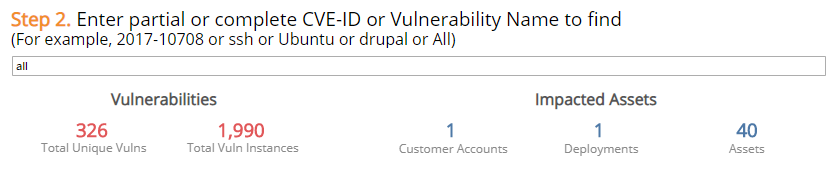
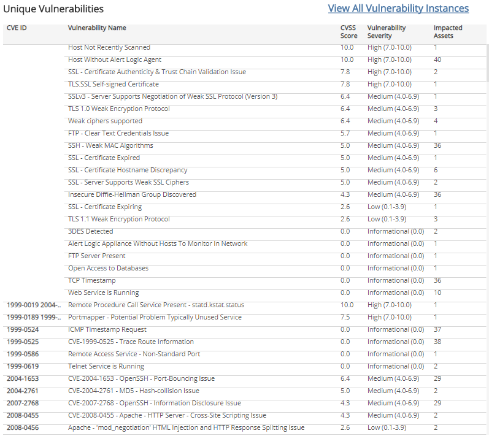

# Current Vulnerability Finder Report

The Current Vulnerability Finder report provides insights into current vulnerabilities found in your environment matching specific criteria and the detailed breakdown of vulnerability instances on impacted assets.

Use this report to address and further analyze  specific vulnerabilities and vulnerability instances found in your environment. You must filter and enter information in 3 steps to narrow down results specific to match the vulnerabilities you are searching. When you find data specific to match your needs, you can view and export reports in CSV or PDF format.

To access the Current Vulnerability Finder report:

1. In the Alert Logic console, click the menu icon (), and then click **Validate**.
2. Click **Reports**, and then click **Vulnerabilities**.
3. Click **Current Vulnerability Finder**, and then click **Current Vulnerability Finder**.

## Select the scope for current vulnerabilities section

To refine your findings, filter your report by **Customer Account**, **Deployment Name**, **Vulnerability Severity**, **CVSS Score**, and/or **Vulnerable Asset Type**.

### Filter the report using drop-down menus

By default, Alert Logic includes **(All)** filter values in the report.

**To add or remove filter values: **

1. Click the drop-down menu in the filter, and then select or clear values.
2. Click **Apply**.

Alert Logic assigns each vulnerability one of the following severities based on the CVSS v2 score for the **Vulnerability Severity** filter. The scores are set by the National Institute of Standards and Technology, and reported to the National Vulnerability Database. Reference the table to filter vulnerabilities into a severity category:

| Severity | CVSS base score |
|---|---|
| High | 7.0 - 10.0 |
| Medium | 4.0 - 6.9 |
| Low | 0.1 - 3.9 |
| Informational | 0.0 |
| Not Scored | No CVSS Score available |

## Enter partial or complete CVE-ID or Vulnerability Name section

You can search on a partial or complete Common Vulnerability and Exposures ID (CVE-ID), or a text string included in the vulnerability name, such as ssh, ubuntu, or drupal. The report will return the total unique vulnerabilities, total vulnerability instances, and the impacted assets that matched the vulnerability information you provided.

If you do not want to search vulnerabilities by CVE-ID or name, enter "All" in the field.

If no vulnerabilities were found, reset the filters in the previous step, and use a different term or enter "All" to view all vulnerabilities.

## Select vulnerabilities section

This section displays all unique vulnerabilities matching the filters and information you entered in the previous steps. Click on the vulnerability name to view or export vunerability instances on the impacted assets, or click **View All Vulnerability Instances** to view and export all vulnerability instances on all impacted assets as CSV data or crosstab format, or PDF format.

