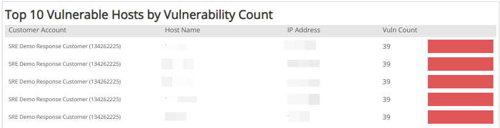
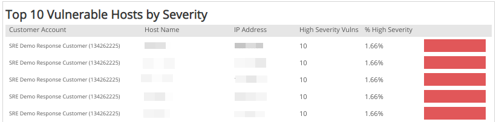
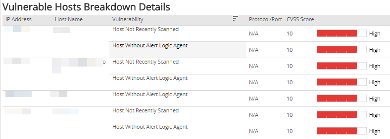

# Current Vulnerable Hosts Breakdown

Current Vulnerable Hosts Breakdown report provides a breakdown of current vulnerable hosts and vulnerability instances ranked by count severity with asset-level detail. Use this report to gain insights into the effectiveness of your vulnerability management, help prioritize your efforts, and focus on specific areas in your environment.

To access the Current Vulnerable Hosts Breakdown report:

1. In the Alert Logic console, click the menu icon (), and then click **Validate**.
2. Click **Reports**, and then click **Vulnerabilities**.
3. Under **Current Vulnerability Breakdown**, click **VIEW**.
4. Click **Current Vulnerable Hosts Breakdown**.

## Filter the report

To refine your findings, filter your report by  **Customer Account**, **Deployment Name**, **VPC/Network**, **Asset Type**, **Category**, **Severity**, and **CVSS Score**.

### Filter the report using drop-down menus

By default, Alert Logic includes **(All)** filter values in the report.

**To add or remove filter values: **

1. Click the drop-down menu in the filter, and then select or clear values.
2. Click **Apply**.

## Vulnerability categories

Alert Logic discovers several types of vulnerabilities, which are divided into categories, and referred to in sections of the report:

* **Configuration**: Exposures related to your deployment that can hinder Alert Logic from delivering service properly, such as no agents or appliance installations, or a misconfiguration where an appliance cannot connect to the server.
* **Security**: Exposures related to vulnerabilities found during internal and external scans, such as a vulnerability that can lead to a breach if not addressed.
* **External**: Exposures related to vulnerabilities found during an external scan, such as a vulnerability that can lead to a breach if not addressed.

## CVSS severity categories

Alert Logic uses CVSS v2 scores to measure the severity of vulnerabilities, which are divided into levels, and referenced to in some sections of this report.

Alert Logic assigns each vulnerability one of the following severities with corresponding icon based on the CVSS v2 score set by the National Institute of Standards and Technology, and reported to the National Vulnerability Database:

| Severity | CVSS base score |
|---|---|
|  High | 7.0 - 10.0 |
| Medium | 4.0 - 6.9 |
| Low | 0.1 - 3.9 |
| Informational | 0.0 |

## Vulnerable Hosts section 

This section provides the current total number of hosts with vulnerabilities in the selected filters.

## Vulnerable Instances section

This section provides the current total number of vulnerability instances found in the selected filters.

## Vulnerabilities by Severity section 

This section provides the current vulnerability count in each CVSS severity category in the selected filters.

## Top 10 Vulnerable Hosts by Vulnerability Count section

The list provides the current top 10 vulnerable hosts, based on the total vulnerability count in the selected filters. The list is organized by customer account, host name, IP address, count of vulnerabilities, and  a bar graph representing the vulnerability count.

## Top 10 Vulnerable Hosts by Severity section

The list displays the current top 10 vulnerable hosts based on the high severity vulnerability count in the selected filters. The list is organized by the customer account, host name, IP address, count of high severity vulnerabilities, the percentage of the high severity vulnerabilities, and a bar graph that represents the count of high severity vulnerabilities.

## Vulnerable Hosts Breakdown Details section

The list provides the current breakdown of vulnerable hosts based on the vulnerability severity in the selected filters. The list is organized by IP address, host name, vulnerability, protocol/port, CVSS score, and the severity of the vulnerability.

