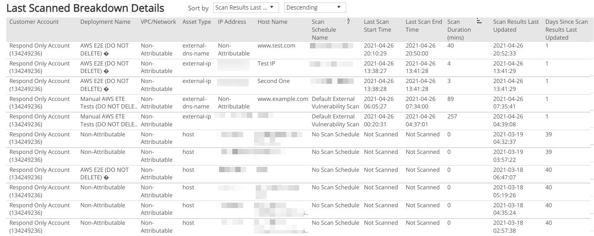

# Last Scanned Breakdown

Last Scanned Breakdown report provides visibility on when your assets were last scanned for vulnerabilities. Use this report to know which assets must be scanned immediately,  gain insights into your last scans, help optimize your scan schedule configuration, and focus on specific areas in your environment.

To access the Last Scanned Breakdown report:

1. In the Alert Logic console, click the menu icon (), and then click **Validate**.
2. Click **Reports**, and then click **Vulnerabilities**.
3. Under **Current Vulnerability Breakdown**, click **VIEW**.
4. Click **Last Scanned Breakdown**.

## Filter the report

To refine your findings, filter your report by  **Customer Account**, **Deployment Name**, **VPC/Network**, **Asset Type**, **Asset Scope**, and **Scan Schedule Name**.

### Filter the report using drop-down menus

By default, Alert Logic includes **(All)** for most filter values in the report. The **Asset Scope** filter is set to **In Scope Assets** by default.

**To add or remove filter values: **

1. Click the drop-down menu in the filter, and then select or clear values.
2. Click **Apply**.

By default, the list is sorted by scan results last updated and organized in descending order. You can set the list to sort by any of the following items:

* Scan Results Last Updated
* Customer Account
* Deployment Name
* VPC/Network
* Asset Type
* IP Address
* Host Name
* Scan Schedule Name
* Scan Duration

You can also use the drop-down list to organize the list by **Ascending** or **Descending** order.

## Last Scanned Breakdown Details section

The list provides the breakdown of your last scanned assets for vulnerabilities based on  the selected filters. The list is organized by customer account, deployment name, VPC/network, asset type, IP address, host name, scan schedule name, last scan start time, last scan end time, scan duration, scan results last updated, and the number of days since scan results were last updated.

