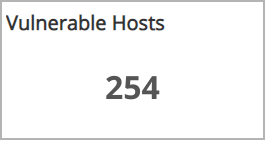
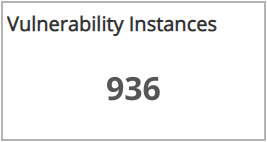
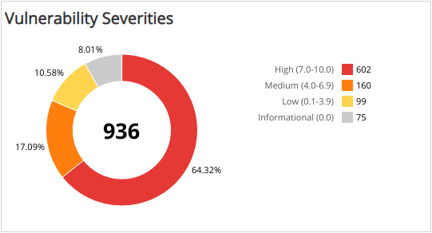
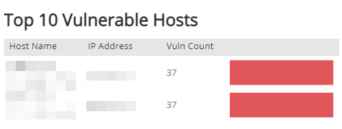
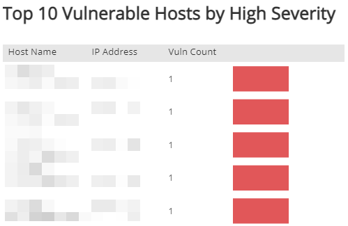
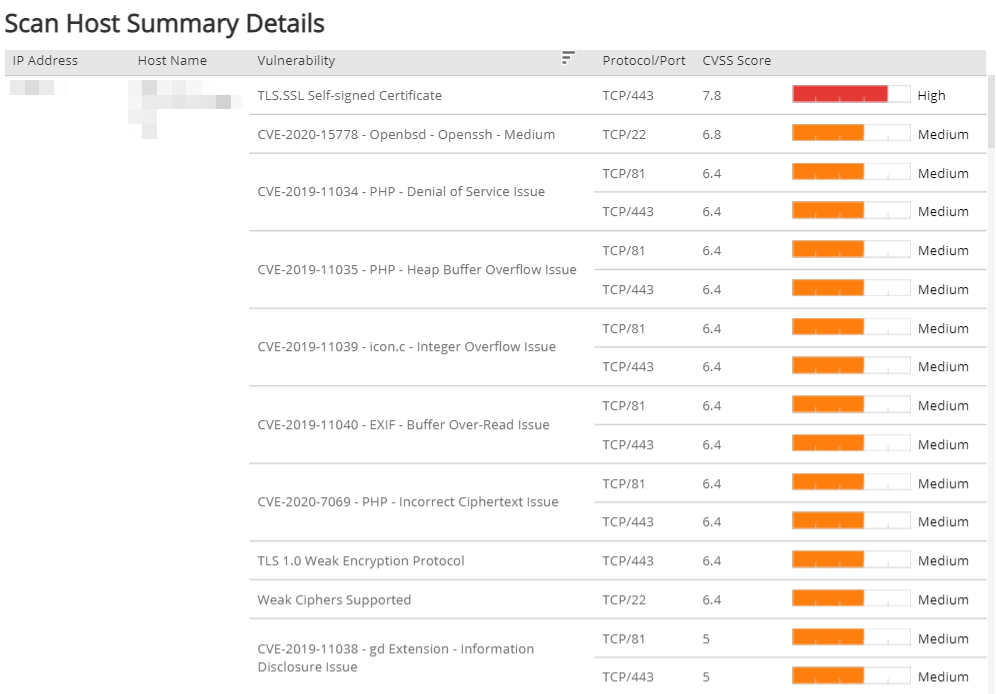

# Scan Host Summary

The Scan Host Summary report provides a breakdown of vulnerable hosts and vulnerability instances found by the selected scan with asset-level detail. Use this report to help prioritize remediation efforts.

To access the Scan Host Summary  report:

1. In the Alert Logic console, click the menu icon (), and then click **Validate**.
2. Click **Reports**, and then click **Vulnerabilities**.
3. Under **Scan Schedule Breakdown**, click **VIEW**.
4. Click **Scan Host Summary**.

## View  the report

To view the report, you must select a single value for  **Customer Account**, **Deployment Name**, **Scan Schedule Name**, and **Scan Start Date**.

    The **Start Scan Time** for a specific scan will not appear until the data refresh following the final scan window defined in the schedule. To validate the most recent data refresh, see the **Last Updated Time** in the top right of the report window.    ## Filter the report

To refine your findings, filter your report by  **Severity**.

### Filter the report using drop-down menus

By default, Alert Logic includes **(All)** filter values in the report.

**To add or remove filter values: **

1. Click the drop-down menu in the filter, and then select or clear values.
2. Click **Apply**.

## Download the report

You can  download the Scan Host Summary report  as an image, data (CSV), crosstab, PDF, or PowerPoint file. To learn how to download reports, see [Report Download Option](../../download-option.md).

## CVSS scores and severity

Alert Logic assigns each vulnerability one of the following severities with corresponding icon based on the CVSS v2 score set by the National Institute of Standards and Technology, and reported to the National Vulnerability Database:

| Severity | CVSS base score |
|---|---|
|  High | 7.0 - 10.0 |
| Medium | 4.0 - 6.9 |
| Low | 0.1 - 3.9 |
| Informational | 0.0 |

## Vulnerable Hosts section 

This section provides the  total number of hosts with vulnerabilities found by the selected scan.

## Vulnerable Instances section

This section provides the  total number of vulnerability instances  found by the selected scan.

## Vulnerabilities by Severity section 

This section provides the  vulnerability count and percentages in each CVSS severity category found by the selected scan.

## Top 10 Vulnerable Hosts by Vulnerability Count section

The list provides the  top 10 vulnerable hosts by total vulnerability count found by the selected scan. The list is organized by  host name, IP address,  vulnerability count,  and a bar graph that represents the relative count of  vulnerabilities by IP address. Hover the bar graph to see the relative percentage of  vulnerabilities for each IP address.

## Top 10 Vulnerable Hosts by High Severity section

The list displays the  top 10 vulnerable hosts by high severity vulnerability count found by the selected scan. The list is organized by  host name, IP address, high severity vulnerability count, and a bar graph that represents the relative count of high severity vulnerabilities by IP address. Hover the bar graph to see the relative percentage of high severity vulnerabilities for each IP address.

## Scanned Host Summary Details section

The list provides the breakdown of vulnerable hosts by vulnerability severity found by the selected scan. The list is organized by IP address, host name, vulnerability, protocol/port, CVSS score, and the severity of the vulnerability. You can hover the severity bar to see a tooltip with additional details about the vulnerability.

