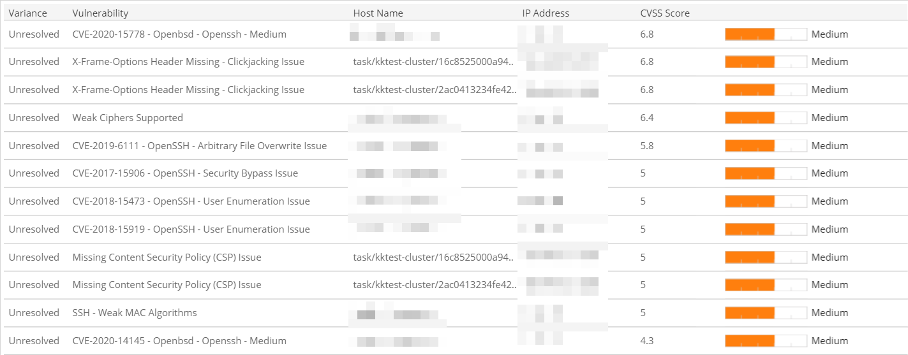

# Scan Variance

The Scan Variance report provides a comparison of new, resolved, and unresolved vulnerability instances  found by the selected scan. Use this report to gain insights into the effectiveness of your vulnerability management and remediation efforts.

To access the Scan Variance report:

1. In the Alert Logic console, click the menu icon (), and then click **Validate**.
2. Click **Reports**, and then click **Vulnerabilities**.
3. Under **Scan Schedule Breakdown**, click **VIEW**.
4. Click **Scan Variance**.

## View  the report

To view the report, you must select a single value for  **Customer Account**, **Deployment Name**, **Scan Schedule Name**, and **Scan Start Date**.

    The **Start Scan Time** for a specific scan will not appear until the data refresh following the final scan window defined in the schedule. To validate the most recent data refresh, see the **Last Updated Time** in the top right of the report window.    ## Filter the report

To refine your findings, filter your report by  **Severity** and **Variance**.

### Filter the report using drop-down menus

By default, Alert Logic includes **(All)** filter values in the report.

**To add or remove filter values: **

1. Click the drop-down menu in the filter, and then select or clear values.
2. Click **Apply**.

## Download the report

You can  download the Scan Variance report  as an image, data (CSV), crosstab, PDF, or PowerPoint file. To learn how to download reports, see [Report Download Option](../../download-option.md).

## Variance status

Alert Logic categorizes vulnerability instances into different statuses, which are referred to in sections of the report:

* **New**: Vulnerability instances that existed on the selected day, but not on the previous day
* **Resolved**: Vulnerability instances that existed on the previous day, but not on the selected day
* **Unresolved**: Vulnerability instances that existed on the selected day and on the previous day

## CVSS scores and severity

Alert Logic assigns each vulnerability one of the following severities with corresponding icon based on the CVSS v2 score set by the National Institute of Standards and Technology, and reported to the National Vulnerability Database:

| Severity | CVSS base score |
|---|---|
|  High | 7.0 - 10.0 |
| Medium | 4.0 - 6.9 |
| Low | 0.1 - 3.9 |
| Informational | 0.0 |

## Scan variance list

The list provides details of the vulnerability instances found by the selected scan. The list is organized by variance, vulnerability name, host name, IP address,  CVSS score, and severity. The list is sorted by descending CVSS score.

