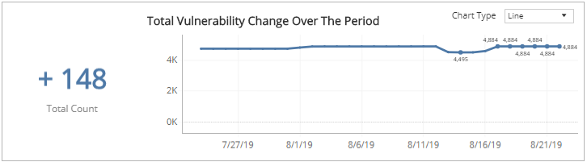
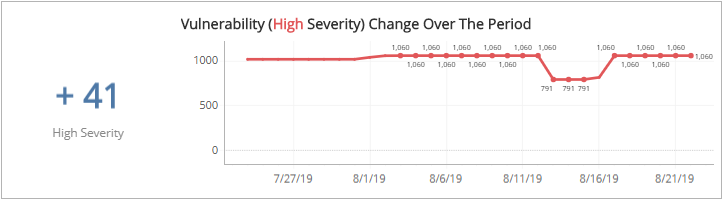
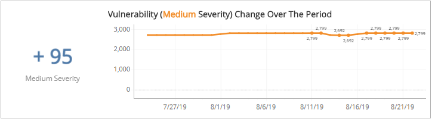
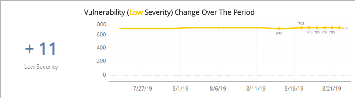

# Monthly Vulnerability Change Trends

The Monthly Vulnerability Change Trends report provides  a summary of the percentage and count changes of vulnerabilities, and trend  by total and severity.

Alert Logic assigns each vulnerability one of the following severities with corresponding icon based on the CVSS v2 score set by the National Institute of Standards and Technology, and reported to the National Vulnerability Database:

| Severity | CVSS base score |
|---|---|
|  High | 7.0 - 10.0 |
| Medium | 4.0 - 6.9 |
| Low | 0.1 - 3.9 |
| Informational | 0.0 |

**To access the Monthly Vulnerability Change Trends report**:

1. In the Alert Logic console, click the menu icon (), and then click **Validate**.
2. Click **Reports**, and then click **Vulnerabilities**.
3. Under **Vulnerabilities Analysis**, click **VIEW**.
4. Click **Monthly Vulnerability Change Trends**.

## Filter the report

To refine your findings, you can filter your report by  **Date Range**, **Customer Account**, **Deployment Name**, **Category**, **Severity**, **CVSS Score**, and **Asset Type**.

### Filter the report using drop-down menus

By default, Alert Logic includes **(All)** filter values in the report.

**To add or remove filter values: **

1. Click the drop-down menu in the filter, and then select or clear values.
2. Click **Apply**.

### Total Vulnerability Change Over the Period section

The section  shows changes in the total count change of vulnerabilities and a graph that presents the daily vulnerability count trend over the selected period of time.

You can display the data as a line or bar charts. Click the drop-down menu on the top right of the this section, and then select the chart type you want to see.

### Vulnerability Change (High Severity) Over the Period section

The section shows changes in the total count change of the vulnerabilities categorized in the high severity rating and a graph that presents the daily high severity vulnerability count trend over the selected period of time.

You can display the data as a line or bar charts. Click the drop-down menu on the top right of the **Vulnerability Count Change Over the Period** section, and then select the chart type you want to see.

### Vulnerability Change (Medium Severity) Over the Period section

The section shows changes in the total count change of the vulnerabilities categorized in the medium severity rating and a graph that presents the daily medium severity vulnerability count trend over the selected period of time.

You can display the data as a line or bar charts. Click the drop-down menu on the top right of the **Vulnerability Count Change Over the Period** section, and then select the chart type you want to see.

### Vulnerability Change (Low Severity) section

The section shows changes in the total count change of the vulnerabilities categorized in the low severity rating and a graph that presents the daily low severity vulnerability count trend over the selected period of time.

You can display the data as a line or bar charts. Click the drop-down menu on the top right of the **Vulnerability Count Change Over the Period** section, and then select the chart type you want to see.

