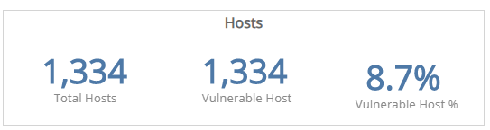
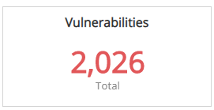
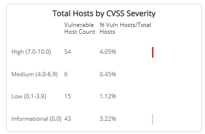
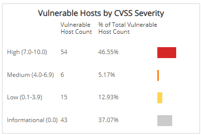
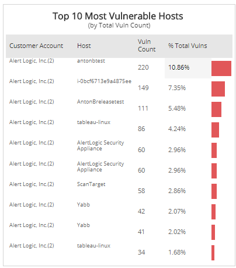
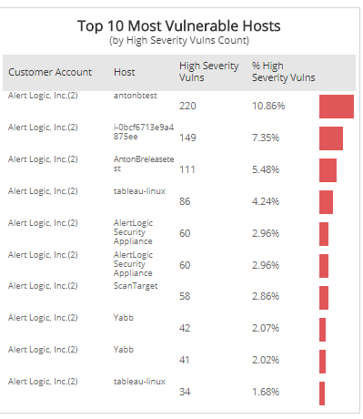

# Monthly Vulnerable Hosts Explorer

The Monthly Vulnerability Hosts Explorer report provides a summary of the most vulnerable assets in your environment.  The report provides the following:

* Total hosts count and vulnerable hosts count
* Percentages of hosts with vulnerabilities
* Host distributions by CVSS severity ratings
* The top 10 view of your most vulnerable hosts

Alert Logic assigns each vulnerability one of the following severities with corresponding icon based on the CVSS v2 score set by the National Institute of Standards and Technology, and reported to the National Vulnerability Database:

| Severity | CVSS base score |
|---|---|
|  High | 7.0 - 10.0 |
| Medium | 4.0 - 6.9 |
| Low | 0.1 - 3.9 |
| Informational | 0.0 |

Use this report to determine where to focus resources and remediation efforts, or identify administrators that require additional guidance.

To access the Monthly Vulnerable Host Explorer report:

1. In the Alert Logic console, click the menu icon (), and then click **Validate**.
2. Click **Reports**, and then click **Vulnerabilities**.
3. Under **Vulnerability Analysis**, click **VIEW**.
4. Click **Monthly Vulnerability Hosts Explorer**.

## Filter the report

To refine your findings, filter your report by  **Select Month**, **Customer Account**, **Deployment Name**, **Category**, **Severity**, and **CVSS Score**.

### Filter the report using drop-down menus

By default, Alert Logic includes **(All)** filter values in the report.

**To add or remove filter values: **

1. Click the drop-down menu in the filter, and then select or clear values.
2. Click **Apply**.

## Hosts section

This section provides the total number of hosts scanned in the selected month(s), the vulnerable hosts, and the percentage of vulnerable hosts.

## Vulnerabilities section

The section provides the total number of vulnerabilities found in the vulnerable hosts in the selected filters.

## Total Hosts by CVSS Severity section

This bar chart categorizes the total hosts in your environment by CVSS severity ratings. The chart also provides the count of vulnerable hosts and the percentage of vulnerable hosts within each category, and it displays a color-coded bar that represents the size of that severity.

## Vulnerable Hosts by CVSS Severity section

This  bar chart categorizes the total vulnerable hosts in your environment by CVSS severity, provides the count of vulnerable hosts and the percentage of vulnerable hosts within each category, along with a displays a color-coded bar that represents the size of that severity.

## Top 10 Most Vulnerable Hosts (by Total Vulnerability Count) section

The list provides the 10 most vulnerable hosts based on the total vulnerability count during the selected month(s). The list is organized by customer account, host name, count of vulnerabilities, and the percentage of the total vulnerabilities count, along with a color-coded bar that represents the size of the vulnerabilities count.

## Top 10 Most Vulnerable Hosts (by High Severity Vulnerability Count) section

The list provides the 10 most vulnerable hosts based on the total high severity vulnerability count during the selected month(s). The list is organized by the customer account, host name, count of high severity vulnerabilities, and the percentage of the high severity vulnerabilities, along with a color-coded bar that represents the size of that severity.

