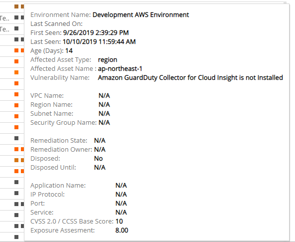

# List of Vulnerabilities

The List of Vulnerabilities report returns a tabular list of all current vulnerabilities, details about each vulnerability, and information about the assets affected by the vulnerability. Use this report to address and further analyze  specific vulnerabilities and vulnerability instances found in your environment.

To access the List of Vulnerabilities report:

1. In the Alert Logic console, click the menu icon (), and then click **Validate**.
2. Click **Reports**, and then click **Vulnerabilities**.
3. Under **Vulnerability List**, click **VIEW**.
4. Click **List of Vulnerabilities**.

## Filter the report

To refine your findings, filter your report by  **Environment Name**, **Disposed**, **Region**, **VPC**, **Subnet**, **Security Groups**, **Asset Type**, **Category**, **Severity**, and **CVSS Score**.

### Filter the report using drop-down menus

By default, Alert Logic includes **(All)** filter values in the report.

**To add or remove filter values: **

1. Click the drop-down menu in the filter, and then select or clear values.
2. Click **Apply**.

The tabular is organized by name, region, VPC, subnet, security groups, application name, and color-coded squares that represent each time it was seen in a scan.

To see more information  about the vulnerability during a scan, hover over a square. Information includes scanning dates, when the vulnerability was first and last seen, age, affected assets, CVSS score, exposure assessment, and more.

The information provided depends on relevance of the vulnerability and scan so not all information may be available.

