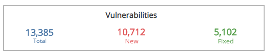
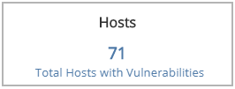
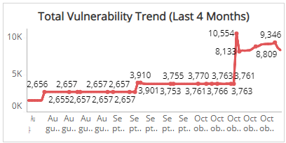
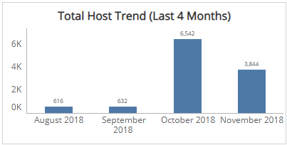
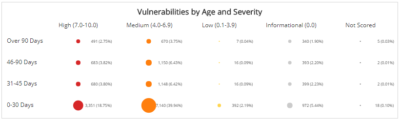
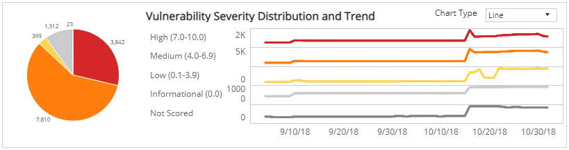
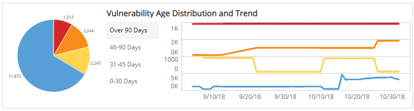

# Monthly Vulnerability Summary

The Monthly Vulnerability Summary report provides summary headline, distribution, and trending data for vulnerabilities found across your environment. The report provides the following:

* Vulnerability status and vulnerable hosts counts
* Severity and age distribution
* Categorized trends
* Top 10 lists
* Exportable vulnerability list

Use this report to gain insights into the effectiveness of your current vulnerability management, learn about new vulnerabilities and emerging threats, help prioritize your efforts, and focus on specific areas in your environment.

Alert Logic assigns each vulnerability one of the following severities with corresponding icon based on the CVSS v2 score set by the National Institute of Standards and Technology, and reported to the National Vulnerability Database:

| Severity | CVSS base score |
|---|---|
|  High | 7.0 - 10.0 |
| Medium | 4.0 - 6.9 |
| Low | 0.1 - 3.9 |
| Informational | 0.0 |

To access the Monthly Vulnerability Summary report:

1. In the Alert Logic console, click the menu icon (), and then click **Validate**.
2. Click **Reports**, and then click **Vulnerabilities**.
3. Under **Vulnerabilities Analysis**, click **VIEW**.
4. Click **Monthly Vulnerability Summary**.

## Filter the report

To refine your findings, filter your report by  **Month**, **Customer Account**, **Deployment Name**, **Category**, **Severity**, **CVSS Score**, and **Asset Type**.

### Filter the report using drop-down menus

By default, Alert Logic includes **(All)** filter values in the report.

**To add or remove filter values: **

1. Click the drop-down menu in the filter, and then select or clear values.
2. Click **Apply**.

## Vulnerabilities Headline section

This section provides the total number of vulnerabilities found, new vulnerabilities seen for the first time, and fixed vulnerabilities not seen during the last scan in the selected months.

## Hosts Headline section

This section provides the total number of hosts with vulnerabilities in the selected filters.

## Total Vulnerability Trend (Last 4 Months) section

The line graph presents the monthly trend of the total number of vulnerabilities from the last four months.

## Total Host Trend (Last 4 Months) section

The bar graph presents the trend of the total hosts from the last four months.

## Vulnerabilities by Age and Severity section

This section presents the distribution of age and severity categories of vulnerabilities in the selected filters presented in color-coded circles. The age categories are the following:

* Over 90 days
* 46-90 days
* 31-45 days
* 0-30 days

Alert Logic assigns each vulnerability one of the following severities with corresponding icon based on the CVSS v2 score set by the National Institute of Standards and Technology, and reported to the National Vulnerability Database:

| Severity | CVSS base score |
|---|---|
|  High | 7.0 - 10.0 |
| Medium | 4.0 - 6.9 |
| Low | 0.1 - 3.9 |
| Informational | 0.0 |

The size of the circles represent the total vulnerabilities in each age category while its color represent the severity category of those vulnerabilities.

To see a specific list of vulnerabilities, click on a circle, severity category, age category, or number, and then click **List these vulnerabilities**. You also have the option to set additional filters on the **Vulnerability Summary** page when you click one or more circles in this section.

##  Vulnerability CVSS Severity and Trends section

This section provides the distribution of CVSS severity categories and trend of vulnerabilities over the selected months in the selected filters.

Alert Logic assigns each vulnerability one of the following severities with corresponding icon based on the CVSS v2 score set by the National Institute of Standards and Technology, and reported to the National Vulnerability Database:

| Severity | CVSS base score |
|---|---|
|  High | 7.0 - 10.0 |
| Medium | 4.0 - 6.9 |
| Low | 0.1 - 3.9 |
| Informational | 0.0 |

The color-coded pie chart presents the total vulnerability count in each CVSS severity category, along with a chart that presents the trend over the selected months of those vulnerabilities.

To see a specific list of vulnerabilities, click on a slice in the pie chart, a severity category, or an item in the graph, and then click **List these vulnerabilities**. You also have the option to set additional filters on the **Vulnerability Summary** page when you click a slice in the pie chart.

You can display the trend data as a line or bar chart. Click the drop-down on the top right of this section, and select the chart type you want to see.

## Vulnerability Age and Trends section

This section shows the distribution of age categories and trend of vulnerabilities over the selected months in the selected filters. The age categories are the following:

* Over 90 days
* 46-90 days
* 31-45 days
* 0-30 days

The color-coded pie chart presents the total vulnerability count in each age category, along with a chart that presents the daily trend over the selected months of those vulnerabilities.

To see a specific list of vulnerabilities, click on a pie chart age category, an age category, or an item in the graph, and then click **List these vulnerabilities**. You also have the option to set additional filters on the **Vulnerability Summary** page when you click a slice in the pie chart.

You can display the trend data as a line or bar chart. Click the drop-down on the top right of **Vulnerability CVSS Severity and Trends** section, and then select the chart type you want to see.

