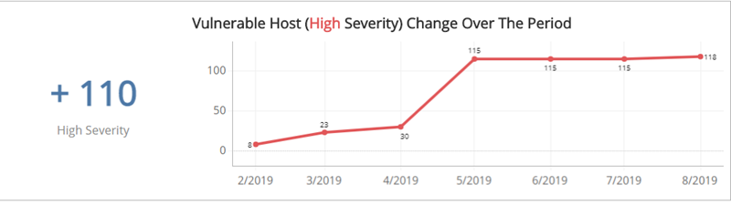
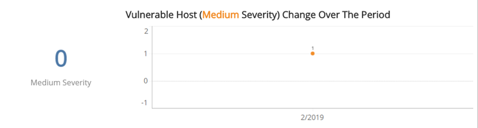
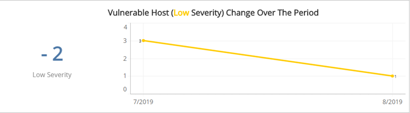

# Monthly Vulnerable Hosts Change Trends

The Monthly Vulnerable Hosts Change Trends report contains sections that show the count and the trend of vulnerable host changes over the selected time period. You can display the data as a line or bar chart. Click the drop-down on the top right of the **Vulnerable Host Count Over the Period** section, and then select the chart type you want to see.

To access the Vulnerable Hosts Change Trends report:

1. In the Alert Logic console, click the menu icon (), and then click **Validate**.
2. Click **Reports**, and then click **Vulnerabilities**.
3. Under **Vulnerabilities Analysis**, click **VIEW**.
4. Click **Monthly Vulnerable Hosts Change Trends**.

To refine your findings, filter your report by  **Select Month**, **Customer Account**, **Deployment Name**, **Category**, **Severity**, and **CVSS Score**.

### Vulnerable Host  Change section

This section shows the change in the total count of vulnerable hosts, and a graph that displays the monthly vulnerable host count trend change over the selected period of time.

### Vulnerability Host Change (High Severity) 

This section shows the total percentage change of the vulnerable hosts categorized as high severity and a graph that displays the monthly percentage trend change over the selected period of time.

### Vulnerability Host Change (Medium Severity) section

The section shows the total percentage change of vulnerable hosts categorized as medium severity, and a graph that displays the monthly percentage trend change over the selected period of time.

### Vulnerability Host Change (Low Severity) section

The section shows the total percentage change of the vulnerable hosts categorized as low severity, and a graph that displays the monthly percentage trend change over the selected period of time.

