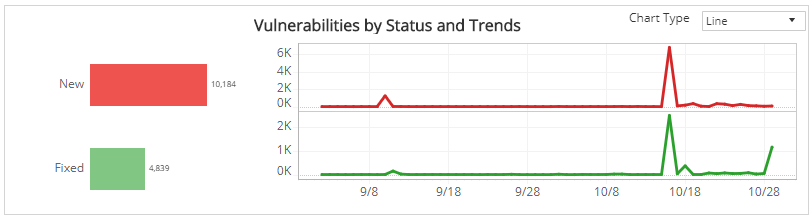
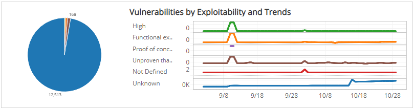
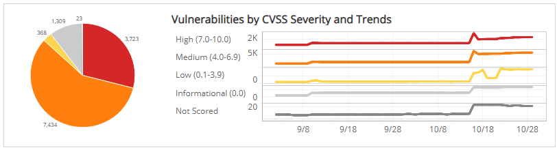
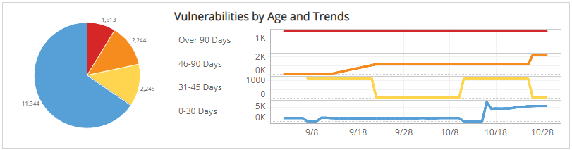
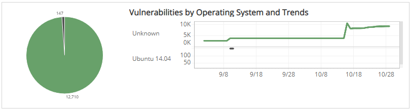
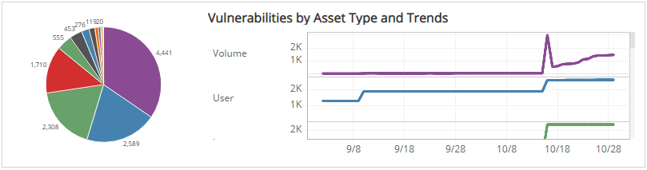

# Weekly Vulnerability Distribution Explorer

The Weekly Vulnerability Distribution Explorer report provides insights into patterns from the vulnerabilities found in your environment, including vulnerability distribution and trends categorized by status, exploitability, severity, age, operating system, and asset type. Use this report to help you optimize your vulnerability management process.

**To access the Weekly Vulnerability Distribution Explorer report**:

1. In the Alert Logic console, click the menu icon (), and then click **Validate**.
2. Click **Reports**, and then click **Vulnerabilities**.
3. Under **Vulnerabilities Analysis**, click **VIEW**.
4. Click **Weekly Vulnerability Distribution Explorer**.

## Filter the report

To refine your findings, you can filter your report by  **Week**, **Customer Account**, **Deployment Name**, **Vulnerable Asset Type**, **Category**, **Severity**, and **CVSS Score**.

### Filter the report using drop-down menus

By default, Alert Logic includes **(All)** filter values in the report.

**To add or remove filter values: **

1. Click the drop-down menu in the filter, and then select or clear values.
2. Click **Apply**.

## Vulnerabilities by Status and Trends section

This section shows the distribution of status categories and trend of vulnerabilities over the selected weeks in the selected filters. The status categories are the following:

* New: First seen in the selected weeks
* Fixed: Not seen after the last scan in the selected weeks

The color-coded bar represents the total vulnerability count in each status category, along with a chart that presents the daily trend over the selected weeks of those vulnerabilities.

You can display the trend data as a line or bar chart. Click the drop-down menu on the top right of this section, and then select the chart type you want to see.

## Vulnerabilities by Exploit Availability and Trends section

This section shows the distribution of exploitability categories and daily trend of vulnerabilities over the selected weeks in the selected filters. The exploit availability categories are the following:

| Category | Exploit Code |
|---|---|
| High | Exploit code works in every situation, or is being delivered via autonomous agent |
| Functional exploit exists | Exploit code is available and works in most situations where the vulnerability exists |
| Proof of concept | (Exploit code is not functional and may require substantial modification by a skilled hacker |
| Unproven that exploit exists | Exploit Code is not available or is entirely theoretical |
| Not Defined | Exploit availability not defined |
| Unknown | Exploit availability unknown |

The color-coded pie chart presents the total vulnerability count in each exploit availability category, along with a chart that presents the daily trend over the selected weeks of those vulnerabilities.

You can view the trend data as a line or bar chart. Click the drop-down menu on the top right of **Vulnerabilities by Status and Trends** section, and then select the chart type you want to see.

## Vulnerabilities by CVSS Severity and Trends section

This section shows the distribution of CVSS severity categories and daily trend of vulnerabilities over the selected weeks in the selected filters.

Alert Logic assigns each vulnerability one of the following severities with corresponding icon based on the CVSS v2 score set by the National Institute of Standards and Technology, and reported to the National Vulnerability Database:

| Severity | CVSS base score |
|---|---|
|  High | 7.0 - 10.0 |
| Medium | 4.0 - 6.9 |
| Low | 0.1 - 3.9 |
| Informational | 0.0 |

The color-coded pie chart presents the total vulnerability count in each CVSS severity category, along with a chart that presents the daily trend over the selected weeks of those vulnerabilities.

You can display the trend data as a line or bar chart. Click the drop-down menu on the top right of **Vulnerabilities by Status and Trends** section, and then select the chart type you want to see.

## Vulnerabilities by Age and Trends section

This section shows the distribution of age categories and daily trend of vulnerabilities over the selected weeks in the selected filters. The age categories are the following:

* Over 90 days
* 46-90 days
* 31-45 days
* 0-30 days

The color-coded pie chart presents the total vulnerability count in each age category, along with a chart that presents the daily trend over the selected weeks of those vulnerabilities.

You can display the trend data as a line or bar chart. Click the drop-down menu on the top right of **Vulnerabilities by Status and Trends** section, and then select the chart type you want to see.

## Vulnerabilities by Operating System and Trends section

This section shows the operating systems and daily trend of vulnerabilities over the selected weeks  in the selected filters. The operating systems are the following:

* Linux
* Unbuntu
* Windows Server
* Unknown (Operating system could not be determined during scan)

The color-coded pie chart presents the total vulnerability count in each operating system, along with a chart that presents the daily trend over the selected weeks of those vulnerabilities.

You can display the trend data as a line or bar chart. Click the drop-down menu on the top right of **Vulnerabilities by Status and Trends** section, and select the chart type you want to see.

## Vulnerabilities by Asset Type and Trends section

This section shows the distribution of asset types and trending of vulnerabilities over the selected weeks within the selected filters. There are dozens of asset types, including the following representative examples:

* Region
* Deployment
* Security Group
* VPC
* DNS Zone
* Load Balancer
* Host
* Volume
* User

The color-coded pie chart presents the total vulnerability count for each asset type, along with a chart that presents the daily trend over the selected weeks of those vulnerabilities.

You can display the trend data as a line or bar chart type. Click the drop-down menu on the top right of **Vulnerabilities by Status and Trends** section, and then select the chart type you want to see.

