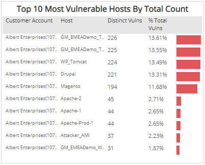
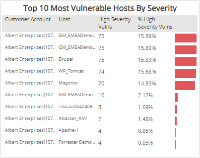
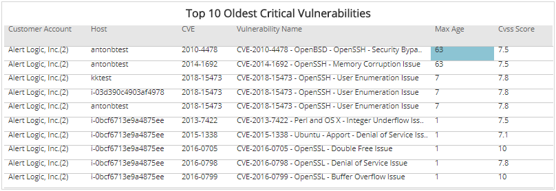
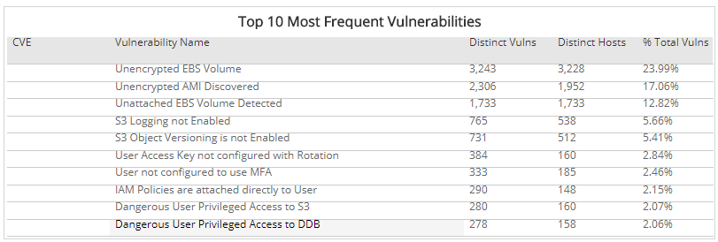

# Weekly Top 10 Vulnerability Lists

The Weekly Top 10 Vulnerability Lists report provides top 10 lists for your most vulnerable hosts by total count and by severity, oldest critical vulnerabilities, and frequent vulnerabilities.

To access the Weekly Top 10 Vulnerability Lists report:

1. In the Alert Logic console, click the menu icon (), and then click **Validate**.
2. Click **Reports**, and then click **Vulnerabilities**.
3. Under **Vulnerabilities Analysis**, click **VIEW**.
4. Click **Weekly Top 10 Vulnerability Lists**.

## Filter the report

To refine your findings, filter your report by  **Week**, **Customer Account**, **Deployment Name**, **Category**, **Severity**, **CVSS Score**, and **Asset Type**.

### Filter the report using drop-down menus

By default, Alert Logic includes **(All)** filter values in the report.

**To add or remove filter values: **

1. Click the drop-down menu in the filter, and then select or clear values.
2. Click **Apply**.

To see a specific list of vulnerabilities, click on an item in the chart, and then click **List these vulnerabilities**.

## Vulnerabilities Headline section

This section provides the total number of vulnerabilities found, new vulnerabilities seen for the first time, and fixed vulnerabilities not seen during the last scan in the selected weeks.

To see a specific list of vulnerabilities, double-click on the Total number headline, and then click **List these vulnerabilities**.

## Hosts Headline section

This section provides the total number of hosts with vulnerabilities in the selected filters.

## Top 10 Most Vulnerable Hosts by Total Count section

The list displays the 10 most vulnerable hosts based on the total vulnerability count during the selected weeks. The list is organized by customer account, host name, distinctive vulnerabilities, and the percentage of those vulnerabilities, along with a color-coded bar that represents the size of the vulnerability count. Click on any item in the chart to see a specific list of vulnerabilities.

## Top 10 Most Vulnerable Hosts by Severity section

The list displays the 10 most vulnerable hosts based on the high severity vulnerability count during the selected weeks. The list is organized by the customer account, host name, count of high severity vulnerabilities, and the percentage of the high severity vulnerabilities, along with a color-coded bar that represents the amount of high severity vulnerabilities.

## Top 10 Oldest Critical Vulnerabilities section

The list displays the 10 oldest critical vulnerabilities based on their age and severity during the selected weeks. The list is organized by the customer account, host name, CVE, vulnerability name, maximum age, and CVSS score.

## Top 10 Most Frequent Vulnerabilities section

The list displays the 10 most frequent vulnerabilities based on the distinct number of vulnerability instances and impacted hosts during the selected weeks. The list is organized by CVE, vulnerability name, distinct vulnerabilities, distinct hosts, and the percentage of the total vulnerabilities.

