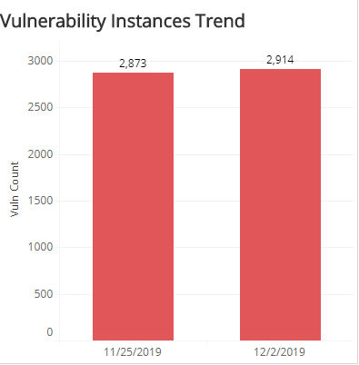
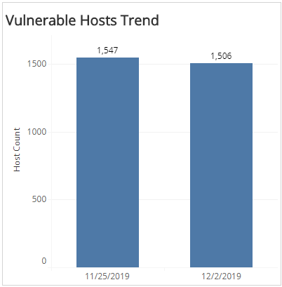
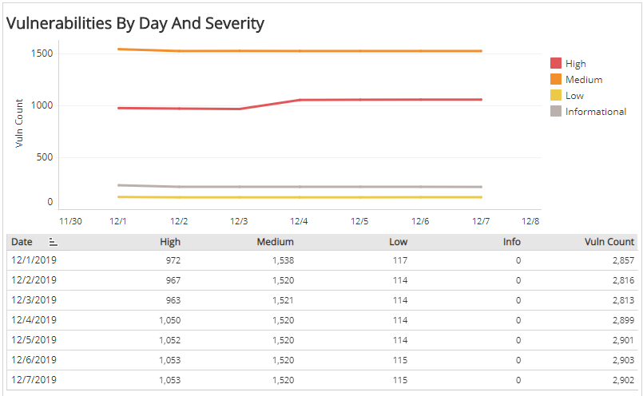
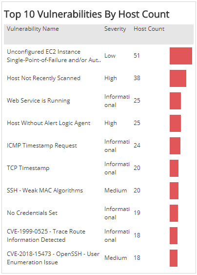
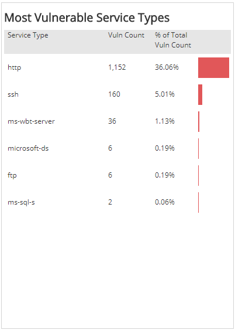
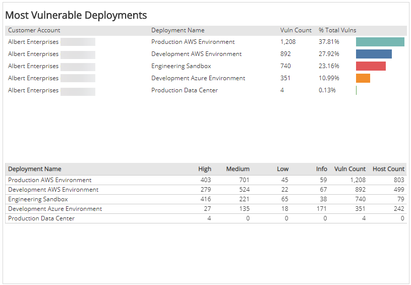
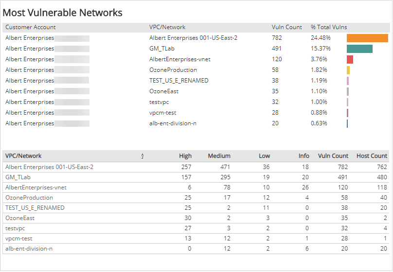

# Weekly Vulnerability Analysis

The Weekly Vulnerability Analysis report  provides insights into vulnerabilities and vulnerable assets found in your environment, including vulnerabilities by severity and age, vulnerability trends, vulnerabilities by day and severity, and top vulnerable hosts, networks, and deployment lists for the selected week. Use this report to gain insights into the effectiveness of your vulnerability management, help prioritize your efforts, and focus on specific areas in your environment.

This report presents data for an entire week, from Monday through Sunday, which immediately becomes available in the beginning of the following week.

To access the Weekly Vulnerability Analysis report:

1. In the Alert Logic console, click the menu icon (), and then click **Validate**.
2. Click **Reports**, and then click **Vulnerabilities**.
3. Under **Vulnerability Analysis - Full Report**, click **VIEW**.
4. Click **Weekly Vulnerability Analysis**.

## Filter the report

To refine your findings, filter your report by  **Select Week**, **Customer Account**, **Deployment Name**, **Category**, **Severity**, **CVSS Score**, and **Vulnerable Asset Type**.

### Filter the report using drop-down menus

By default, Alert Logic includes **(All)** filter values in the report.

**To add or remove filter values: **

1. Click the drop-down menu in the filter, and then select or clear values.
2. Click **Apply**.

## CVSS severity categories

Alert Logic uses CVSS v2 scores to measure the severity of vulnerabilities, which are divided into categories, and referenced to in some sections of this report.

Alert Logic assigns each vulnerability one of the following severities with corresponding icon based on the CVSS v2 score set by the National Institute of Standards and Technology, and reported to the National Vulnerability Database:

| Severity | CVSS base score |
|---|---|
|  High | 7.0 - 10.0 |
| Medium | 4.0 - 6.9 |
| Low | 0.1 - 3.9 |
| Informational | 0.0 |

## Vulnerabilities by Severity section 

This section provides the vulnerability count in each CVSS severity category for the selected week.

## Vulnerabilities by Age section

This section provides the vulnerability count in each age category for the selected week.

## Vulnerability Instance Trend

This section provides a comparison of the vulnerability count for the selected week, and the previous week of the one you selected.

## Vulnerable Hosts Trend

This section provides a comparison of the vulnerable host count for the selected week, and the previous week of the one you selected.

## Vulnerabilities by Day and Severity section

This section provides a line graph of the vulnerability count for every CVSS severity category and trend  over the selected week, and a list with the count, and total count of vulnerabilities in every CVSS severity category on each day.

## Top 10 Vulnerabilities by Host Count  

The list provides the top 10 vulnerabilities based on host count for the selected week. The list is organized by vulnerability name, severity, host count, and a bar graph representing the host count.

## Most Vulnerable Service Types section

This section provides the most vulnerable service types for the selected week. The list is organized by service type, vulnerability count, the percentage total the vulnerability count, and a bar graph representing the vulnerability count.

## Top 10 Vulnerable Hosts by Vuln Count section 

The list provides the 10 most vulnerable hosts based on the total vulnerability count for the selected week. The list is organized by customer account, host name, host IP address, vulnerability count, and  a  bar graph representing the vulnerability count.

## Most Vulnerable Deployments section

This section provides the count and percentages for the most vulnerable deployments in a color-coded bar graph, and list of the most  vulnerable deployments, organized by severity rankings, vulnerability count, and host count.

## Most Vulnerable Networks section

This section provides the count and percentages for the most vulnerable networks in a color-coded bar graph, and list of the most  vulnerable networks, organized by severity rankings, vulnerability count, and host count.

