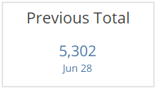
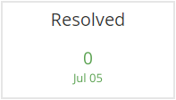
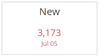
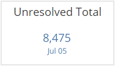
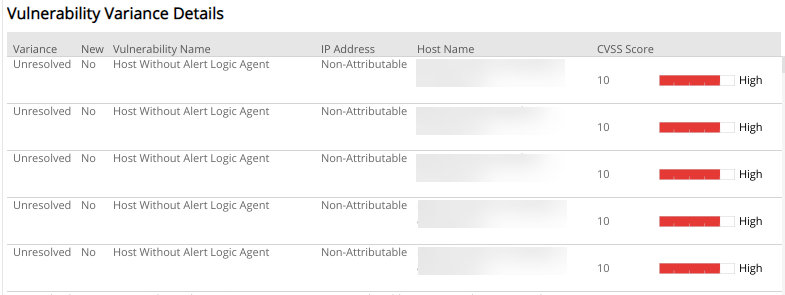

# Weekly Vulnerability Variance

The Weekly Vulnerability Variance report provides a comparison of total unresolved, new, and resolved vulnerability instances in your environment from the previous week. Use this report to gain insights into the effectiveness of your vulnerability management and remediation efforts.

To access the Weekly Vulnerability Variance  report:

1. In the Alert Logic console, click the menu icon (), and then click **Validate**.
2. Click **Reports**, and then click **Vulnerabilities**.
3. Under **Vulnerability Variance**, click **VIEW**.
4. Click **Weekly Vulnerability Variance**.

## Filter the report

To refine your findings, filter your report by **Select Week**, **Customer Account**, **Deployment Name**, **VPC/Network**, **Category**, **Severity**, **Variance**, and **New**.

### Filter the report using drop-down menus

By default, Alert Logic includes **(All)** filter values in the report.

**To add or remove filter values: **

1. Click the drop-down menu in the filter, and then select or clear values.
2. Click **Apply**.

## Vulnerability categories

Alert Logic discovers several types of vulnerabilities, which are divided into categories, and referred to in sections of the report:

* **Configuration**: Exposures related to your deployment that can hinder Alert Logic from delivering service properly, such as no agents or appliance installations, or a misconfiguration where an appliance cannot connect to the server.
* **Security**: Exposures related to vulnerabilities found during internal and external scans, such as a vulnerability that can lead to a breach if not addressed.
* **External**: Exposures related to vulnerabilities found during an external scan, such as a vulnerability that can lead to a breach if not addressed.

## CVSS severity categories

Alert Logic uses CVSS v2 scores to measure the severity of vulnerabilities, which are divided into levels, and referenced to in some sections of this report.

Alert Logic assigns each vulnerability one of the following severities with corresponding icon based on the CVSS v2 score set by the National Institute of Standards and Technology, and reported to the National Vulnerability Database:

| Severity | CVSS base score |
|---|---|
|  High | 7.0 - 10.0 |
| Medium | 4.0 - 6.9 |
| Low | 0.1 - 3.9 |
| Informational | 0.0 |

## Variance status

Alert Logic categorizes vulnerability instances into different statuses, which are referred to in sections of the report:

* **New**: Vulnerability instances that existed on the last day of the selected week, but not on the previous week
* **Resolved**: Vulnerability instances that existed on the last day of the previous week, but not on the last day of the selected week
* **Unresolved**: Vulnerability instances that existed on the last day of the selected week and the last day of the previous week

## Variance between selected weeks

The following sections headline the variance of vulnerability instances  between the last day of the week you selected and the previous week.

### Previous Total section

This section provides the total number of vulnerability instances that existed on  the last day of the previous week in the selected filters.

### Resolved section 

This section provides the number of vulnerability instances that were resolved from  the last day of the previous week in the selected filters.

### New section 

This section provides the number of vulnerability instances that were first seen or seen again on the last day of  the week you chose in the selected filters.

### Unresolved Total section 

This section provides the total number of vulnerability instances that went unresolved from the last day of  the previous week and remained on the  last day of the week you chose in the selected filters.

## Vulnerability Variance Details

The list provides details of the vulnerability instances that existed on the  last day of the week you chose in the selected filters. The list is organized by variance and new status, vulnerability name, IP address, host name, CVSS score, and the severity category represented in a bar graph.

