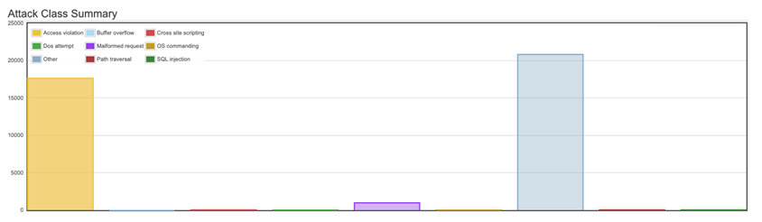
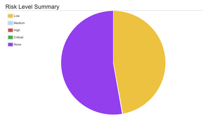
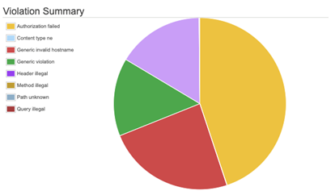
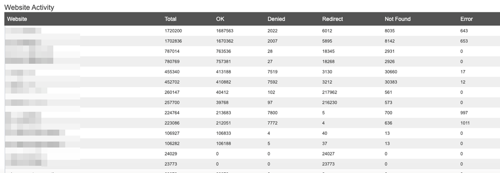

# WAF Activity Report

The WAF Activity report provides information on activity being validated by the Alert Logic Managed Web Application Firewall (WAF). Use the report to evaluate  WAF activity by attack class, risk level, violation description, and website activity.

The Activity Report provides a filtered report on activity during a slice of time.

To access the WAF activity report:

1. In the Alert Logic console, click the menu icon (), and then click **Validate**.
2. Click **Reports**, and then click **WAF**.
3. In the side navigation menu, click **Activity**.

## Filter the report

You can filter the report by recent date range, custom date range, and appliance.

**To filter the report by recent date range**:

1. Click the **Select Range** drop-down menu.
2. Select **Last Hour**, **Last 24 Hours**, **Last Week**, or **Last Month**.
3. Click **Go**.

**To filter the report by custom date range**:

1. Enter a date in the starting date field.
2. Enter a date in the ending date field.
3. Click **Go**.

**To filter the report by appliance**:

1. Click the **Filter** drop-down menu.
2. Click in appliances search field, and a list of appliance filter options is displayed.
3. Select one or more appliances, and then click **Filter**.
4. Click the delete icon() to remove an appliance, or click **Clear Filters**.

## Attack class summary section

This section provides the total count for WAF activity by attack class. You can hover or click on a bar to see total count and attack class details.

## Risk Level summary section

This section provides a summary of risk levels for WAF activity. You can hover or click on a sector of the pie chart will display a tooltip that provides count and percentage for the risk level.

## Violation summary section

This section provides a summary of violations for WAF activity. You can hover or click on a sector of the pie chart will display a tooltip that provides count and percentage for the violation type.

## Website activity section

This section provides the total count for  activity being validated by the WAF and total counts for each response action taken by the WAF.

