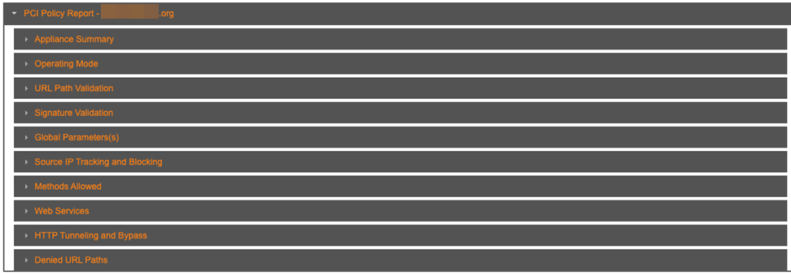

# WAF Policy Report

The WAF Policy report provides a summary of the Alert Logic Managed Web Application Firewall (WAF) security configuration on a per website basis. Each PCI Policy report  provides the security policy settings for a single website protected by the WAF. Use this report to review policy settings across appliances and websites.

To access the WAF Policy report:

1. In the Alert Logic console, click the menu icon (), and then click **Validate**.
2. Click **Reports**, and then click **WAF**.
3. In the side navigation menu, click **Policy**.

## Search

You can search for a PCI policy report by name or IP address.

## Filter the report

You can filter the PCI policy reports by  appliance.

**To filter the report by appliance**:

1. Click the **Filter** drop-down menu.
2. Click in appliances search field, and a list of appliance filter options is displayed.
3. Select one or more appliances, and then click **Filter**.
4. Click the delete icon() to remove an appliance, or click **Clear Filters**.

## PCI Policy Report section

This section provides the policy settings for the website designated in the report name. Click the drop-down arrow to display the policy setting categories.

### Appliance Summary section

This section provides information about the parent customer, appliance owner, appliance name, and date in service for the PCI Policy.

### Operating Mode section

This section provides the configured operating modes for the selected policy with descriptions.

#### Operating Mode Definitions section

This section provides details on the operating modes in a list of activity types, the configured operating mode response action, and a description of the activity.

### URL Path Validation section

This section provides information on URL path validation, including Global URL validation status, Global URL signature based matching, Global URL Regexp matching, and Regexp.

### Signature Validation section

This section provides details on enabled signatures, custom signatures, and settings for criticality by attack class.

#### Signatures Enabled

This section lists attack classes by name and provides enabled/disabled information for negative filtering and classification signatures. An "X" means the signature is enabled for the activity type.

#### Custom Signatures

This section lists any custom signatures with details on attack class, value, status, and comments.

#### Attack Class Criticality Levels

This section lists attack classes by name, risk level, and description.

### Global Parameter(s) section

This section lists the global parameters and provides details for each parameter policy and defines validation classes.

#### Global Parameter Policies

This section provides the name, type, update (automatic or manual), value, and enabled/disabled status for each parameter policy.

#### Validation Class Definitions

This section provides the name, value, and description of each validation class for the global parameters.

### Source IP Tracking and Backlog section

This section provides policy information on tracking and blocking activity by IP, including if IP source tracking is enabled, risk level for automatic tracking of denied requests, if IP source immediate blocking is enabled, and risk level for automatic blocking of IP sources.

### Methods Allowed section

This section lists whether HEAD, GET, POST, OPTIONS, PUT, and DELETE methods are allowed or disallowed in the policy.

### Web Services section

This section lists whether XML, JSON, and Plain Text are allowed or disallowed in the policy.

### HTTP Tunneling and Bypass section

This section states whether HTTP tunneling and bypass flash remoting are allowed or disallowed in the policy.

### Denied URL Paths section

This section states whether global URL blocking is enabled or disabled. If global URL blocking is enabled, this section also provides information on which blocked global URLs are defined.
