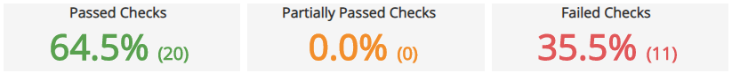
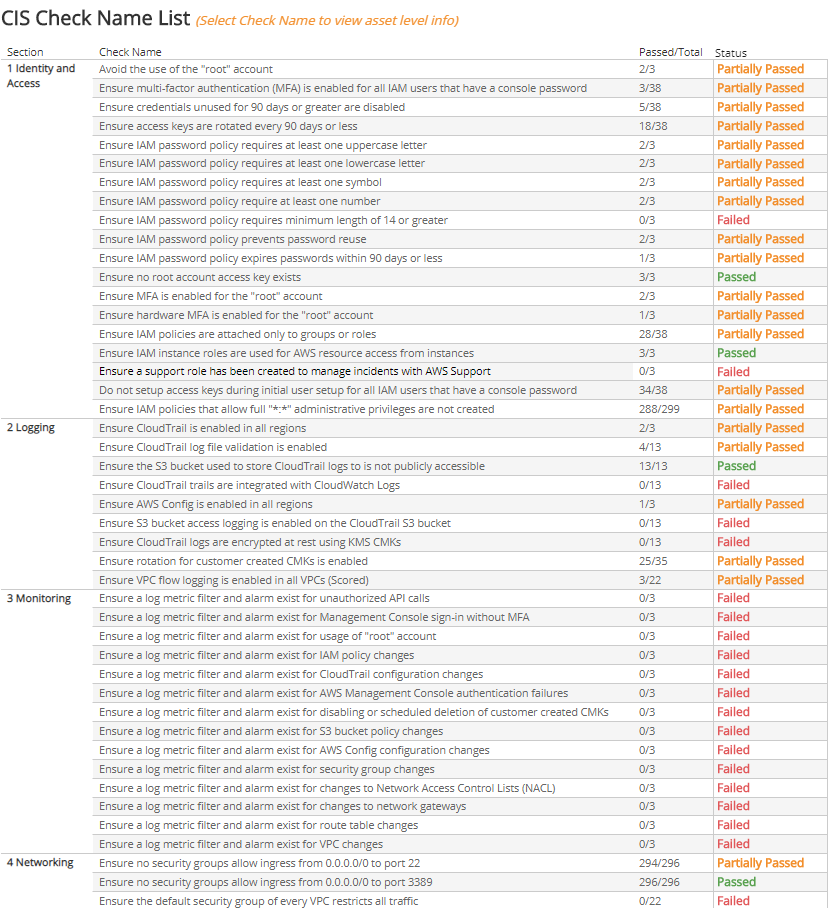

# CIS AWS Foundation Benchmark

CIS Amazon Web Services (AWS) Foundation Benchmark report provides an assessment of how your environment conforms to configuration guidelines developed by Center for Internet Security (CIS) experts. Alert Logic performs a series of benchmark checks on your AWS deployments to display the statuses of the checks for each section.

For more information about AWS CIS Benchmarks, see [cisecurity.org/benchmark/amazon_web_services](https://www.cisecurity.org/benchmark/amazon_web_services/).

**To access the AWS Foundation Benchmark report:**

1. In the Alert Logic console, click the menu icon (), and then click **Validate**.
2. Click **Reports**, and then click  **Compliance**.
3. Under **CIS  AWS Benchmark**, click **VIEW**.
4. Click **CIS AWS Foundations Benchmark**.

To refine your findings, you can filter your report by  deployment and section.

## Status of checks

This section headlines the percentages and numbers of the checks that passed, partially passed, and failed out of the total checks performed.

## Check name list

This list consists of all the sections and the checks within those sections, the number of assets that passed out of the total number of assets that were checked, and the current status of that check. You can click an item in the list to go to the details page for that check. To leave the details page, click **Undo**.

