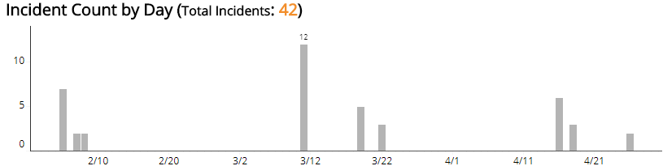
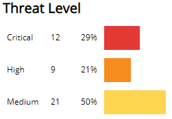
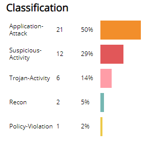
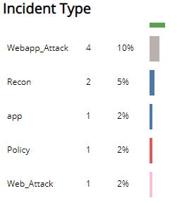
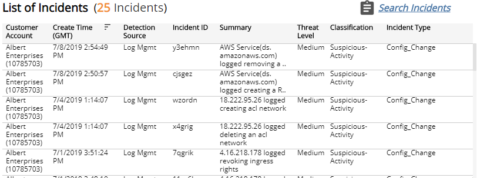

# HIPAA 164.308(a)(6)(ii)—Response and Reporting

The Health Insurance Portability and Accountability Act (HIPAA) Security Audit reports show available documentation and compliance artifacts that help you demonstrate compliance with requirements of the HIPAA Security Rule, as outlined in the HIPAA Audit Protocol.

This report provides documentation of security incidents and notifications contacts to help you demonstrate compliance with HIPAA 164.308(a)(6)(ii).

**To access the HIPAA 164.308(a)(6)(ii) report:**

1. In the Alert Logic console, click the menu icon (), and then click **Validate**.
2. Click **Reports**, and then click  **Compliance**.
3. Under **HIPAA Security Audit**, click **VIEW**.
4. Click **HIPAA 164.308(a)(6)(ii)—Response and Reporting**.

## Filter the report

To refine your findings, you can filter your report by  date range, customer account, and deployment name.

### Filter the report using drop-down menus

By default, Alert Logic includes **(All)** filter values in the report.

**To add or remove filter values: **

1. Click the drop-down menu in the filter, and then select or clear values.
2. Click **Apply**.

The report summary page displays two columns. **HIPAA Audit Protocol** lists each audit protocol inquiry for testing the selected HIPAA Security Rule requirement. **Available Documentation and Artifacts** describes, and contains links to, the documentation and compliance artifacts that this report can generate for each protocol.

This report is composed of three pages, the Summary page, the Security Incidents page, and the Escalation and Notification Contacts page. Each page includes filters to specify the scope of the information you need to collect.

## Available documentation and artifacts

This report provides documentation and artifacts that help you demonstrate that your organization has procedures in place to identify and respond to known security incidents, and document security incidents and their outcomes.

In addition, this report includes a link for quick access to the Incidents page in the Alert Logic console where auditors can search, observe, and review the details for security incidents your organization mitigated. This report also includes a link to the Notifications page in the Alert Logic console, where auditors can observe the current incident notification contacts for your organization.

### Security Incidents page

The Security Incidents page of this report lists the distribution of incidents from all detection sources, such as Log Management, Log Review, and Network IDS. You can use the information on this page to document the security incidents mitigated in your environment.

To generate this report, from the Summary page, click **Security Incidents page**. To refine your findings, you can filter this page by date range, customer account, deployment name, status, and detection source.

#### Incident Count by Day section

This section provides the daily incident count and the total count for  the selected period.

#### Threat Level section

This section displays the incident threat levels, the incident count for each threat level, and the percentage for each incident threat level in a color-coded bar graph in the selected filters. The threat levels are the following:

* Critical: May represent a successful attack or breach
* High: Requires immediate attention
* Medium: Requires closer observation and monitoring
* Low: Common violations and events
* Info: No threat detected or used for correlation

#### Classification section 

This section displays the classifications of incidents, the count for each incident classification, and the percentage for each incident classification in a color-coded bar graph in the selected filters.

#### Incident Type section

This section displays the types of incidents, the count for each incident types, and the percentage for each incident type in a color-coded bar graph in the selected filters.

#### List of Incidents section

The list displays Log Management incidents for the selected filters. The list is organized by customer account, date created, detection source, incident ID, summary, threat level, classification, and incident type.

Click **Search Incidents** to be redirected to the Incidents Lists page, which contains more information about the incidents in the selected period.

### Escalation and Notification Contacts page

The Escalation and Notification Contacts page of this report lists the escalation contacts and the incident notification contacts for your organization. You can use information on this page to demonstrate that Network IDS is configured to alert and notify personnel of security incidents by email or by phone.
