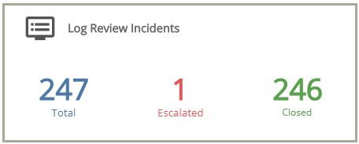
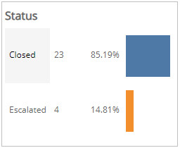
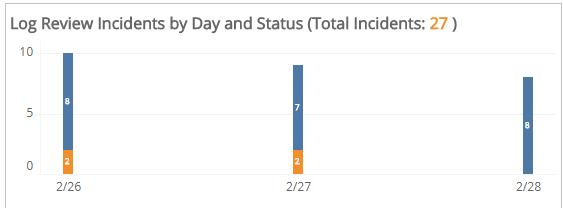
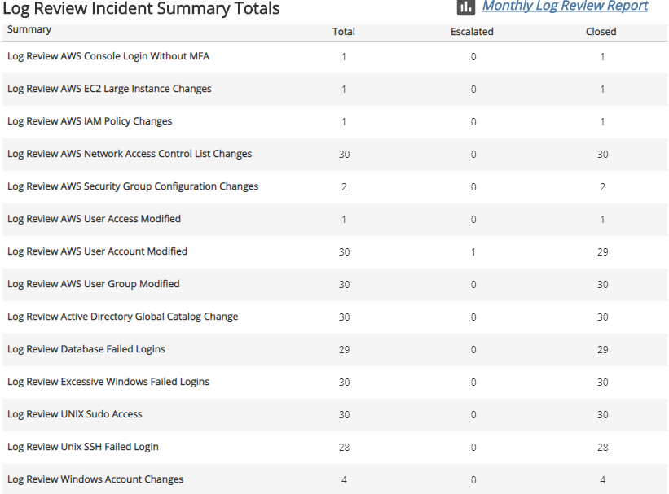
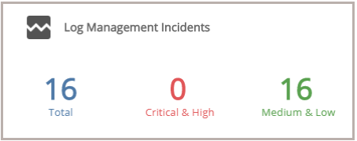

# PCI Requirement 10.6 (Incidents)

The PCI Requirement 10.6 (Incidents) report shows log review and log management incidents to help demonstrate compliance to Requirement 10.6 of PCI DSS.

This report is composed of three pages, **Summary** page, **Log Review Incidents** page, and the Log Management** Incidents** page. Click the Log Review Incidents icon () to see the **Log Review Incidents** page. Click the Log Management Incident icon () to see the **Log Management Incidents** page. Click the arrow icons (,) on top of the Log Review Incidents page or Log Management Incidents page to move through the pages in the report.

**To access the PCI Requirement 10.6 (Incidents) report:**

1. In the Alert Logic console, click the menu icon (), and then click **Validate**.
2. Click **Reports**, and then click  **Compliance**.
3. Click **PCI Audit**, and then click **PCI Requirement 10.6 (Incidents)**.

## Filter the report

To refine your findings, you can filter your report by customer account and date range.

### Filter the report using drop-down menus

By default, Alert Logic includes **(All)** filter values in the report.

**To add or remove filter values: **

1. Click the drop-down menu in the filter, and then select or clear values.
2. Click **Apply**.

## Log Review Incidents section

This section provides the total number of log review incidents found, the status count of log review incidents that the Alert Logic Security Operations Center (SOC) escalated and closed for the selected period.

Click the Log Review incidents icon () to be redirected to the [Log Review Incidents page](#Log), which contains more information about the incidents during  the selected period.

### Log Review Incidents page

The Log Review Incidents page provides the count and percentage of total incidents of each status, a daily histogram chart, and a summary of log review incidents for the selected period.

#### Status section

This section provides the status counts and percentages of total incidents that the Alert Logic Security Operations Center (SOC) analysts closed and escalated for the selected period.

#### Log Review Incidents by Day and Status section

This section provides a stacked histogram chart that displays the daily status counts  of total incidents that the SOC analysts closed and escalated for the selected period.

#### Log Review Incidents Summary Total section

This section displays the total, escalated, and closed incident counts for each type of log review summary category for the selected period.

For more information about the incidents during the selected period, click the **Monthly Log Review Report** to be redirected to the Monthly Log Review report. To learn more about the Monthly Log Review report, see [Monthly Log Review Report](../threats/log-review-analysis/monthly-log-review.md).

## Log Management Incidents section

This section provides the total number of log management incidents created, the number of those log management incidents in critical and high threat levels, and the number of those log management incidents in the medium and low threat levels for the selected period.

Click the Log Management Incidents icon () to be redirected to the [Log Management Incidents page](#Log2) page, which contains more information about the incidents for the selected period.

### Log Management Incidents page

The Log Management Incidents page provides the daily incident count, the incident count and percentages in each threat level, the incident count and percentages in each classification,  the incident count and percentages in each incident type, and a list of incidents for the selected filters.

#### Incident Count by Day section

This section provides the daily incident count and the total count for  the selected period.

#### Threat Level section

This section displays the incident threat levels, the incident count for each threat level, and the percentage for each incident threat level in a color-coded bar graph in the selected filters.

#### Classification section 

This section displays the classifications of incidents, the count for each incident classification, and the percentage for each incident classification in a color-coded bar graph in the selected filters.

#### Incident Type section

This section displays the types of incidents, the count for each incident types, and the percentage for each incident type in a color-coded bar graph in the selected filters.

#### List of Incidents section

The list displays the log management incidents for the selected filters. The list is organized by date created, detection source, incident ID, summary, threat level, classification, and incident type.

Click **Search Incidents** to be redirected to the Incidents Lists page, which contains more information about the incidents in the selected period.

