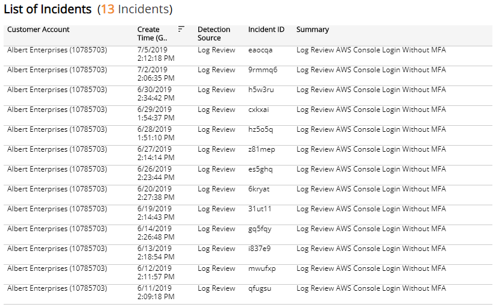

# PCI Requirement 10.6.1

The Payment Card Industry Data Security Standard (PCI DSS) Audit reports provide available documentation and compliance artifacts that help you demonstrate compliance with requirements of the PCI DSS.

The PCI Requirement 10.6.1 report provides Log Review incidents and Log Management incidents that help you demonstrate compliance with Requirement 10.6.1.

**To access the PCI Requirement 10.6.1 report:**

1. In the Alert Logic console, click the menu icon (), and then click **Validate**.
2. Click **Reports**, and then click  **Compliance**.
3. Under **PCI DSS Audit**, click **VIEW**.
4. Click **PCI Requirement 10.6.1**.

## Filter the report

To refine your findings, you can filter your report by  date range, and customer account.

### Filter the report using drop-down menus

By default, Alert Logic includes **(All)** filter values in the report.

**To add or remove filter values: **

1. Click the drop-down menu in the filter, and then select or clear values.
2. Click **Apply**.

The report summary page displays two columns. **Testing Procedures** lists each procedure that is required  for testing the selected PCI requirement. **Available Documentation and Artifacts** describes, and contains links to, the documentation and compliance artifacts that this report can generate for each testing procedure.

This report is composed of four pages, the Summary page, the **Log Review** Summary page, the **Log Review** Incidents page, and the Log Management Incidents page. Each page includes its own filters to specify the information you need to collect the required artifacts.

## Available Documentation and Artifacts

This report provides documentation and artifacts that help you demonstrate that security events and logs from the cardholder data environment went through a daily audit log review process that includes manual review of security events, and automated review and alerting of security events.

In addition, this report includes a link for quick access to the Log Review incidents reviewed by Alert Logic analysts in the Alert Logic console where you can search for and view the details of the incidents. A link for quick access to the Log Management incidents  in the Alert Logic console where you can search for and view the details of the incidents is also included.

### Log Review Summary page

The Log Review Summary page provides the daily distribution of log incidents reviewed by Alert Logic analysts. You can use the information on this page to demonstrate that the daily audit log review process includes manual review of security events. You can also click the link for quick access to the Log Review incidents in the Alert Logic console where you can search for and view the details of the incidents.

To generate this report, from the Summary page, click **Log Review Summary page**. To refine your findings, you can filter this page by date range, and customer account.

#### Status section

This section provides the status counts and percentages of total incidents that the Alert Logic Security Operations Center (SOC) analysts closed and escalated for the selected period.

#### Log Review Incidents by Day and Status section

This section provides a stacked histogram chart that displays the daily status counts  of total incidents that the SOC analysts closed and escalated for the selected period.

#### Log Review Incidents Summary Total section

This section displays the total, escalated, and closed incident counts for each type of log review summary category for the selected period.

For more information about the incidents during the selected period, click the **Monthly Log Review Report** to be redirected to the Monthly Log Review report. To learn more about the Monthly Log Review report, see [Monthly Log Review Report](../threats/log-review-analysis/monthly-log-review.md).

### Log Review Incidents page

The Log Review Incidents page provides the daily distribution of log in incidents reviewed by Alert Logic analysts. You can use the information on this page to demonstrate that the daily audit log review process includes manual review of security events. You can also click the link for quick access to the Log Review incidents in the Alert Logic console where you can search for and view the details of the incidents.

To generate this report, from the Summary page, click **Log Review Incidents page**. To refine your findings, you can filter this page by date range, and customer account.

#### Incident Count by Day section

This section provides the daily incident count and the total count for  the selected period.

#### List of Incidents section

The list displays Log Review incidents for the selected filters. The list is organized by customer account, date created, detection source, incident ID, and summary.

Click **Search Incidents** to be redirected to the Incidents Lists page, which contains more information about the incidents in the selected period.

### Log Management Incidents page

The Log Management Incidents page provides the daily distribution of Log Management incidents. You can use the information on this page to demonstrate that the daily review process includes an automated review of audit logs and access changes. You can also click the link for quick access to the Log Management incidents in the Alert Logic console where you can search for and view the details of the incidents.

To generate this report, from the Summary page, click **Log Management Incidents page**. To refine your findings, you can filter this page by date range and customer account.

#### Incident Count by Day section

This section provides the daily incident count and the total count for  the selected period.

#### Threat Level section

This section displays the incident threat levels, the incident count for each threat level, and the percentage for each incident threat level in a color-coded bar graph in the selected filters. The threat levels are the following:

* Critical: May represent a successful attack or breach
* High: Requires immediate attention
* Medium: Requires closer observation and monitoring
* Low: Common violations and events
* Info: No threat detected or used for correlation

#### Classification section 

This section displays the classifications of incidents, the count for each incident classification, and the percentage for each incident classification in a color-coded bar graph in the selected filters.

#### Incident Type section

This section displays the types of incidents, the count for each incident types, and the percentage for each incident type in a color-coded bar graph in the selected filters.

#### List of Incidents section

The list displays Log Management incidents for the selected filters. The list is organized by customer account, date created, detection source, incident ID, summary, threat level, classification, and incident type.

Click **Search Incidents** to be redirected to the Incidents Lists page, which contains more information about the incidents in the selected period.

