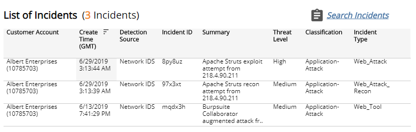

# PCI Requirement 11.4

The Payment Card Industry Data Security Standard (PCI DSS) Audit reports provide available documentation and compliance artifacts that help you demonstrate compliance with requirements of the PCI DSS.

The PCI Requirement 11.4 report shows Network IDS incidents and customer escalation contacts that help you demonstrate compliance with Requirement 11.4.

**To access the PCI Requirement 11.4 report:**

1. In the Alert Logic console, click the menu icon (), and then click **Validate**.
2. Click **Reports**, and then click  **Compliance**.
3. Under **PCI DSS Audit**, click **VIEW**.
4. Click **PCI Requirement 11.4**.

## Filter the report

To refine your findings, you can filter your report by date range, customer account, and deployment.

### Filter the report using drop-down menus

By default, Alert Logic includes **(All)** filter values in the report.

**To add or remove filter values: **

1. Click the drop-down menu in the filter, and then select or clear values.
2. Click **Apply**.

The report summary page displays two columns. **Testing Procedures** lists each procedure that is required for testing the selected PCI requirement. **Available Documentation and Artifacts** describes, and contains links to, the documentation and compliance artifacts that this report can generate for each testing procedure.

This report is composed of three pages, the **Summary** page, the **Escalation and Notification Contacts** page, and the Network IDS****Incidents page. Each page includes its own filters to specify the information you need to collect the required artifacts.

## Available Documentation and Artifacts

This report provides documentation and artifacts that may help you demonstrate that traffic is monitored at the perimeter and at critical points of the cardholder data environment.

In addition, this report includes a link for quick access to the Network Health page in the Alert Logic console where you can view details of the networks monitored by Network IDS. A link also exists for quick access to the Scope of Protection topology diagram in the Alert Logic console where you can view the Network IDS coverage for each deployment.

The list of networks and topology provided by Alert Logic may not cover the entire cardholder data environment. You must provide network diagrams with all components of the cardholder data environment.

This report also provides documentation and artifacts that help you demonstrate that intrusion detection and intrusion prevention techniques alert personnel of suspected compromises. The report includes a link for quick access to the Escalation and Notifications Contacts page in the Alert Logic console where you can view the current Incident Notification contacts for your organization.

You can also find guidance information that helps you demonstrate intrusion detection and intrusion prevention techniques are configured, maintained, and updated per vendor instructions to ensure optimal protection. Additional documentation and compliance artifacts are available to support your efforts to demonstrate compliance with Requirement 11.4.  A link also exists for quick access to the Network IDS page in the Alert Logic console where you can view the distribution and list of incidents detected by Network IDS.

### Escalation and Notification Contacts page

This section provides the list of contacts notified for escalations, and the list of contacts alerted for incident notifications. You can use the information on this page to demonstrate that Network IDS is configured to alert and notify personnel of security incidents by email or phone. You can also click the link for quick access to the Escalation and Notifications Contacts page in the Alert Logic console where you can view the current Incident Notification contacts for your organization.

To generate this report, from the Summary page, click **Escalation and Notification Contacts page**. To refine your findings, you can filter this page by customer account.

### Network IDS Incidents page

Additional compliance artifacts are available to support your efforts to demonstrate compliance with Requirement 11.4. You can use the information on this page to demonstrate the distribution and list of incidents detected by the Network IDS for further compliance with Requirement 11.4. You can also click the link for quick access to the Network IDS page in the Alert Logic console where you can view the distribution and list of incidents detected by Network IDS.

To generate this report, from the Summary page, click **Network IDS Incidents page**. To refine your findings, you can filter this page by date range, customer account, and deployment name.

#### Incident Count by Day section

This section provides the daily incident count and the total count for  the selected period.

#### Threat Level section

This section displays the incident threat levels, the incident count for each threat level, and the percentage for each incident threat level in a color-coded bar graph in the selected filters. The threat levels are the following:

* Critical: May represent a successful attack or breach
* High: Requires immediate attention
* Medium: Requires closer observation and monitoring
* Low: Common violations and events
* Info: No threat detected or used for correlation

#### Classification section 

This section displays the classifications of incidents, the count for each incident classification, and the percentage for each incident classification in a color-coded bar graph in the selected filters.

#### Incident Type section

This section displays the types of incidents, the count for each incident types, and the percentage for each incident type in a color-coded bar graph in the selected filters.

#### List of Incidents section

The list displays the Network IDS incidents for the selected filters. The list is organized by customer account, date created, detection source, incident ID, summary, threat level, classification, and incident type.

Click the **Search Incidents** to be redirected to the Incidents List page for more information about the incidents in the selected period.

