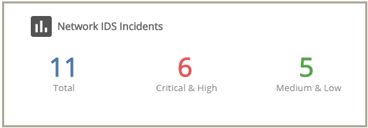
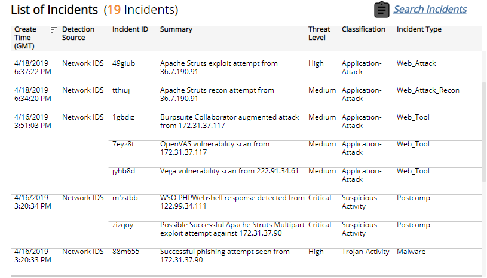
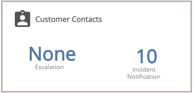

# PCI Requirement 11.4

The PCI Requirement 11.4 report will soon be replaced by a newer version with the same name in the Alert Logic console. This document will also be replaced  to reflect those changes. The new documentation that will replace this document can be found [here](PCI-requirement-11.4.md).

The PCI Requirement 11.4 report shows Network IDS incidents and customer escalation contacts to help you demonstrate compliance to Requirement 11.4 of the PCI DSS.

This report is composed of three pages, **Summary** page, Network IDS** Incidents** page, and the **Customer Contacts** page. Click the Network IDS Incidents icon () to see the Network IDS Incidents page. Click the Customer Contacts icon () to see the Customer Contacts page. Click the arrow icons (, ) on top of the Network IDS Incidents page or Customer Contacts page to move through the pages in the report.

**To access the PCI Requirement 11.4 report:**

1. In the Alert Logic console, click the menu icon (), and then click **Validate**.
2. Click **Reports**, and then click  **Compliance**.
3. Click **PCI Audit**, and then click **PCI Requirement 11.4**.

## Filter the report

To refine your findings, you can filter your report by customer account and date range.

### Filter the report using drop-down menus

By default, Alert Logic includes **(All)** filter values in the report.

**To add or remove filter values: **

1. Click the drop-down menu in the filter, and then select or clear values.
2. Click **Apply**.

## Network IDS Incidents section

This section provides the total number of Network IDS incidents found, the number of those Network IDS incidents in critical and high threats, and the number of those Network IDS incidents in the medium and low threats for the selected period.

Click the Network IDS icon () to be redirected to the [Network IDS Incidents page](#Network), which contains more information about the incidents in the selected period.

### Network IDS Incidents page

The Network IDS Incidents page provides the daily incident count, the incident count and percentages in each threat level, the incident count and percentages in each classification,  the incident count and percentages in each incident type, and list of incidents for the selected filters.

To refine your findings further, you can filter this page by date range, customer account, and deployment name. By default, the page is filtered to the customer account and date range you selected from the Summary page, and the **(All)** value for the deployment name filter.

#### Incident Count by Day section

This section provides the daily incident count, and the total count, in the selected period.

#### Threat Level section

This section displays the incident threat levels, the incident count for each threat level, and the percentage for each incident threat level in a color-coded bar graph in the selected filters.

#### Classification section 

This section displays the classifications of incidents, the count for each incident classification, and the percentage for each incident classification in a color-coded bar graph in the selected filters.

#### Incident Type section

This section displays the types of incidents, the count for each incident types, and the percentage for each incident type in a color-coded bar graph in the selected filters.

#### List of Incidents section

The list displays the Network IDS incidents for the selected filters. The list is organized by date created, detection source, incident ID, summary, threat level, classification, and incident type.

Click the **Search Incidents** to be redirected to the Incidents List page for more information about the incidents in the selected period.

## Customer Contacts section

This section provides the number of contacts notified for escalations, and the number of contacts contacted for incident notifications.

Click the Customer Contacts icon () to  be redirected to the Customer Contacts page, which includes tabular lists of your escalation, notification and incidents notification contacts for the selected customer account.
