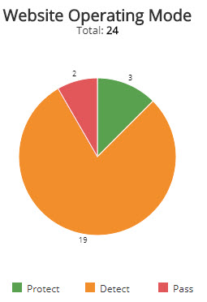
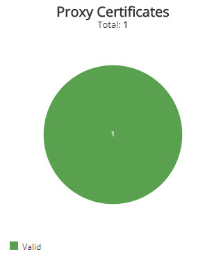
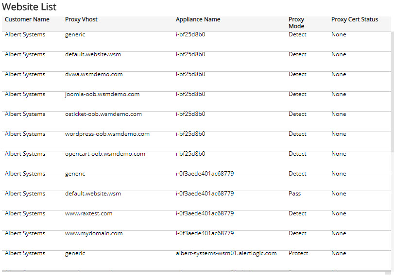
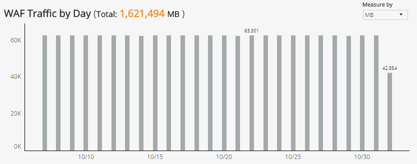
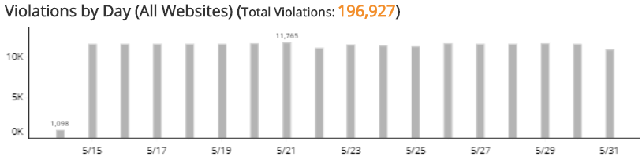
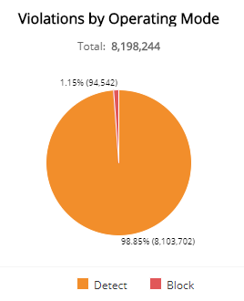
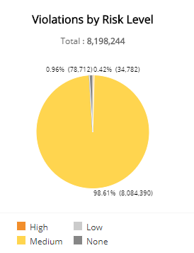
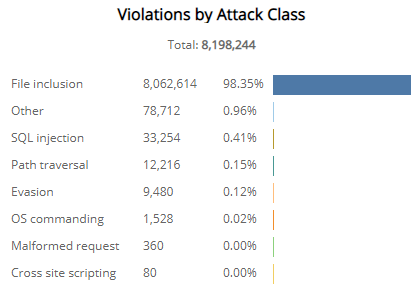
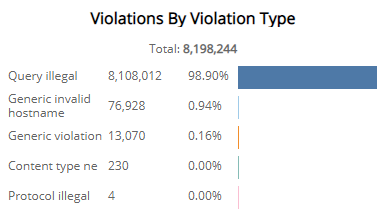

# PCI Requirement 6.6

The Payment Card Industry Data Security Standard (PCI DSS) Audit reports provide available documentation and compliance artifacts that help you demonstrate compliance with requirements of the PCI DSS.

The PCI Requirement 6.6 report provides Alert Logic Managed Web Application Firewall (WAF) deployments, traffic, incidents, and attacks that help demonstrate compliance with Requirement 6.6.

**To access the PCI Requirement 6.6 report:**

1. In the Alert Logic console, click the menu icon (), and then click **Validate**.
2. Click **Reports**, and then click  **Compliance**.
3. Under **PCI DSS Audit**, click **VIEW**.
4. Click **PCI Requirement 6.6**.

## Filter the report

To refine your findings, you can filter your report by  date range and customer account.

### Filter the report using drop-down menus

By default, Alert Logic includes **(All)** filter values in the report.

**To add or remove filter values: **

1. Click the drop-down menu in the filter, and then select or clear values.
2. Click **Apply**.

The report summary page displays two columns. **Testing Procedures** lists each procedure that is required  for testing the selected PCI requirement. **Available Documentation and Artifacts** describes, and contains links to, the documentation and compliance artifacts that this report can generate for each testing procedure.

This report is composed of four pages, the **Summary** page, the **WAF** Deployment page, the **WAF**Traffic page, and the **WAF** Policy Violation page. Each page includes filters  to specify the scope of the information you need to collect.

## Available Documentation and Artifacts

This report provides documentation and artifacts that help you demonstrate that the WAF is situated in front of your public-facing web applications to detect and prevent web-based attacks, is actively running and up to date, generates audit logs, and is configured to either block web-based attacks, or generate an alert that is immediately investigated.   In addition, this report includes a link for quick access to the WAF deny logs in the Alert Logic console where you can search for and view the details of WAF deny logs.

### WAF Deployment page

The WAF Deployment page provides the list of protected websites. You can use the information on this page to demonstrate the WAF is configured to detect and protect your public-facing web applications.

To generate this report, from the Summary page, click WAF** Deployment page**. To refine your findings, you can filter this page by  customer account and appliance name.

#### Website Operating Mode section

This section displays the website operating mode in a color-coded pie chart in the selected filters. The graph presents the following operating modes:

* Pass: Requests are not blocked, and logging is not performed. This mode is primarily used during the onboarding phase and for troubleshooting.
* Detect: Default operating mode during the tuning phase. Violations to configured policy rules are only logged.
* Protect: Violations to configured policy rules will be blocked and logged.

#### Proxy Certificates section

This section provides the proxy certificate statuses in a color-coded pie chart for the selected period. The graph presents the following proxy certificate statuses:

* Valid
* Expires in less than six months
* Expires soon
* Expired

#### Website List section

The list displays the websites protected by the WAF appliances in your environment for the selected period. The list is organized by customer name, proxy vhost, appliance name, proxy mode, and proxy certificate status.

### WAF Traffic page

The WAF Traffic page of this report provides the daily web traffic statistics. You can use the information on this page to demonstrate the WAF is actively processing requests and traffic in front of your web applications.

To generate this report, from the Summary page, click WAF** Traffic page**. To refine your findings, you can filter this page by date range, customer account, appliance name, and measuring unit.

#### WAF Traffic by Day section

The bar graph displays the daily WAF traffic volume in the selected filters. You can view the data measured  by request or data size (in MB). Click the **Measure by** drop-down, and then select how you want the data measured.

#### Appliance List section

The list displays the daily traffic volume by request and megabytes processed by the WAF appliances in your environment for the selected period. The list is organized by date, customer name, appliance name, traffic requests, and traffic (in MB).

### Web App Policy Violations page

The WAF Policy Violations page of this report provides the daily distribution of WAF policy violations. You can use the information on this page to demonstrate the WAF is configured to detect and block web-based attacks.You can also click the link for quick access to the WAF deny logs in the Alert Logic console where you can search for and view the details of WAF deny logs.

To generate this report, from the Summary page, click **WAF Policy Violations page**. To refine your findings, you can filter this page by  date range and customer account.

#### Violations by Day section

The bar graph presents the daily WAF policy violation count for all the protected websites in the selected filters.

#### Violations by Operating Mode section

This section displays WAF policy violations by operating mode in a color-coded pie chart in the selected filters. The graph presents the following operating modes:

* Pass: Requests are not blocked, and logging is not performed. This mode is primarily used during the onboarding phase and troubleshooting.
* Detect: Default operating mode during the tuning phase. Violations to configured policy rules are only logged.
* Block:	Violations to configured policy rules will be blocked and logged.

####  Violations by Risk Level section

This section displays the WAF policy violations by risk level presented in a color-coded pie chart in the selected filters. The risk levels are the following:

* Critical: Could represent a successful attack or breach
* High: Requires immediate attention
* Medium: Recommended observation and monitoring
* Low: Common violations and events
* None:           No risk detected

#### Violations by Attack Class section

The list displays the WAF policy violations by attack class during the selected period. The list is organized by attack class, the total number of violations in each attack class, and the percentage of violations in each attack class, along with a color-coded bar that represents the size of violations in each attack class. Hover over the color-coded bar for more information about that attack class.

#### Violations by Violation Type section

The list displays the WAF policy violations by violation type during the selected period. The list is organized by violation type, the total number of that violation type, and the percentage of each violation type, along with a color-coded bar that represents the size of that violation type. Hover over the color-coded bar for more information about that violation type.

