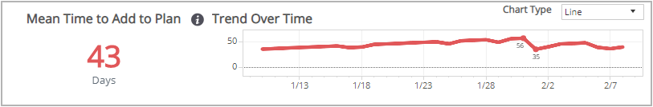
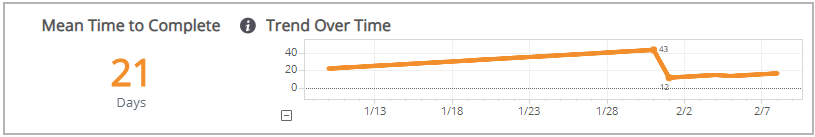
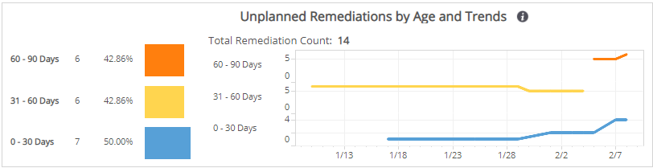
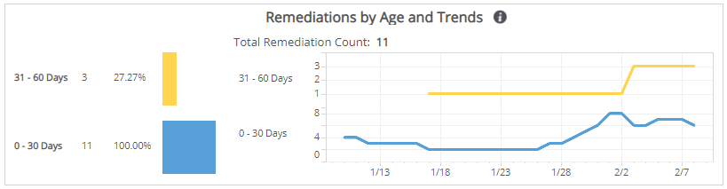
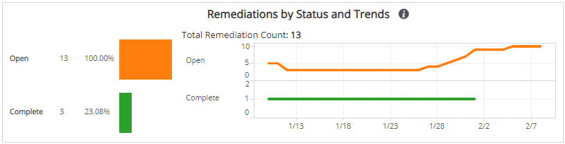
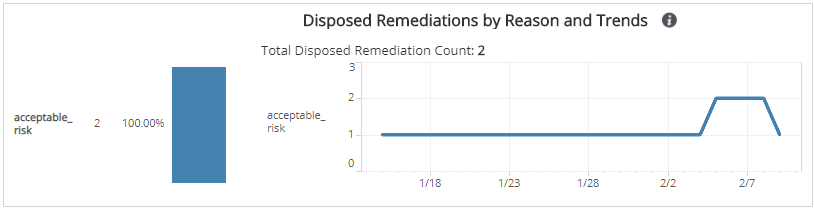

# Configuration Remediation Trends Report

The Configuration Remediation Trends report evaluates the overall responsiveness of your organization to known issues in the Remediations page that degrade the effectiveness of collection, scanning, detection, or response capabilities deployed in your environment.

**To access the Configuration Remediation Trends report**:

1. In the Alert Logic console, click the menu icon (), and then click **Validate**.
2. Click **Reports**, and then click  **Remediations**.
3. Under **Configuration Remediations**, click **VIEW**.
4. Click **Configuration Remediation Trends**.

## Filter the report

To refine your findings, you can filter your report by **Date Range**, **Customer Account**,  **Deployment Name**, **Network**, and **Asset Tags**.

### Filter the report using drop-down menus

By default, Alert Logic includes **(All)** filter values in the report.

**To add or remove filter values: **

1. Click the drop-down menu in the filter, and then select or clear values.
2. Click **Apply**.

Hover over information icons () to learn about the data presented in each section.

## Mean Time to Add to Plan section

This section provides the average number of days between the discovery of a new vulnerability  and when a user added the configuration remediation  for the vulnerability to a plan.

### Trend over Time

The chart next to **Mean Time to Add to Plan** count presents the daily mean time trend (in days) over the selected time period to add new configuration remediations to a plan.

You can display the data as a line or bar chart. Click the drop-down on the top right of this section, and select the chart type you want to see. This selection changes all the charts.

## Mean Time to Complete section

This section provides the average number of days between the addition of a configuration remediation to a plan and when a user completed the configuration remediation.

### Trend over Time

The chart next to the **Mean Time to Complete** count presents the daily mean time trend (in days) over the selected time period to complete a planned configuration remediation.

You can display the data as a line or bar chart. Click the drop-down on the top right of the **Mean Time to Add to Plan** section at the top of the page, and select the chart type you want to see. This selection changes all the charts.

## Unplanned Remediations by Age and Trends section

This section provides the count and percentages within categorized age ranges of configuration remediations that were not added to a remediations plan. The categorized age ranges for unplanned remediations are the following:

* 90 and more days
* 60 to 90 days
* 31 to 60 days
* 0 to 30 days

The size of the color-coded bars represents the percentage of configuration remediations that went unplanned in the selected filters.

The data next to the chart presents the daily age trend over the selected time period of those configuration remediations that were unplanned.

You can display the data as a line or bar chart. Click the drop-down on the top right of the **Mean Time to Add to Plan** section at the top of the page, and select the chart type you want to see. This selection changes all the charts.

## Remediations by Age and Trend section

This section provides the count and percentages within categorized age ranges of configuration remediations that were added to a remediations plan. The categorized age ranges for the planned remediations are the following:

* 90 and more days
* 60 to 90 days
* 31 to 60 days
* 0 to 30 days

The size of the color-coded bars represent the total remediation count in the selected filters.

The data next to the chart presents the daily age trend over the selected time period of those configuration remediations that were planned.

You can display the data as a line or bar chart. Click the drop-down on the top right of the **Mean Time to Add to Plan** section at the top of the page, and select the chart type you want to see. This selection changes all the charts.

## Remediations by Status and Trend section

This section provides the  count and percentages of configuration remediations within each status. The statuses for remediations are the following:

* Opened (no action taken)
* Reopened (verified and opened)
* Complete (verified and closed)
* Disposed (removed from view)

The size of the color-coded bars represents the percentage of remediations in that status in the selected filters.

The data next to the chart presents the trend over the selected time period of the statuses for those remediations.

You can display the data as a line or bar chart. Click the drop-down on the top right of the **Mean Time to Add to Plan** section at the top of the page, and select the chart type you want to see. This selection changes all the charts.

## Disposed Remediation by Reason and Trends section

This section provides the count and percentages of configuration remediations that were added to a plan and disposed (removed from view), and the reasons specified. The reasons for disposed remediations are the following:

* Acceptable Risk
* False Positive
* Compensating Control

The size of the color-coded bars represents the percentage of disposed remediations in that reason in the selected filters.

The data next to the chart presents the daily trend over the selected time period of the reasons for those disposed configuration remediations.

You can display the data as a line or bar chart. Click the drop-down on the top right of the **Mean Time to Add to Plan** section at the top of the page, and select the chart type you want to see. This selection changes all the charts.

