# Weekly Enterprise Risk

The Weekly Enterprise Risk report provides valuable insights and analysis of your incidents, events, and vulnerabilities  in your environment. Use this report to evaluate threats and incidents, and your response efforts, validate events and focus your efforts, and gain insights into the effectiveness of your vulnerability management.

This report presents data for an entire week, from Monday through Sunday, which immediately becomes available in the beginning of the following week.

To access the Weekly Enterprise report:

1. In the Alert Logic console, click the menu icon (), and then click **Validate**.
2. Click **Reports**, and then click   **Risk**.
3. Under **Enterprise Risk**, click **VIEW**.
4. Click **Weekly Enterprise Risk**.

## Filter the report

To refine your findings, filter your report by  **Select Week**, **Customer Account**, and **Deployment Name**.

### Filter the report using drop-down menus

By default, Alert Logic includes **(All)** filter values in the report.

**To add or remove filter values: **

1. Click the drop-down menu in the filter, and then select or clear values.
2. Click **Apply**.

## Incidents

The Incidents section provides visibility into threats and incidents in your environment, including  incident statuses, threat levels, classification, and daily incident count for the selected week.

### Incident by Status section

This section provides the count and percentages for open, snoozed, and closed incidents for the selected week.

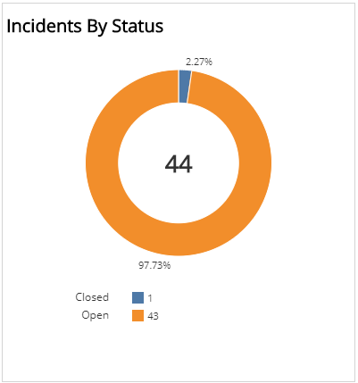

### Incident by Threat Level section

This section provides the count and percentages of incidents in each threat level for the selected week.

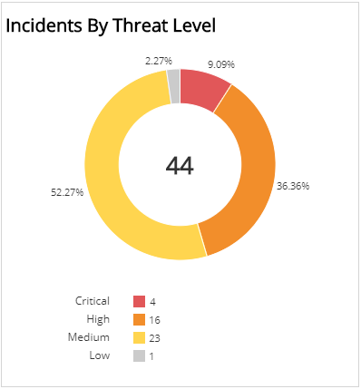

### Incident by Classification section

This section provides the count and percentages for each incident classification in a color-coded bar graph for the selected week.

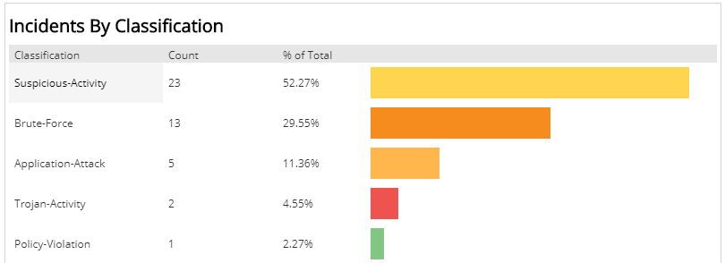

### Incident by Day section

This section displays a bar graph of the daily incident count, and a list with the count and total percentage of incidents on each day for the selected week.

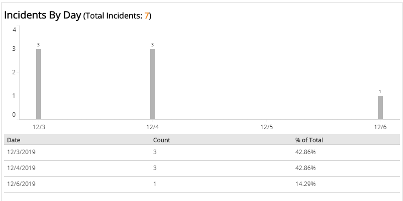

## Events

The Events section provides visibility into Network IDS events processed in your environment, including event classification, top signatures, and events per day for the selected week.

### Events by Classification section

This section displays the classifications of events, the count  and the percentage for each event classification in a color-coded bar graph for the selected week.

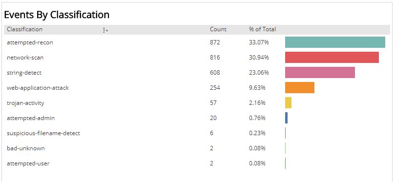

### Top 10 Signatures section

This section displays the top ten signatures, the event count and the total percentage of events for each signature, in a color-coded bar graph for the selected week.

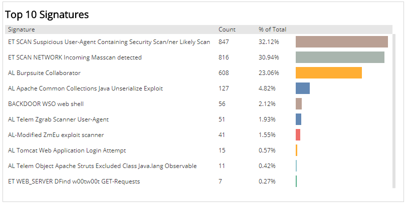

### Events by Day section

This section displays a bar graph of the daily event count, and a list with the count and total percentage of events on each day for the selected week.

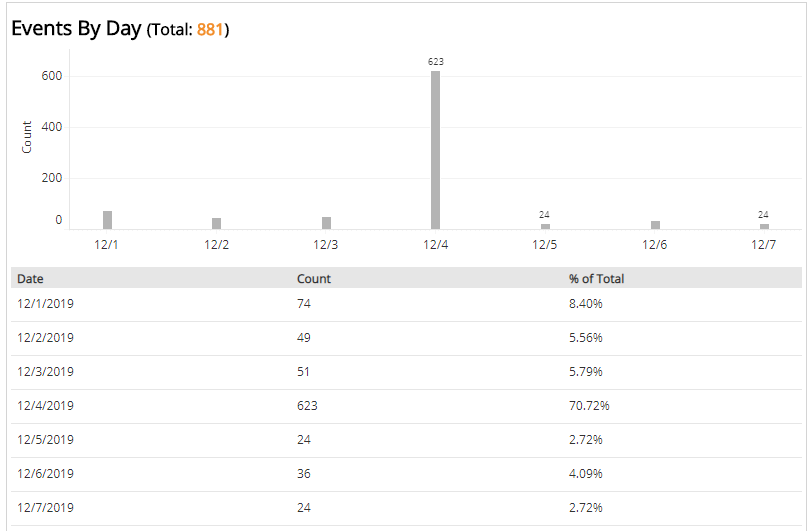

## Vulnerabilities

The Vulnerabilities section provides insights into vulnerabilities and vulnerable assets found in your environment, including vulnerabilities by severity and age, top vulnerable hosts lists, and vulnerabilities by day and severity for the selected week.

In this section, Alert Logic measures the CVSS severity category based on the CVSS v2 score.

Alert Logic assigns each vulnerability one of the following severities with corresponding icon based on the CVSS v2 score set by the National Institute of Standards and Technology, and reported to the National Vulnerability Database:

| Severity | CVSS base score |
|---|---|
|  High | 7.0 - 10.0 |
| Medium | 4.0 - 6.9 |
| Low | 0.1 - 3.9 |
| Informational | 0.0 |

### Vulnerabilities by Severity section 

This section provides the vulnerability count in each CVSS severity category for the selected week.

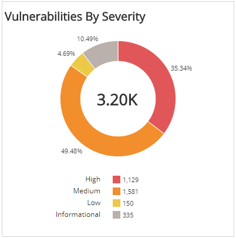

### Vulnerabilities by Age section

This section provides the vulnerability count in each age category for the selected week.

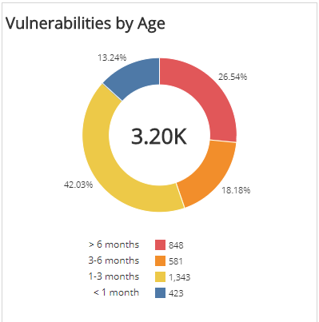

### Top 10 Vulnerable Hosts by Vuln Count section 

The list provides the 10 most vulnerable hosts based on the total vulnerability count during the selected week. The list is organized by customer account, host name, host IP address, count of vulnerabilities, and  a  bar that represents the size of the vulnerabilities count.

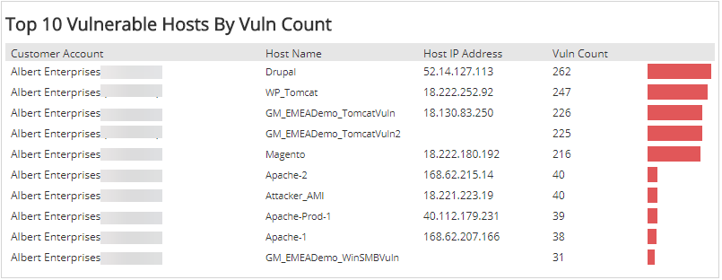

### Top 10 Vulnerable Hosts by Average TRI Score section 

The list provides the 10 most vulnerable hosts based on the Threat Risk Index (TRI) score during the selected week. The list is organized by customer account, host name, host IP address, average TRI score, and  bar that represents the size of the TRI score.

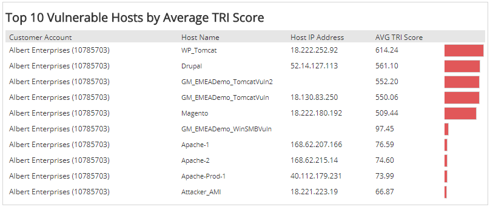

### Vulnerabilities by Day and Severity section

This section provides a line graph of the vulnerability count for every CVSS severity category and trend  over the selected week, and a list with the count and total count of vulnerabilities in every CVSS severity category on each day for the selected week.

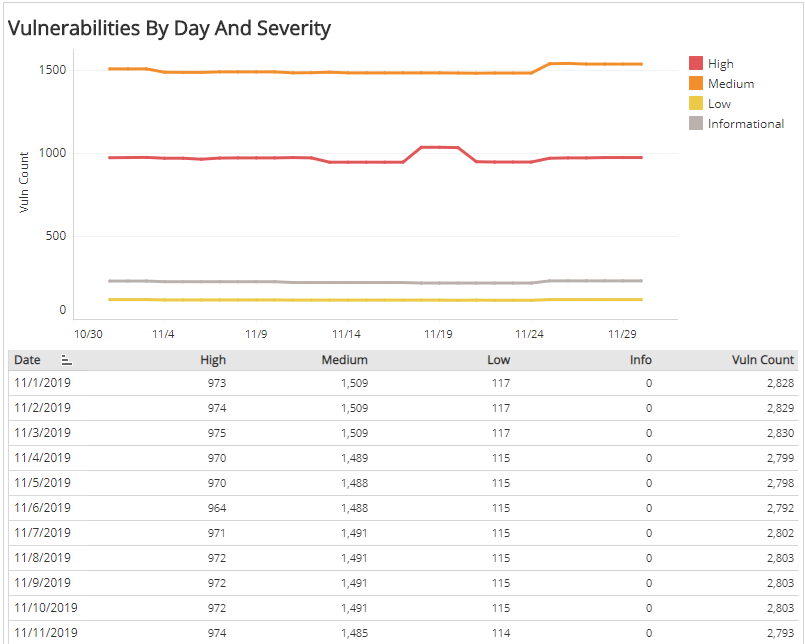
