# Monthly Security Posture Report

The Monthly Security Posture report provides the current and historic monthly security risk and health posture of your environment, including configuration and security remediations, risk posture overviews, vulnerabilities assessments, and threat analysis.

Use this report to prioritize opportunities to improve your overall security posture and optimize security collection, detection, and response capabilities deployed in your environment.

This report is composed of the following six pages:

* Summary
* Configuration Remediations
* Risk Index
* Vulnerabilities
* Security Remediations
* Threats

To page through the report, go to the next page, click the arrow icon () on the top right of the report.

To access the Monthly Security Posture report:

1. In the Alert Logic console, click the menu icon (), and then click **Validate**.
2. Click **Reports**, and then click   **Risk**.
3. Click **Security Posture**, and then click **Monthly Security Posture**.

## Filter the report

To refine your findings, filter your report by month and customer account name.

### Filter the report using drop-down menus

By default, Alert Logic includes **(All)** filter values in the report.

**To add or remove filter values: **

1. Click the drop-down menu in the filter, and then select or clear values.
2. Click **Apply**.

The report allows you to share its data by email, or download the report as an image, data, crosstab, or PDF file.

## Summary page

The Summary page provides an overview of the contents analyzed within the pages of this report.

### Open Configuration Remediations section

This section provides the total number of open configuration remediations for the previous month and the selected month, and the total change with percentage for open configuration remediations between those two months.

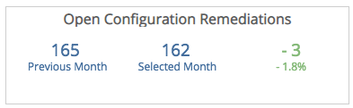

### Average Threat Risk Index (TRI) section

This section provides the average TRI score for the previous month and the selected month, and the total change (and the percentage of change) of the TRI score between those two months.

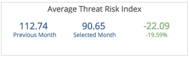

### Vulnerabilities section

This section provides the total number of vulnerabilities and assets with high severity vulnerabilities.

Total Count

The top row provides the total number of vulnerabilities for the previous month and the selected month, and the total change (and the percentage of change) for the total number of vulnerabilities between those two months.

**Assets with High Severity Vulnerabilities**

The bottom row provides the total number of assets with high severity vulnerabilities for the previous month and the selected month, and the total change (and the percentage of change) for those assets between the two months.

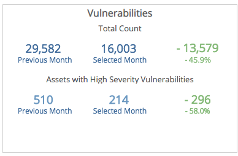

### Threats section

This section provides the  total number of incidents and the percentages of those incidents in the critical and high severity categories.

**Total Incident Count**

The top row provides the total number of incidents for the previous month and the selected month, and the total change with percentage for the number of incidents between those two months.

**Critical and High Severity Percentage**

The bottom row provides the percentages of incidents in the critical and high severity categories for the previous month and the selected month, and the total change (and the percentage of change) for those incidents in the critical and high severity categories between the two months.

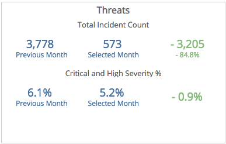

## Configuration Remediations page

To see the Configuration Remediations page, click the arrow icon () on the top right of the Summary page.

The Configuration Remediations page provides an overview of the state of configuration remediations and how they are handled in the Remediations page of the Alert Logic console.

### Open Configuration Remediations section

This section provides the total number of open configuration remediations for the previous month and the selected month, and the total change (and the percentage of change) of open configuration remediations between those two months.

### Average Remediation Age section

This section provides the average number of days to add new configuration remediations to your planned remediations for the previous month and the selected month, and the percentage change of the average number of days between those two months.

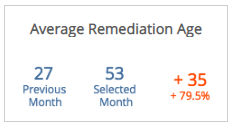

### Mean Days to Complete section

This section provides the average number of days to complete the configuration remediations added to your planned remediations for the previous month and the selected month, and the total change (and the percentage of change) of the average number of days to complete those remediations between those two months.

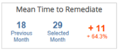

### Unplanned Configuration Remediations by Asset section

This section provides the number and percentage changes of configuration remediations, by asset type, that you did not add to your planned remediations for the last month, the selected month, and the total change (and the percentage of change) between those two months. The color-coded bars represent the percentage change of configuration remediations that went unplanned for that asset.

To view the number of unplanned configuration remediations from deployments, VPC/networks, or customer accounts, click the **Asset Type** drop-down menu on the top right of the graph, and then select the asset type you want to see.

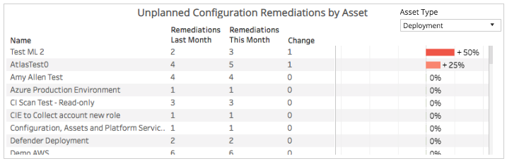

### Top Configuration Remediations by Impacted Assets section

This section displays the configuration remediations with the most impacted assets in your environment for the selected month. The list is organized by customer account, deployment name, remediation, and number of impacted assets.

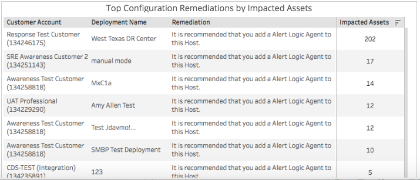

## Risk Index page

To see the Risk Index page, click the arrow icon () on the top right of the Configuration Remediations page.

The Risk Index page provides an overview of your TRI score trends by assets.

The **Customer Account** filter impacts the TRI score and averages displayed in some sections of this page when there are multiple customer accounts. If you filter by all customer accounts,  the report displays the Average TRI Score across all customer accounts. If you filter by a single customer account, the report displays the TRI score (not the average) for the selected customer account.

### Threat Risk Index section

This section provides the average TRI score for the previous month and the selected month, and the total change (and the percentage of change) for the TRI score between those two months.

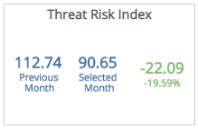

### Threat Risk Index Trends section

This section provides the daily TRI score trend of the last 14 days for the selected month.

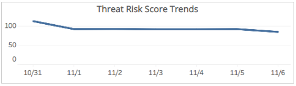

### TRI Score and Vulnerabilities Change by Asset section

This section provides the number and percentage changes of TRI scores, by asset type, for the previous month, and the selected month. The color-coded bars represent the percentage change of TRI score change between those two months. The report organizes the list by asset name, previous month, selected month, and the number and percentage change.

To view the TRI score changes from deployments, VPC/networks, or customer accounts, click the **Asset Type** drop-down menu on the top right of the graph, and then select the asset type you want to see.

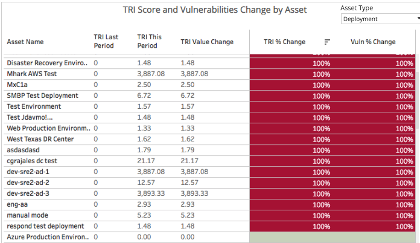

## Vulnerabilities page

To see the Vulnerabilities page, click the arrow icon () on the top right of the Risk Index page.

The Vulnerabilities page provides an overview of vulnerabilities found across your environment.

### Assets section

This section provides a bar graph that displays the number of scanned assets and the number of vulnerable assets found in the selected month.

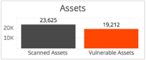

### Vulnerabilities section

This section provides a bar graph that displays the total number of vulnerabilities found, the number of vulnerabilities seen for the first time, and the number of vulnerabilities in the high severity category in the selected month.

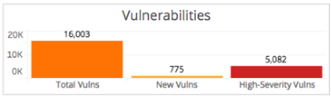

### Total Vulnerabilities section

This section provides the total number of vulnerabilities found in the previous and the selected month.

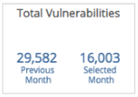

### Assets with High Severity Vulnerabilities section

This section provides the number of assets with vulnerabilities in the high severity category in the previous month and the selected month.

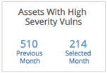

### Vulnerabilities with Known Exploits section

This section provides the number of vulnerabilities with known exploit code available in the previous month and the selected month.

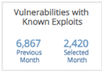

### Internet-Facing Vulnerabilities section

This section provides the number of vulnerabilities found in external scans in the previous month and the selected month.

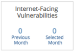

### Vulnerabilities by Asset and Severity section

This section presents the distribution of assets and vulnerability severity categories in the previous and selected months displayed as color-coded circles. The size of the circles represents the total vulnerabilities in each severity category, while the color represents the month.

Alert Logic assigns each vulnerability one of the following severities with corresponding icon based on the CVSS v2 score set by the National Institute of Standards and Technology, and reported to the National Vulnerability Database:

| Severity | CVSS base score |
|---|---|
|  High | 7.0 - 10.0 |
| Medium | 4.0 - 6.9 |
| Low | 0.1 - 3.9 |
| Informational | 0.0 |

To see more information on a specific set of vulnerabilities, hover over a circle.

To view the distribution of assets and severity categories of vulnerabilities from deployments, VPC/networks, or customer accounts, click the **Asset Type** drop-down menu on the top right of the graph, and then select the asset type you want to see.

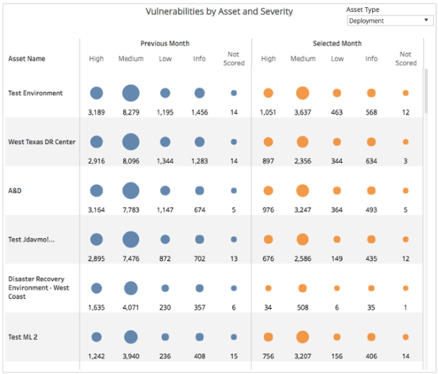

## Security Remediations page

To see the Security Remediations page, click the arrow icon () on the top right of the Vulnerabilities page.

The Security Remediations page provides an overview of the state of security remediations and how they are handled in the Remediations page of the Alert Logic console.

### Security Remediations section

This section provides the total number of open security remediations for the previous month and the selected month, and the total change (and the percentage of change) of open security remediations between those two months.

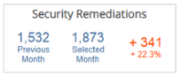

### Average Remediation Age section

This section provides the average number of days to add new security remediations to your planned remediations for the previous month and the selected month, and the (and the percentage of change) of the average days between those two months.

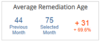

### Mean Days to Remediate section

This section provides the average number of days to complete the security remediations added to your planned remediations for the previous month and the selected month, and the total change (and the percentage of change) of the average number of days to complete between those two months.

### Unplanned Security Remediations by Asset section

This section provides the number and percentage changes of security remediations, by asset type, that you did not add to your planned remediations for the last month, the selected month, and the total change with percentage between those two months. The color-coded bars on the right represents the percentage change of security remediations that went unplanned in that asset.

To view the number of unplanned security remediations from deployments, VPC/networks, or customer accounts, click the **Asset Type** drop-down menu on the top right of the graph, and then select the asset type you want to see.

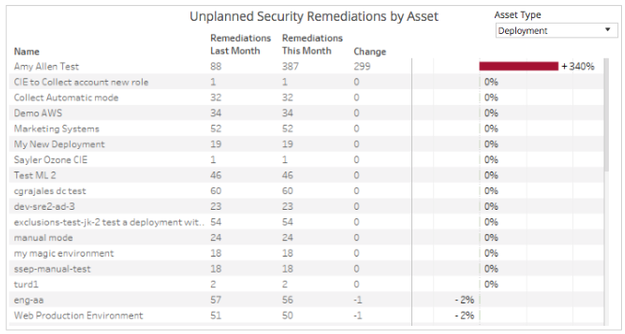

### Top Security Remediations by Impact Assets section

This section displays the security remediations with the most impacted assets in your environment for the selected month. The list is organized by customer account, deployment name, remediation, and number of impacted assets.

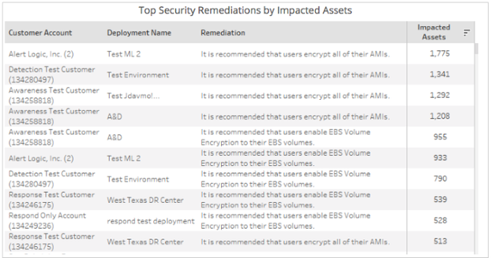

## Threats page

To see the Threats page, click the arrow icon () on the top right of the Security Remediations page.

The Threats page provides an overview of threats found across your environment.

### Threat Collection section

This section provides a color-coded bar graph that displays IDS traffic, log and WAF traffic in the selected month.

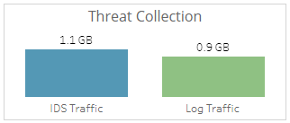

### Threat Detection section

This section provides a graph that displays the total incidents, incidents in the critical or high threat level categories, and incidents that were escalated in the selected month.

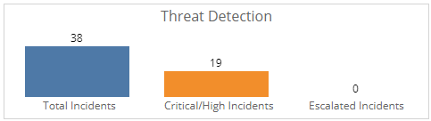

### Total Incidents section

This section provides the total number of incidents in the selected month.

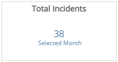

### Critical and High Incidents section

This section provides the number of incidents in the critical or high threat level categories for the previous and selected months.

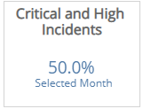

### Assets with Critical or High Incidents section

This section provides the number of assets with incidents in the critical or high threat level categories for the previous and selected months.

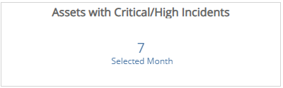

### Incidents by Asset and Threat Level section

This section displays the distribution of assets and threat level categories of incidents for the previous and selected months presented in color-coded circles. The size of the circles represents the number of incidents in each threat level category while the  color represents the month.

The threat levels are the following:

* Critical: May represent a successful breach
* High: Requires immediate attention
* Medium: Requires closer observation and monitoring
* Low: Common events

To see more information on a specific set of incidents, hover over a circle.

To view the distribution of assets and severity categories of incidents from deployments, VPC/networks, or customer accounts, click the **Asset Type** drop-down menu on the top right of the graph, and then select the asset type you want to see.

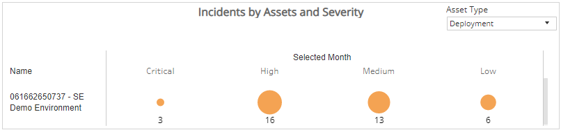
