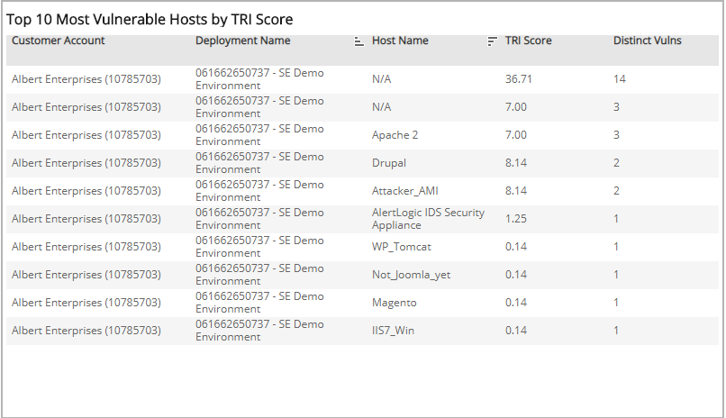
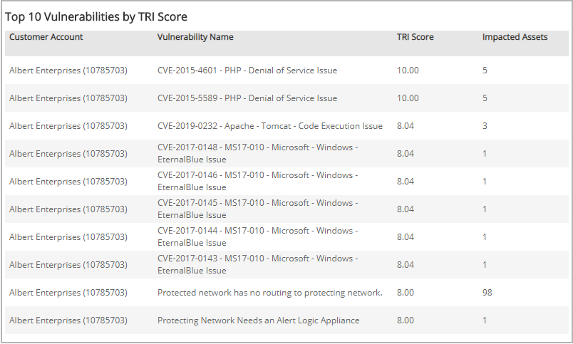

# Top 10 TRI Lists

The Top 10 TRI Lists report provides  top 10 lists of your most vulnerable hosts by TRI score, and the top 10 vulnerabilities by TRI Score.

Use this report to enable a proactive risk management approach and prioritize risk mitigation efforts on specific areas in your environment.

To access the Top 10 TRI Lists report:

1. In the Alert Logic console, click the menu icon (), and then click **Validate**.
2. Click **Reports**, and then click   **Risk**.
3. Under **Threat Risk Index**, click **VIEW**.
4. Click **Top 10 TRI Lists**.

## Filter the report

To refine your findings,  filter your report by **Customer Account**, **Deployment Name**, **View Previous Days**, and **VPC/Network**.

### Filter the report using drop-down menus

By default, Alert Logic includes **(All)** filter values in the report.

**To add or remove filter values: **

1. Click the drop-down menu in the filter, and then select or clear values.
2. Click **Apply**.

## Top 10 Most Vulnerable Hosts by TRI Score section

The list displays the 10 hosts in your environment with the highest TRI scores for the selected day. The list is organized by customer account, vulnerability name, host name, TRI score, and the distinct vulnerabilities in that host.

## Top 10 Most Vulnerable Hosts by Severity section

The list displays the 10 vulnerabilities in your environment with the highest TRI scores on the selected day. The list is organized by customer account, description, TRI score, and number of impacted assets.

