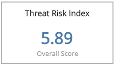
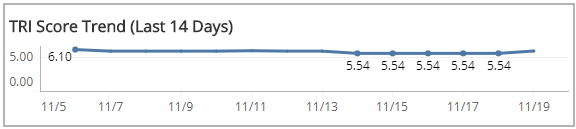
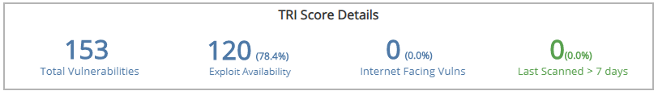
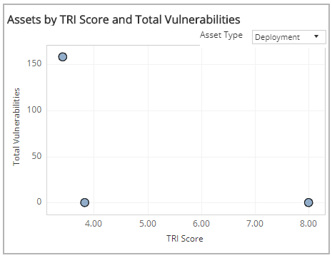
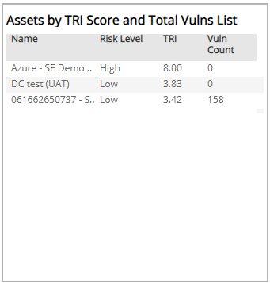
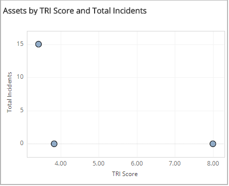
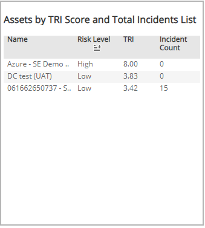

# TRI Summary

The TRI Summary report provides a summary of the recent threat risk index (TRI) scores of your environment, including the overall TRI score and trends, score details, and risk index asset distribution charts.

Use this report to enable a proactive risk management approach and prioritize risk mitigation efforts on specific areas in your environment.

To access the TRI Summary report:

1. In the Alert Logic console, click the menu icon (), and then click **Validate**.
2. Click **Reports**, and then click   **Risk**.
3. Under **Threat Risk Index**, click **VIEW**.
4. Click **TRI Summary**.

## Filter the report

To refine your findings, filter your report by **Customer Account**, and **View Previous Days**.

### Filter the report using drop-down menus

By default, Alert Logic includes **(All)** filter values in the report.

**To add or remove filter values: **

1. Click the drop-down menu in the filter, and then select or clear values.
2. Click **Apply**.

## Threat Risk Index section

This section provides the overall TRI score in the selected filters.

## TRI Score Trend in the Last 14 Days section

This section provides the daily TRI score trend for the 14 days prior to the current day.

## TRI Score Details Headline section

This section provides the total number of vulnerabilities, number and percentage of vulnerabilities with known exploit code available, the number and percentage of internet- facing vulnerabilities found in external scans, and the number and percentage of hosts that were last scanned more than seven days prior to ago in the selected day.

## Assets by TRI Score and Total Vulnerabilities section

This sections displays the correlation of TRI scores and total vulnerabilities for the selected day represented in a scatter graph and a list. You can view the correlation of TRI scores and total vulnerabilities from deployments or VPC/networks. Click the **Asset Type** drop-down menu on the top right of the graph, and then select the asset type you want to see.

### Assets by TRI Score and Total Vulnerabilities List section

The list displays the name of the deployment or the VPC/network, the associated risk level, the TRI score, and the vulnerability count. To refine the list, select one or more circles in the scatter graph to the left of the list.

You can also click on a name in the list to filter by the selected asset in the scatter graph and filter data in the Threat Index, TRI Score Trends and TRI Score Details for the selected asset.

## Assets by TRI Score and Total Incidents section

This section displays the correlation of TRI scores and total incidents in the selected day represented in a scatter graph and a list. You can view the correlation of TRI scores and total incidents from deployments or VPC/networks. Click the **Asset Type** drop-down on the top right of the graph in the **Assets by TRI Score** and **Total Vulnerabilities** section, and then select the asset type you want to see.

### Assets by TRI Score and Total Incidents List section

The list displays the name of the deployment or VPC/network, the associated risk level, the TRI score, and the incident count. To refine the list, select one or more circles in the scatter graph to the left of the list.

You can also click on a name in the list to filter by the selected asset in the scatter graph and filter data in the Threat Index, TRI Score Trends and TRI Score Details for the selected asset.

