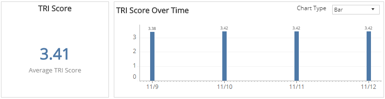
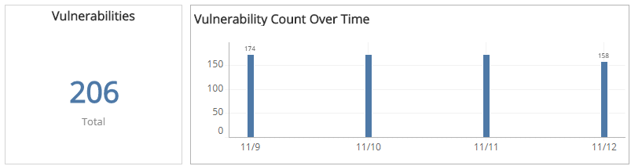
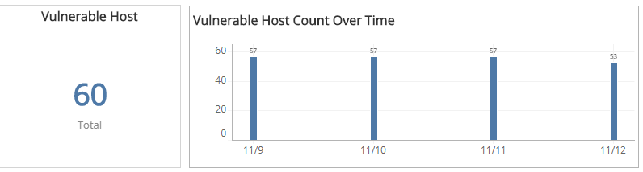
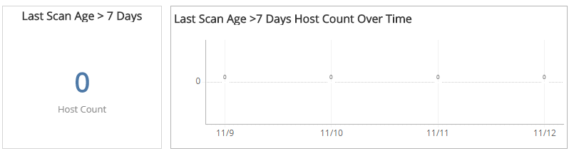
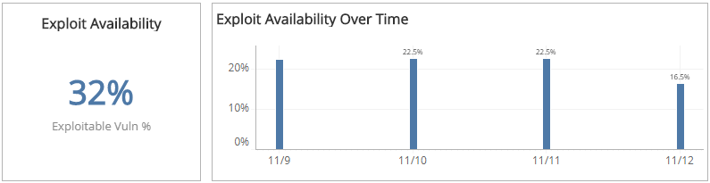
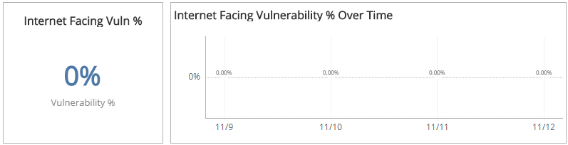

# TRI Trends Report

The TRI Trends report provides insights into threat risk index (TRI) scores and trends in reducing risks, including average TRI scores, total vulnerability and host counts, internet-facing vulnerabilities, exploit availability, and last scanned age.

Use this report to identify patterns in the overall TRI score trends and contributing factors, gauge progress made, and focus efforts on key areas to reduce threats in your environment.

To access the TRI Summary report:

1. In the Alert Logic console, click the menu icon (), and then click **Validate**.
2. Click **Reports**, and then click   **Risk**.
3. Under **Threat Risk Index**, click **VIEW**.
4. Click **TRI Trends**.

## Filter the report

To refine your findings, filter your report by **Date Range**, **Customer Account**, and **Deployment Name**.

### Filter the report using drop-down menus

By default, Alert Logic includes **(All)** filter values in the report.

**To add or remove filter values: **

1. Click the drop-down menu in the filter, and then select or clear values.
2. Click **Apply**.

## TRI Score Over Time section

This section  shows the average TRI score  and a graph that presents the daily TRI score trend over the selected date range.

You can display the data as a line or bar chart. Click the **Chart Type** drop-down on the top right of the section, and then select the chart type you want to see.

## Vulnerabilities Count Over Time section

This section shows the total number of vulnerabilities and a graph that presents the daily number of vulnerabilities for over the selected date range.

You can display the data as a line or bar chart. Click the **Chart Type**drop-down on the top right of the **TRI Score Over Time** section, and then select the chart type you want to see.

## Vulnerable Host Count Over Time section

This section  displays shows the total number of vulnerable hosts and a graph that presents the daily number of vulnerable hosts for over the selected date range.

You can display the data as a line or bar chart. Click the **Chart Type**drop-down on the top right of the **TRI Score Over Time** section, and then select the chart type you want to see.

## Last Scan Age section

This section  shows the total number of hosts that were last scanned more than seven days ago and a graph that presents the daily count of hosts that were last scanned more than seven days ago over the selected date range.

You can display the data as a line or bar chart. Click the **Chart Type** drop-down on the top right of the **TRI Score Over Time** section, and then select the chart type you want to see.

## Exploit Availability section

This section displays shows the percentage of total vulnerabilities with known exploit codes available and a graph that presents the daily percentages of vulnerabilities with known exploit available over the selected date range.

You can display the data as a line or bar chart. Click the **Chart Type** drop-down on the top right of the **TRI Score Over Time** section, and then select the chart type you want to see.

##  Internet-facing Vulnerabilities percentages section

This section shows the percentage of total vulnerabilities found as a result of external scans and a graph that presents the daily percentages of internet-facing vulnerabilities for over the selected date range.

You can display the data as a line or bar chart. Click the **Chart Type** drop-down on the top right of the **TRI Score Over Time** section, and then select the chart type you want to see.

