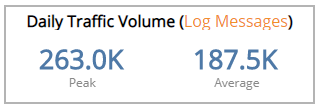
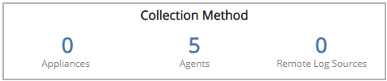
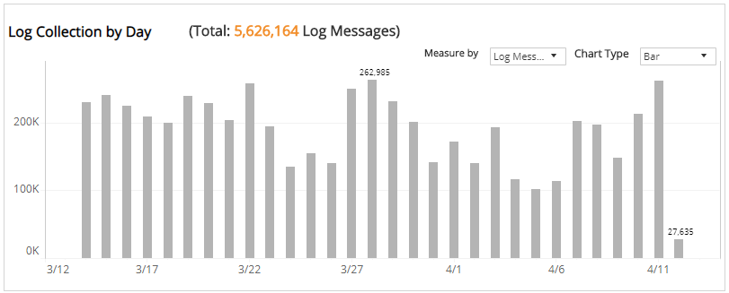

# Log Collection

The Log Collection report provides visibility into log collection volume and log messages processed in your environment, including log collection per day and a list of collectors with volume by GB, EPS or log messages. Use this report to support log collection configuration and optimization efforts in your environment.

To access the Log Collection report:

1. In the Alert Logic console, click the menu icon (), and then click **Validate**.
2. Click **Reports**, and then click **Service**.
3. Under **Capability Usage**, click **VIEW**.
4. Click **Log Collection**.

## Filter the report

To refine your findings, filter your report by   **Date Range**, **Customer Account**, and **Deployment Name**.

### Filter the report using drop-down menus

By default, Alert Logic includes **(All)** filter values in the report.

**To add or remove filter values: **

1. Click the drop-down menu in the filter, and then select or clear values.
2. Click **Apply**.

## Daily Traffic Volume section

This section provides the peak daily volume  and average daily volume of collected log messages during the selected period.

## Collection Method section

This section provides the total count of collectors that received log data for each collection method (appliances, agents, and remote log sources) in the selected period.

## Log Collection by Day section

The bar graph displays the daily log collection for the selected filters. You can display the data as a line or bar chart. Click the **Chart Type** drop-down on the top right of the graph, and then select the chart type you want to see. You can also view the data measured  by events per second (EPS), gigabytes (GB), or log messages. Click the **Measure by** drop-down, and then select how you want the data measured.

## Log Collection Volume section

The list displays the daily log collection volume by collector, GB, EPS, and messages processed in your environment for the selected period. The list is organized by date, customer account, collector method, collector name, host name, IP address,  total GB, total EPS, and total messages.

