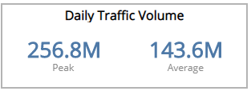
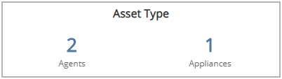
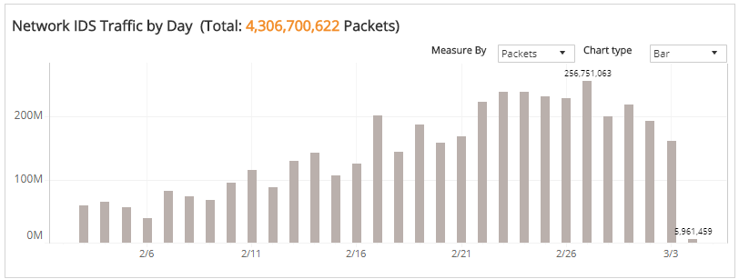
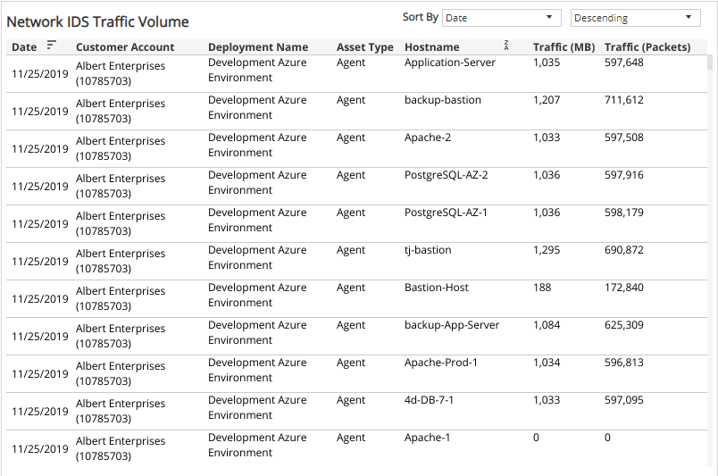

# IDS Traffic

This report provides visibility into IDS traffic volume and collections processed in your environment, including IDS traffic per day, a list of collectors with traffic packets and megabytes, and a top ten collector list. Use this report to support IDS configuration and optimization efforts in your environment.

To access the Network IDS Traffic report:

1. In the Alert Logic console, click the menu icon (), and then click **Validate**.
2. Click **Reports**, and then click **Service**.
3. Under **Capability Usage**, click **VIEW**.
4. Click **Network IDS Traffic**.

## Filter the report

To refine your findings, filter your report by  **Date Range**, **Customer Account**, **Deployment Name**, **Asset Type**, and **Host Name**.

### Filter the report using drop-down menus

By default, Alert Logic includes **(All)** filter values in the report.

**To add or remove filter values: **

1. Click the drop-down menu in the filter, and then select or clear values.
2. Click **Apply**.

## Daily Traffic Volume section

This section provides the peak daily traffic volume and average amount of daily traffic volume during the selected period.

## Asset Type section

This section provides the total count of each asset type (agents and appliances) that received traffic in the selected period.

## Network IDS Traffic by Day section

The bar graph displays the daily traffic volume for the selected filters. You can display the data as a line or bar chart. Click the **Chart Type** drop-down on the top right of the graph, and then select the chart type you want to see. You can also view the data measured  by packets or megabytes (MB). Click the **Measure by** drop-down, and then select how you want the data measured.

## Network IDS Traffic Volume section

The list displays the daily traffic volume by collectors, megabytes, and packets processed by Network IDS in your environment for the selected period. The list is organized by date, customer account, asset type, host name, and traffic in MBs and packets.

